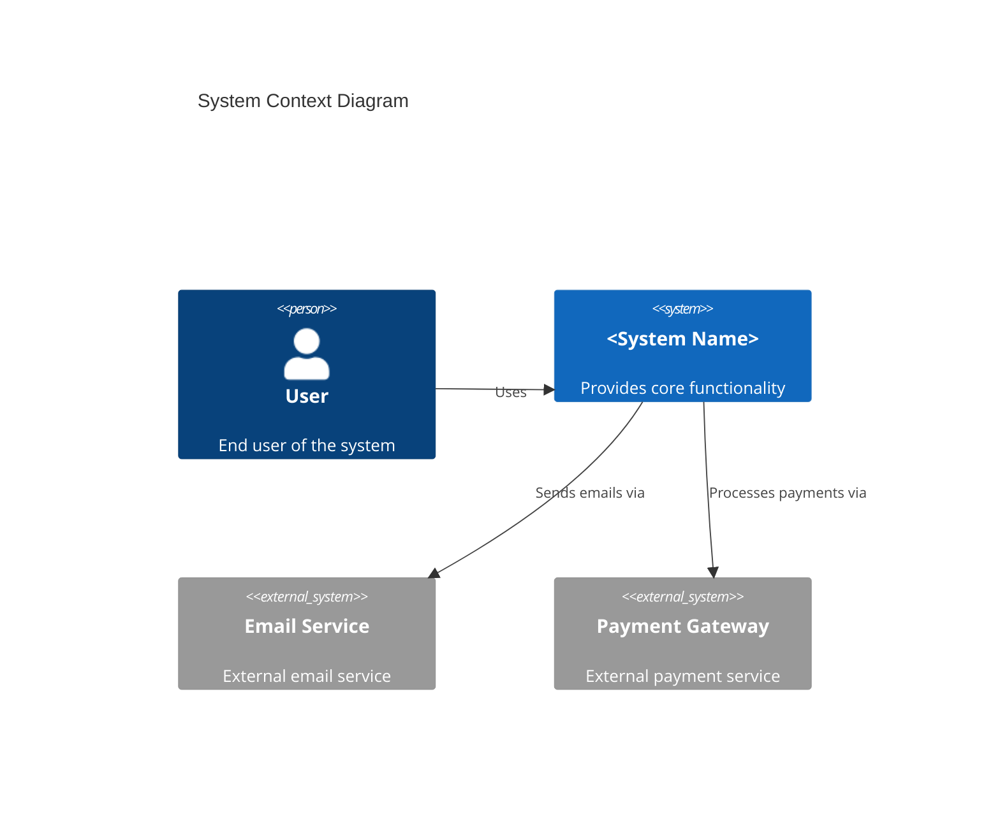
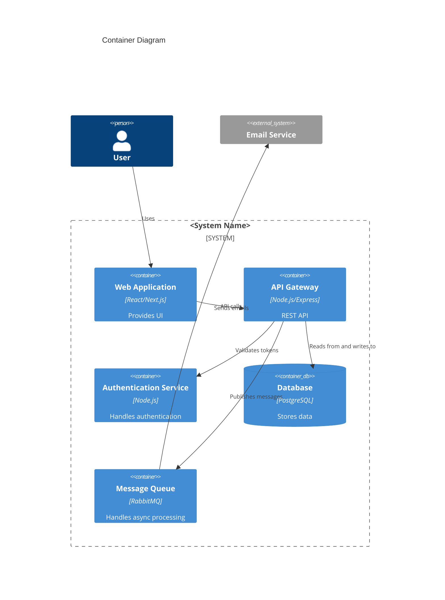
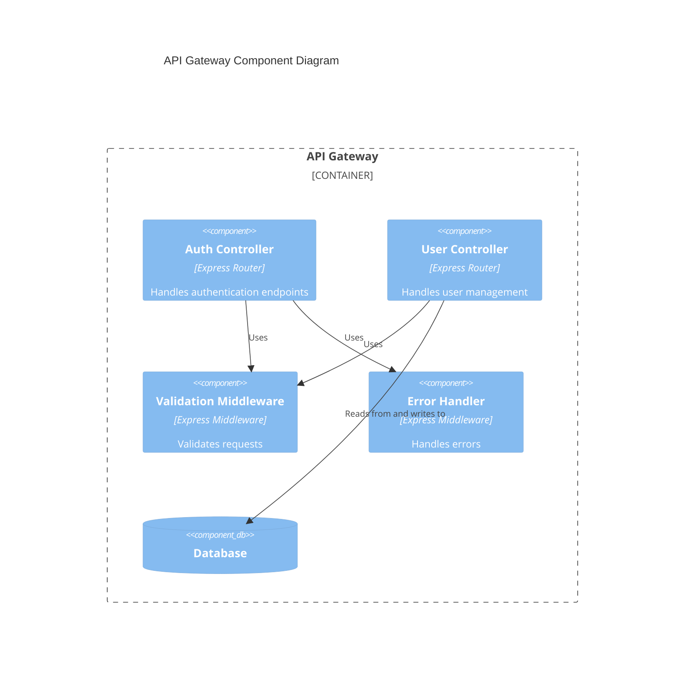
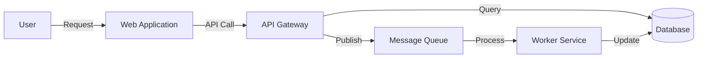

# Architecture Overview: <Project Name>

> This document describes the system-wide architecture, technology stack, design principles, and architectural patterns used across all features.

**Source Requirements:** SRS Section 2 (Overall Description), Section 7 (Quality Attributes)

---

## 1. Overview

**Purpose:**
> Describe the purpose of this architecture document and its scope.

**Architecture Principles:**
- <Principle 1: e.g., Microservices architecture, separation of concerns>
- <Principle 2: e.g., API-first design>
- <Principle 3: e.g., Scalability and high availability>
- <Principle 4: e.g., Security by design>

**Design Goals:**
- <Goal 1>
- <Goal 2>
- <Goal 3>

---

## 2. System Context (C4 Level 1)

> High-level view showing the system and its relationships with users and external systems.

**External Systems:**
- <External System 1>: <Purpose and relationship>
- <External System 2>: <Purpose and relationship>

**Users:**
- <User Type 1>: <Role and interaction>
- <User Type 2>: <Role and interaction>

---

## 3. Container Architecture (C4 Level 2)

> Shows the high-level technical building blocks (applications, databases, file systems, etc.).

**Containers:**

| Container | Technology | Purpose | Responsibilities |
|-----------|------------|---------|------------------|
| Web Application | <Tech Stack> | <Purpose> | <Responsibilities> |
| API Gateway | <Tech Stack> | <Purpose> | <Responsibilities> |
| Database | <DBMS> | <Purpose> | <Responsibilities> |
| Message Queue | <MQ Technology> | <Purpose> | <Responsibilities> |

---

## 4. Component Architecture (C4 Level 3)

> Shows how containers are broken down into components (for key containers only).

**Example: API Gateway Components**

---

## 5. Technology Stack

**Frontend:**
- Framework: <React/Vue/Angular>
- Language: <TypeScript/JavaScript>
- Build Tool: <Webpack/Vite>
- State Management: <Redux/Zustand>
- UI Library: <Material-UI/Ant Design>

**Backend:**
- Runtime: <Node.js/Python/Java>
- Framework: <Express/FastAPI/Spring Boot>
- Language: <TypeScript/Python/Java>

**Database:**
- Primary Database: <PostgreSQL/MySQL/MongoDB>
- Caching: <Redis/Memcached>
- Search: <Elasticsearch/OpenSearch> (if applicable)

**Infrastructure:**
- Containerization: <Docker>
- Orchestration: <Kubernetes/Docker Compose>
- Cloud Provider: <AWS/Azure/GCP>
- CI/CD: <GitHub Actions/Jenkins/GitLab CI>

**Other Services:**
- Message Queue: <RabbitMQ/Apache Kafka>
- Monitoring: <Prometheus/Grafana>
- Logging: <ELK Stack/CloudWatch>

---

## 6. Architectural Patterns

**Pattern 1: <Pattern Name>**
- **Description:** <Description of the pattern>
- **Rationale:** <Why this pattern is used>
- **Implementation:** <How it's implemented>

**Pattern 2: <Pattern Name>**
- **Description:** <Description>
- **Rationale:** <Rationale>
- **Implementation:** <Implementation>

**Common Patterns:**
- **Layered Architecture:** <Description>
- **Microservices:** <Description>
- **Event-Driven Architecture:** <Description>
- **API Gateway Pattern:** <Description>
- **Database per Service:** <Description>

---

## 7. Design Principles

**Separation of Concerns:**
> Each component/module should have a single, well-defined responsibility.

**Loose Coupling:**
> Components should interact through well-defined interfaces, minimizing dependencies.

**High Cohesion:**
> Related functionality should be grouped together within components.

**Scalability:**
> System should be designed to handle growth in users, data, and transactions.

**Security:**
> Security should be built into every layer of the architecture.

**Observability:**
> System should provide visibility into its operations through logging, monitoring, and tracing.

---

## 8. System Boundaries

**Internal Components:**
- <Component 1>
- <Component 2>

**External Dependencies:**
- <External Service 1>: <Purpose, SLA>
- <External Service 2>: <Purpose, SLA>

**Integration Points:**
- <Integration Point 1>: <Protocol, format>
- <Integration Point 2>: <Protocol, format>

---

## 9. Data Flow

**High-Level Data Flow:**

**Data Flow Patterns:**
- **Request-Response:** <Description>
- **Event-Driven:** <Description>
- **Batch Processing:** <Description>

---

## 10. Non-Functional Requirements

**Performance:**
- API Response Time: <Target, e.g., < 200ms for 95th percentile>
- Throughput: <Target, e.g., 1000 requests/second>
- Database Query Time: <Target>

**Scalability:**
- Horizontal Scaling: <Approach>
- Vertical Scaling: <Approach>
- Auto-scaling: <Configuration>

**Availability:**
- Target Uptime: <99.9%>
- Disaster Recovery: <Strategy>
- Backup Strategy: <Strategy>

**Security:**
- Authentication: <Method>
- Authorization: <Method>
- Data Encryption: <At rest, in transit>
- Compliance: <Standards>

---

## 11. Deployment Architecture

**Environments:**
- Development: <Description>
- Staging: <Description>
- Production: <Description>

**Deployment Strategy:**
- <Blue-Green/Canary/Rolling Update>

**Infrastructure Components:**
- Load Balancer: <Type and configuration>
- Application Servers: <Number and configuration>
- Database: <Configuration and replication>
- Caching Layer: <Configuration>

---

## 12. References

**Related Documents:**
- [Security Patterns](../common/security-patterns-template.md)
- [Performance Standards](../common/performance-standards-template.md)
- [Integration Patterns](../common/integration-patterns-template.md)
- [Deployment & Infrastructure](../common/deployment-infrastructure-template.md)
- [Basic Design - API Design](../../basic_design/api-design-template.md)
- [Basic Design - Database Design](../../basic_design/db-design-template.md)

**SRS References:**
- SRS Section 2: Overall Description
- SRS Section 7: Quality Attributes

---

## 13. Notes

**Design Decisions:**
- <Decision 1>: <Rationale>
- <Decision 2>: <Rationale>

**Trade-offs:**
- <Trade-off 1>: <Decision and rationale>
- <Trade-off 2>: <Decision and rationale>

**Future Considerations:**
- <Future enhancement 1>
- <Future enhancement 2>
