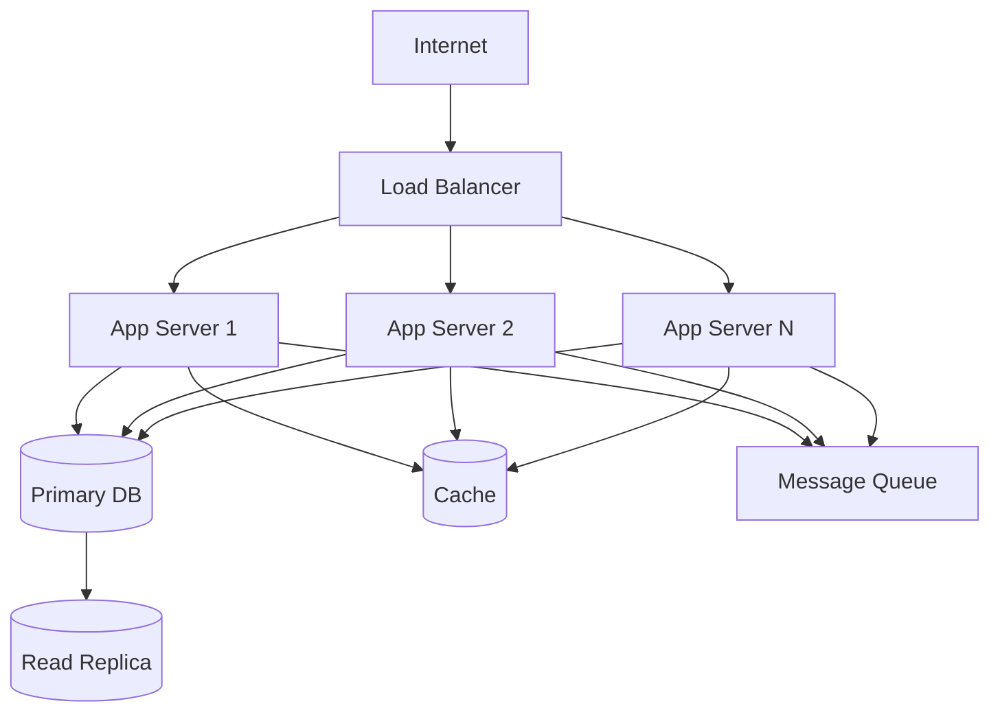

# Deployment & Infrastructure: <Project Name>

> This document describes the deployment architecture, infrastructure design, CI/CD pipelines, and operational procedures for the system.

**Source Requirements:** SRS Section 2.3 (Operating Environment), Section 7 (Quality Attributes)

---

## 1. Overview

**Purpose:**
> This document defines the infrastructure architecture, deployment strategies, and operational procedures to ensure reliable, scalable, and maintainable system deployment.

**Infrastructure Principles:**
- Infrastructure as Code
- Automated deployments
- Environment parity
- Security by default
- Monitoring and observability

---

## 2. Infrastructure Architecture

### 2.1 High-Level Architecture



### 2.2 Infrastructure Components

**Compute:**
- Application servers: <Type and configuration>
- Worker servers: <For background jobs>
- Auto-scaling groups: <Configuration>

**Storage:**
- Primary database: <Type and configuration>
- Read replicas: <Number and configuration>
- Cache: <Type and configuration>
- Object storage: <For files and assets>

**Networking:**
- Load balancer: <Type and configuration>
- CDN: <Configuration>
- VPC/Network: <Configuration>
- DNS: <Configuration>

**Monitoring:**
- Logging: <Tool and configuration>
- Metrics: <Tool and configuration>
- Tracing: <Tool and configuration>
- Alerting: <Configuration>

---

## 3. Containerization

### 3.1 Docker Configuration

**Dockerfile Structure:**
```dockerfile
FROM <base-image>
WORKDIR /app
COPY package*.json ./
RUN npm install
COPY . .
RUN npm run build
EXPOSE <port>
CMD ["npm", "start"]
```

**Docker Best Practices:**
- Use multi-stage builds
- Minimize image size
- Use specific version tags
- Run as non-root user
- Use .dockerignore
- Optimize layer caching

### 3.2 Container Orchestration

**Kubernetes (if used):**
- Deployment configurations
- Service definitions
- ConfigMaps and Secrets
- Ingress configuration
- Resource limits and requests
- Health checks

**Docker Compose (if used):**
- Service definitions
- Network configuration
- Volume mounts
- Environment variables

---

## 4. CI/CD Pipeline

### 4.1 Pipeline Stages

**Pipeline Flow:**

```mermaid
flowchart LR
    Code[Code Commit] --> Build[Build]
    Build --> Test[Test]
    Test --> Security[Security Scan]
    Security --> BuildImage[Build Image]
    BuildImage --> DeployDev[Deploy Dev]
    DeployDev --> IntegrationTest[Integration Tests]
    IntegrationTest --> DeployStaging[Deploy Staging]
    DeployStaging --> E2ETest[E2E Tests]
    E2ETest --> DeployProd[Deploy Production]
```



**Stages:**
1. **Build:** Compile code, install dependencies
2. **Test:** Run unit tests, integration tests
3. **Security Scan:** Scan for vulnerabilities
4. **Build Image:** Create Docker image
5. **Deploy Dev:** Deploy to development environment
6. **Integration Tests:** Run integration tests
7. **Deploy Staging:** Deploy to staging environment
8. **E2E Tests:** Run end-to-end tests
9. **Deploy Production:** Deploy to production (with approval)

### 4.2 CI/CD Configuration

**Build Configuration:**
- Build tool: <npm/yarn/maven/gradle>
- Build commands: <Commands>
- Artifact storage: <Location>

**Test Configuration:**
- Test framework: <Jest/Mocha/JUnit>
- Test coverage threshold: <Percentage>
- Test reports: <Location>

**Deployment Configuration:**
- Deployment tool: <Kubernetes/ECS/Heroku>
- Deployment strategy: <Blue-Green/Canary/Rolling>
- Rollback procedure: <Procedure>

### 4.3 Branching Strategy

**Branch Types:**
- **main/master:** Production-ready code
- **develop:** Integration branch
- **feature/***: Feature branches
- **release/***: Release preparation
- **hotfix/***: Production fixes

**Deployment Triggers:**
- Push to main: Deploy to production
- Push to develop: Deploy to staging
- Pull request: Deploy to preview environment

---

## 5. Environments

### 5.1 Environment Configuration

**Development:**
- Purpose: Local development and testing
- Infrastructure: <Minimal/Shared>
- Data: <Sample/Mock data>
- Access: <Open/Restricted>

**Staging:**
- Purpose: Pre-production testing
- Infrastructure: <Similar to production>
- Data: <Anonymized production data>
- Access: <Team access>

**Production:**
- Purpose: Live system
- Infrastructure: <Full scale>
- Data: <Real production data>
- Access: <Restricted>

### 5.2 Environment Variables

**Configuration Management:**
- Use environment variables for configuration
- Store secrets in secure vault
- Use different configs per environment
- Document all environment variables

**Secrets Management:**
- Tool: <AWS Secrets Manager/HashiCorp Vault>
- Rotation: <Strategy>
- Access control: <Policy>

---

## 6. Deployment Strategies

### 6.1 Blue-Green Deployment

**Process:**
1. Deploy new version to green environment
2. Test green environment
3. Switch traffic from blue to green
4. Monitor green environment
5. Keep blue as rollback option

**Advantages:**
- Zero downtime
- Easy rollback
- Safe testing

### 6.2 Canary Deployment

**Process:**
1. Deploy new version to subset of servers
2. Route small percentage of traffic to new version
3. Monitor metrics
4. Gradually increase traffic
5. Full rollout or rollback based on metrics

**Advantages:**
- Gradual rollout
- Risk mitigation
- Real-world testing

### 6.3 Rolling Deployment

**Process:**
1. Deploy new version to one server at a time
2. Wait for health check
3. Deploy to next server
4. Continue until all servers updated

**Advantages:**
- No additional infrastructure
- Gradual update
- Automatic rollback on failure

---

## 7. Infrastructure as Code

### 7.1 IaC Tools

**Tool:** <Terraform/CloudFormation/Ansible>

**Infrastructure Components:**
- Compute resources
- Storage resources
- Networking resources
- Security groups
- Load balancers
- Databases

### 7.2 Infrastructure Versioning

**Version Control:**
- Store IaC in version control
- Use branches for changes
- Review infrastructure changes
- Tag infrastructure versions

**Best Practices:**
- Modularize infrastructure code
- Use variables for configuration
- Document infrastructure
- Test infrastructure changes

---

## 8. Monitoring and Observability

### 8.1 Logging

**Log Aggregation:**
- Tool: <ELK Stack/CloudWatch/Splunk>
- Log retention: <Duration>
- Log levels: <DEBUG/INFO/WARN/ERROR>

**Structured Logging:**
```json
{
  "timestamp": "2025-01-15T10:30:00Z",
  "level": "INFO",
  "service": "user-service",
  "message": "User created",
  "user_id": "user123",
  "request_id": "req_123456789"
}
```

### 8.2 Metrics

**Application Metrics:**
- Response time
- Request rate
- Error rate
- Business metrics

**Infrastructure Metrics:**
- CPU utilization
- Memory utilization
- Disk I/O
- Network I/O

**Metrics Tool:** <Prometheus/CloudWatch/Datadog>

### 8.3 Tracing

**Distributed Tracing:**
- Tool: <Jaeger/Zipkin/OpenTelemetry>
- Trace requests across services
- Identify performance bottlenecks
- Debug distributed systems

### 8.4 Alerting

**Alert Rules:**
- High error rate
- Slow response times
- Resource exhaustion
- Service unavailability
- Security incidents

**Alert Channels:**
- Email
- Slack/Teams
- PagerDuty
- SMS

---

## 9. Disaster Recovery

### 9.1 Backup Strategy

**Backup Types:**
- **Database backups:** <Frequency and retention>
- **File backups:** <Frequency and retention>
- **Configuration backups:** <Frequency and retention>
- **Infrastructure backups:** <IaC versioning>

**Backup Storage:**
- Location: <Region/Zone>
- Encryption: <Yes/No>
- Retention: <Duration>

### 9.2 Recovery Procedures

**Recovery Time Objective (RTO):** <Target, e.g., 4 hours>
**Recovery Point Objective (RPO):** <Target, e.g., 1 hour>

**Recovery Procedures:**
1. Identify failure
2. Assess impact
3. Execute recovery plan
4. Verify recovery
5. Document incident

### 9.3 High Availability

**HA Configuration:**
- Multi-AZ deployment
- Database replication
- Load balancing
- Auto-scaling
- Health checks

---

## 10. Security

### 10.1 Infrastructure Security

**Network Security:**
- VPC configuration
- Security groups
- Network ACLs
- DDoS protection

**Access Control:**
- IAM roles and policies
- Least privilege principle
- MFA for sensitive operations
- Audit logging

### 10.2 Data Security

**Encryption:**
- Encryption at rest
- Encryption in transit
- Key management
- Certificate management

**Compliance:**
- <GDPR/PCI-DSS/HIPAA>
- Data residency requirements
- Audit trails

---

## 11. Cost Optimization

### 11.1 Cost Management

**Strategies:**
- Right-size resources
- Use reserved instances
- Auto-scaling
- Spot instances for non-critical workloads
- Monitor and optimize costs

**Cost Monitoring:**
- Track costs by service
- Set budget alerts
- Regular cost reviews
- Optimize unused resources

---

## 12. References

**Related Documents:**
- [Architecture Overview](../common/architecture-overview-template.md)
- [Performance Standards](../common/performance-standards-template.md)
- [Security Patterns](../common/security-patterns-template.md)
- [Feature Detail Design Template](../feature-detail-design-template.md)

**SRS References:**
- SRS Section 2.3: Operating Environment
- SRS Section 7: Quality Attributes

---

## 13. Notes

**Infrastructure Considerations:**
- <Consideration 1>
- <Consideration 2>

**Future Enhancements:**
- <Enhancement 1>
- <Enhancement 2>
