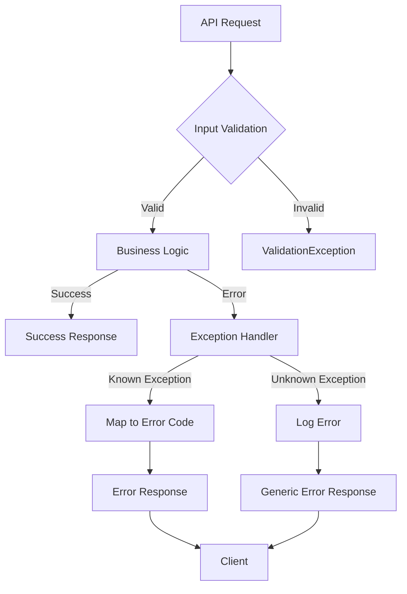

# Error Handling Patterns: <Project Name>

> This document defines standard error handling patterns, error codes, exception handling strategies, and user-facing error messages used across all features.

**Source Requirements:** SRS Section 7 (Quality Attributes - Reliability)

---

## 1. Overview

**Purpose:**
> This document establishes error handling standards that ensure consistent error responses, proper logging, and good user experience across all features.

**Error Handling Principles:**
- Fail fast and fail clearly
- Provide meaningful error messages
- Log errors for debugging
- Don't expose sensitive information
- Handle errors gracefully

---

## 2. Standard Error Response Format

### 2.1 API Error Response

**Standard Format:**
```json
{
  "error": {
    "code": "ERROR_CODE",
    "message": "Human-readable error message",
    "details": {
      "field": "Additional error details",
      "timestamp": "2025-01-15T10:30:00Z",
      "request_id": "req_123456789"
    },
    "errors": [
      {
        "field": "email",
        "message": "Invalid email format"
      }
    ]
  }
}
```

**HTTP Status Codes:**
- `400 Bad Request`: Client error (validation, malformed request)
- `401 Unauthorized`: Authentication required
- `403 Forbidden`: Insufficient permissions
- `404 Not Found`: Resource not found
- `409 Conflict`: Resource conflict (duplicate, constraint violation)
- `422 Unprocessable Entity`: Validation errors
- `429 Too Many Requests`: Rate limit exceeded
- `500 Internal Server Error`: Server error
- `503 Service Unavailable`: Service temporarily unavailable

### 2.2 Error Response Fields

| Field | Type | Required | Description |
|-------|------|----------|-------------|
| `error.code` | string | Yes | Machine-readable error code |
| `error.message` | string | Yes | Human-readable error message |
| `error.details` | object | No | Additional error context |
| `error.errors` | array | No | Field-specific validation errors |
| `error.timestamp` | string | Yes | ISO 8601 timestamp |
| `error.request_id` | string | Yes | Unique request identifier for tracing |

---

## 3. Error Code Taxonomy

### 3.1 Error Code Format

**Format:** `<CATEGORY>_<SUBCATEGORY>_<SPECIFIC>`

**Categories:**
- `VALIDATION`: Input validation errors
- `AUTHENTICATION`: Authentication failures
- `AUTHORIZATION`: Authorization failures
- `NOT_FOUND`: Resource not found
- `CONFLICT`: Resource conflicts
- `EXTERNAL`: External service errors
- `INTERNAL`: Internal server errors
- `RATE_LIMIT`: Rate limiting errors

### 3.2 Common Error Codes

**Validation Errors:**
- `VALIDATION_REQUIRED`: Required field missing
- `VALIDATION_INVALID_FORMAT`: Invalid format
- `VALIDATION_OUT_OF_RANGE`: Value out of allowed range
- `VALIDATION_DUPLICATE`: Duplicate value not allowed

**Authentication Errors:**
- `AUTH_INVALID_CREDENTIALS`: Invalid username/password
- `AUTH_TOKEN_EXPIRED`: Authentication token expired
- `AUTH_TOKEN_INVALID`: Invalid authentication token
- `AUTH_REQUIRED`: Authentication required

**Authorization Errors:**
- `AUTHZ_INSUFFICIENT_PERMISSIONS`: User lacks required permissions
- `AUTHZ_RESOURCE_FORBIDDEN`: Access to resource forbidden
- `AUTHZ_ROLE_REQUIRED`: Specific role required

**Not Found Errors:**
- `NOT_FOUND_RESOURCE`: Resource not found
- `NOT_FOUND_ENDPOINT`: API endpoint not found

**Conflict Errors:**
- `CONFLICT_DUPLICATE`: Duplicate resource
- `CONFLICT_STATE`: Invalid state for operation
- `CONFLICT_CONCURRENT_MODIFICATION`: Concurrent modification detected

**External Service Errors:**
- `EXTERNAL_SERVICE_UNAVAILABLE`: External service unavailable
- `EXTERNAL_SERVICE_TIMEOUT`: External service timeout
- `EXTERNAL_SERVICE_ERROR`: External service error

**Internal Errors:**
- `INTERNAL_SERVER_ERROR`: Internal server error
- `INTERNAL_DATABASE_ERROR`: Database error
- `INTERNAL_PROCESSING_ERROR`: Processing error

**Rate Limit Errors:**
- `RATE_LIMIT_EXCEEDED`: Rate limit exceeded
- `RATE_LIMIT_QUOTA_EXCEEDED`: Quota exceeded

---

## 4. Exception Handling Strategy

### 4.1 Exception Hierarchy

**Exception Types:**
```
BaseException
├── ValidationException
│   ├── RequiredFieldException
│   ├── InvalidFormatException
│   └── OutOfRangeException
├── AuthenticationException
│   ├── InvalidCredentialsException
│   └── TokenExpiredException
├── AuthorizationException
│   └── InsufficientPermissionsException
├── NotFoundException
├── ConflictException
│   └── DuplicateResourceException
├── ExternalServiceException
│   ├── ServiceUnavailableException
│   └── ServiceTimeoutException
└── InternalException
    ├── DatabaseException
    └── ProcessingException
```

### 4.2 Exception Handling Flow



### 4.3 Exception Handling Best Practices

**Do:**
- Catch specific exceptions
- Log errors with context
- Return appropriate HTTP status codes
- Provide meaningful error messages
- Include request ID for tracing

**Don't:**
- Expose internal implementation details
- Return stack traces to clients
- Log sensitive information
- Swallow exceptions silently
- Return generic "Something went wrong" messages

---

## 5. User-Facing Error Messages

### 5.1 Message Guidelines

**Principles:**
- Clear and concise
- Actionable when possible
- User-friendly language
- Avoid technical jargon
- Don't blame the user

### 5.2 Message Examples

**Good Messages:**
- "Please enter a valid email address"
- "Password must be at least 8 characters long"
- "This email is already registered. Please sign in or use a different email"
- "We couldn't find the page you're looking for"

**Bad Messages:**
- "Error 500"
- "Invalid input"
- "Database connection failed"
- "Null pointer exception"

### 5.3 Localization

**Error Message Localization:**
- Store error messages in resource files
- Support multiple languages
- Use message keys for consistency
- Provide default fallback messages

---

## 6. Logging and Monitoring

### 6.1 Error Logging

**Log Levels:**
- **ERROR**: Errors that require attention but don't stop the system
- **CRITICAL**: Critical errors that may stop the system
- **WARNING**: Warnings that may indicate problems

**Log Format:**
```json
{
  "timestamp": "2025-01-15T10:30:00Z",
  "level": "ERROR",
  "error_code": "VALIDATION_INVALID_FORMAT",
  "message": "Invalid email format",
  "request_id": "req_123456789",
  "user_id": "user123",
  "ip_address": "192.168.1.1",
  "stack_trace": "...",
  "context": {
    "field": "email",
    "value": "invalid-email"
  }
}
```

### 6.2 Error Monitoring

**Monitoring Metrics:**
- Error rate by error code
- Error rate by endpoint
- Error rate over time
- Response time for error cases

**Alerting:**
- Critical error threshold exceeded
- Unusual error pattern detected
- Error rate spike detected

---

## 7. Retry and Recovery Patterns

### 7.1 Retry Strategy

**When to Retry:**
- Transient errors (network timeouts, temporary service unavailability)
- Rate limit errors (with backoff)
- External service errors

**When NOT to Retry:**
- Client errors (4xx)
- Authentication/authorization errors
- Validation errors
- Permanent failures

### 7.2 Retry Configuration

**Retry Parameters:**
- Max Retries: <Number, e.g., 3>
- Initial Delay: <Duration, e.g., 100ms>
- Backoff Strategy: <Exponential/Linear>
- Max Delay: <Duration, e.g., 5s>

**Exponential Backoff Example:**
```
Attempt 1: Wait 100ms
Attempt 2: Wait 200ms
Attempt 3: Wait 400ms
Attempt 4: Wait 800ms
```

### 7.3 Circuit Breaker Pattern

**Circuit Breaker States:**
- **Closed**: Normal operation
- **Open**: Failing, reject requests immediately
- **Half-Open**: Testing if service recovered

**Configuration:**
- Failure Threshold: <Number of failures to open circuit>
- Timeout: <Duration before attempting recovery>
- Success Threshold: <Number of successes to close circuit>

---

## 8. Error Handling by Layer

### 8.1 Client-Side Error Handling

**Responsibilities:**
- Display user-friendly error messages
- Handle network errors
- Retry failed requests when appropriate
- Show loading states
- Handle validation errors

### 8.2 API Gateway Error Handling

**Responsibilities:**
- Validate request format
- Handle authentication errors
- Rate limiting
- Request/response transformation
- Error response formatting

### 8.3 Application Layer Error Handling

**Responsibilities:**
- Business logic validation
- Exception catching and mapping
- Error logging
- Error response generation

### 8.4 Database Layer Error Handling

**Responsibilities:**
- Handle database connection errors
- Handle constraint violations
- Handle transaction errors
- Map database errors to application errors

---

## 9. Error Handling Examples

### 9.1 Validation Error Example

**Request:**
```http
POST /api/users
Content-Type: application/json

{
  "email": "invalid-email",
  "age": -5
}
```

**Response:**
```http
HTTP/1.1 422 Unprocessable Entity
Content-Type: application/json

{
  "error": {
    "code": "VALIDATION_ERROR",
    "message": "Validation failed",
    "timestamp": "2025-01-15T10:30:00Z",
    "request_id": "req_123456789",
    "errors": [
      {
        "field": "email",
        "message": "Invalid email format"
      },
      {
        "field": "age",
        "message": "Age must be a positive number"
      }
    ]
  }
}
```

### 9.2 Authentication Error Example

**Request:**
```http
GET /api/users/me
Authorization: Bearer invalid_token
```

**Response:**
```http
HTTP/1.1 401 Unauthorized
Content-Type: application/json

{
  "error": {
    "code": "AUTH_TOKEN_INVALID",
    "message": "Invalid authentication token",
    "timestamp": "2025-01-15T10:30:00Z",
    "request_id": "req_123456789"
  }
}
```

### 9.3 Not Found Error Example

**Request:**
```http
GET /api/users/999
```

**Response:**
```http
HTTP/1.1 404 Not Found
Content-Type: application/json

{
  "error": {
    "code": "NOT_FOUND_RESOURCE",
    "message": "User not found",
    "timestamp": "2025-01-15T10:30:00Z",
    "request_id": "req_123456789"
  }
}
```

---

## 10. References

**Related Documents:**
- [Security Patterns](../common/security-patterns-template.md)
- [Feature Detail Design Template](../feature-detail-design-template.md)

**SRS References:**
- SRS Section 7: Quality Attributes - Reliability

---

## 11. Notes

**Error Handling Considerations:**
- <Consideration 1>
- <Consideration 2>

**Future Enhancements:**
- <Enhancement 1>
- <Enhancement 2>
