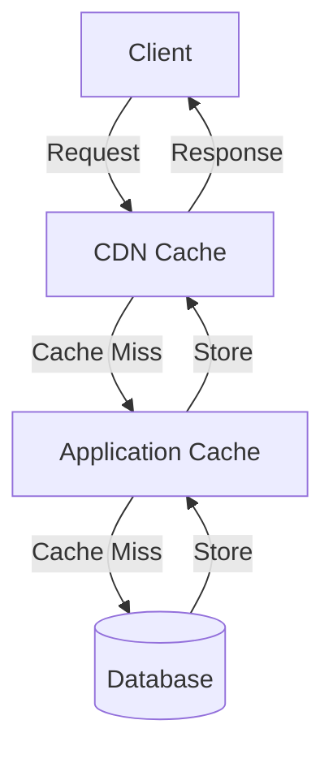

# Performance Standards: <Project Name>

> This document defines performance requirements, optimization strategies, caching approaches, and scalability patterns used across all features.

**Source Requirements:** SRS Section 7.2 (Performance Requirements)

---

## 1. Overview

**Purpose:**
> This document establishes performance standards and optimization guidelines that ensure the system meets performance requirements and scales effectively.

**Performance Principles:**
- Measure before optimizing
- Optimize bottlenecks, not everything
- Cache aggressively where appropriate
- Design for horizontal scalability
- Monitor and alert on performance metrics

---

## 2. Performance Requirements

### 2.1 Response Time Targets

**API Response Times:**
- **P50 (Median):** <Target, e.g., < 100ms>
- **P95 (95th percentile):** <Target, e.g., < 200ms>
- **P99 (99th percentile):** <Target, e.g., < 500ms>
- **P99.9 (99.9th percentile):** <Target, e.g., < 1000ms>

**Page Load Times:**
- **First Contentful Paint (FCP):** <Target, e.g., < 1.5s>
- **Largest Contentful Paint (LCP):** <Target, e.g., < 2.5s>
- **Time to Interactive (TTI):** <Target, e.g., < 3.5s>

**Database Query Times:**
- **Simple queries:** <Target, e.g., < 10ms>
- **Complex queries:** <Target, e.g., < 100ms>
- **Aggregation queries:** <Target, e.g., < 500ms>

### 2.2 Throughput Targets

**API Throughput:**
- **Requests per second (RPS):** <Target, e.g., 1000 RPS>
- **Concurrent users:** <Target, e.g., 10,000 concurrent>
- **Peak load handling:** <Target, e.g., 3x normal load>

**Database Throughput:**
- **Transactions per second (TPS):** <Target>
- **Read operations per second:** <Target>
- **Write operations per second:** <Target>

### 2.3 Resource Utilization

**CPU Usage:**
- **Average:** <Target, e.g., < 70%>
- **Peak:** <Target, e.g., < 90%>

**Memory Usage:**
- **Average:** <Target, e.g., < 80%>
- **Peak:** <Target, e.g., < 90%>

**Database Connections:**
- **Connection pool size:** <Configuration>
- **Max connections:** <Limit>

---

## 3. Caching Strategies

### 3.1 Caching Layers

**Multi-Layer Caching:**



**Caching Layers:**
1. **CDN Cache:** Static assets, API responses
2. **Application Cache:** In-memory cache (Redis, Memcached)
3. **Database Cache:** Query result cache
4. **Browser Cache:** Client-side caching

### 3.2 Cache Types

**Cache-Aside (Lazy Loading):**
```
1. Check cache
2. If cache miss, fetch from database
3. Store in cache
4. Return data
```

**Write-Through:**
```
1. Write to database
2. Write to cache
3. Return success
```

**Write-Back (Write-Behind):**
```
1. Write to cache
2. Return success immediately
3. Asynchronously write to database
```

**Refresh-Ahead:**
```
1. Proactively refresh cache before expiration
2. Serve from cache
```

### 3.3 Cache Invalidation

**Invalidation Strategies:**
- **Time-based expiration:** Cache expires after TTL
- **Event-based invalidation:** Invalidate on data changes
- **Tag-based invalidation:** Invalidate by tags
- **Manual invalidation:** Explicit cache clearing

**Cache Keys:**
- Format: `<resource>:<identifier>:<version>`
- Example: `user:123:v1`, `product:456:cache`

**TTL Configuration:**
- **Static data:** Long TTL (hours/days)
- **Semi-static data:** Medium TTL (minutes)
- **Dynamic data:** Short TTL (seconds) or no cache

### 3.4 What to Cache

**Good Candidates:**
- Frequently accessed data
- Expensive computations
- Database query results
- API responses
- Static content
- User sessions

**Don't Cache:**
- Frequently changing data
- User-specific sensitive data (unless encrypted)
- Large binary data
- Real-time data

---

## 4. Database Optimization

### 4.1 Query Optimization

**Optimization Techniques:**
- Use appropriate indexes
- Avoid N+1 queries
- Use query pagination
- Select only needed columns
- Use database-specific optimizations

**Indexing Strategy:**
- Index frequently queried columns
- Index foreign keys
- Composite indexes for multi-column queries
- Monitor index usage
- Remove unused indexes

### 4.2 Connection Pooling

**Connection Pool Configuration:**
- **Min connections:** <Number>
- **Max connections:** <Number>
- **Idle timeout:** <Duration>
- **Connection timeout:** <Duration>

**Best Practices:**
- Reuse connections
- Monitor pool usage
- Set appropriate pool size
- Handle connection failures gracefully

### 4.3 Database Scaling

**Scaling Strategies:**
- **Read replicas:** Distribute read load
- **Sharding:** Partition data across databases
- **Partitioning:** Partition tables by range/hash
- **Archiving:** Move old data to archive storage

---

## 5. API Optimization

### 5.1 Response Optimization

**Techniques:**
- **Pagination:** Limit response size
- **Field selection:** Allow clients to request specific fields
- **Compression:** Gzip/Brotli compression
- **Response caching:** Cache API responses
- **Batch requests:** Combine multiple requests

### 5.2 Request Optimization

**Techniques:**
- **Request validation:** Fail fast on invalid requests
- **Rate limiting:** Prevent abuse
- **Request batching:** Combine multiple operations
- **Async processing:** Process long-running tasks asynchronously

### 5.3 API Design for Performance

**Best Practices:**
- Use appropriate HTTP methods
- Implement proper status codes
- Use HTTP caching headers
- Support conditional requests (ETag, Last-Modified)
- Provide bulk operations endpoints

---

## 6. Scalability Patterns

### 6.1 Horizontal Scaling

**Approach:**
- Stateless application servers
- Load balancing
- Shared state in external store (Redis, database)
- Auto-scaling based on metrics

**Scaling Triggers:**
- CPU utilization > threshold
- Memory utilization > threshold
- Request queue length > threshold
- Response time > threshold

### 6.2 Vertical Scaling

**Approach:**
- Increase server resources (CPU, RAM)
- Upgrade database instance
- Optimize application code
- Use faster hardware

**When to Use:**
- Small to medium scale
- Quick performance boost needed
- Cost-effective for current load

### 6.3 Auto-Scaling Configuration

**Scaling Policies:**
- **Scale-up:** Add instances when metrics exceed threshold
- **Scale-down:** Remove instances when metrics below threshold
- **Cooldown period:** Wait before scaling again
- **Min/Max instances:** Set boundaries

---

## 7. Performance Monitoring

### 7.1 Key Metrics

**Application Metrics:**
- Response time (P50, P95, P99, P99.9)
- Request rate (RPS)
- Error rate
- Active connections
- Queue length

**Infrastructure Metrics:**
- CPU utilization
- Memory utilization
- Disk I/O
- Network I/O
- Database connections

**Business Metrics:**
- User actions per second
- Transaction completion rate
- User satisfaction scores

### 7.2 Monitoring Tools

**Tools:**
- <APM tool, e.g., New Relic, Datadog>
- <Application logs>
- <Database monitoring>
- <Infrastructure monitoring>

**Dashboards:**
- Real-time performance dashboard
- Historical performance trends
- Error rate dashboard
- Resource utilization dashboard

### 7.3 Alerting

**Alert Conditions:**
- Response time > threshold
- Error rate > threshold
- Resource utilization > threshold
- Service availability < threshold

**Alert Channels:**
- Email notifications
- Slack/Teams notifications
- PagerDuty escalations
- SMS notifications

---

## 8. Performance Testing

### 8.1 Testing Types

**Load Testing:**
- Test under expected load
- Identify performance bottlenecks
- Verify system meets requirements

**Stress Testing:**
- Test beyond normal capacity
- Find breaking points
- Test system recovery

**Spike Testing:**
- Test sudden load increases
- Verify system handles spikes
- Test auto-scaling

**Endurance Testing:**
- Test over extended period
- Identify memory leaks
- Test resource stability

### 8.2 Performance Test Scenarios

**Scenarios:**
- Normal load scenario
- Peak load scenario
- Gradual load increase
- Sudden load spike
- Sustained high load

### 8.3 Performance Benchmarks

**Baseline Metrics:**
- Establish baseline performance
- Document expected performance
- Set performance targets
- Track performance over time

---

## 9. Optimization Checklist

**Application Optimization:**
- [ ] Database queries optimized
- [ ] Appropriate indexes created
- [ ] Caching implemented
- [ ] N+1 queries eliminated
- [ ] Pagination implemented
- [ ] Response compression enabled
- [ ] Unnecessary data processing removed
- [ ] Async processing for long operations

**Infrastructure Optimization:**
- [ ] Connection pooling configured
- [ ] Load balancing configured
- [ ] Auto-scaling configured
- [ ] CDN configured
- [ ] Caching layer configured
- [ ] Monitoring and alerting set up

---

## 10. References

**Related Documents:**
- [Architecture Overview](../common/architecture-overview-template.md)
- [Feature Detail Design Template](../feature-detail-design-template.md)

**SRS References:**
- SRS Section 7.2: Performance Requirements

---

## 11. Notes

**Performance Considerations:**
- <Consideration 1>
- <Consideration 2>

**Future Enhancements:**
- <Enhancement 1>
- <Enhancement 2>
