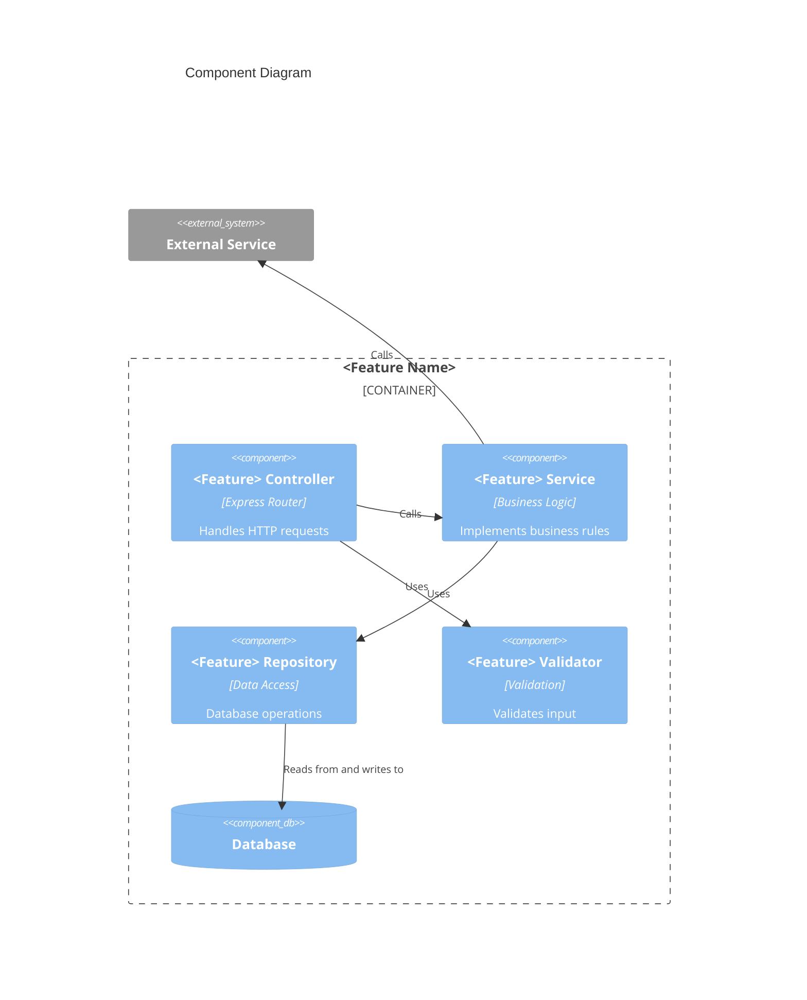
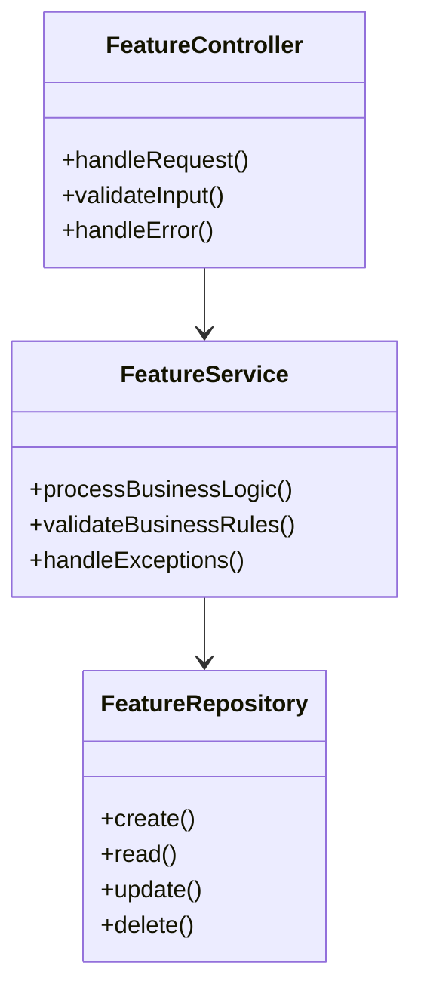
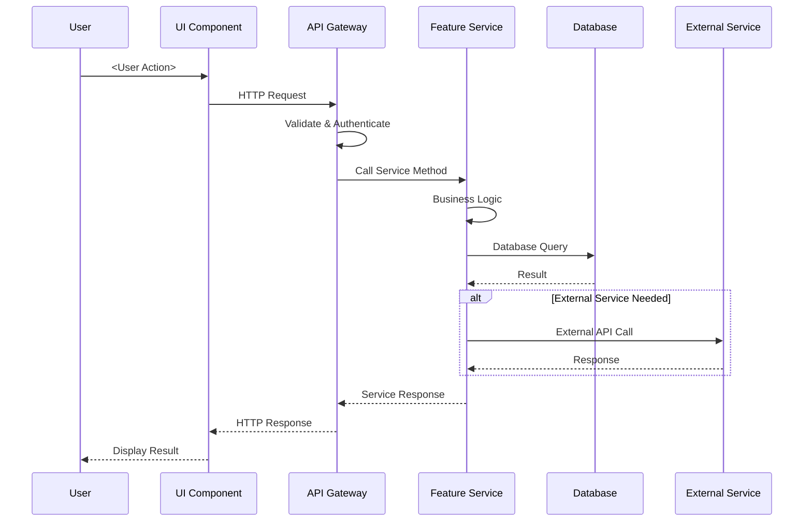
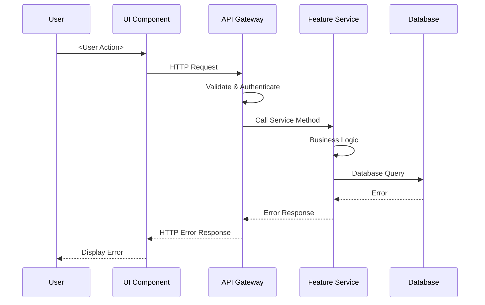
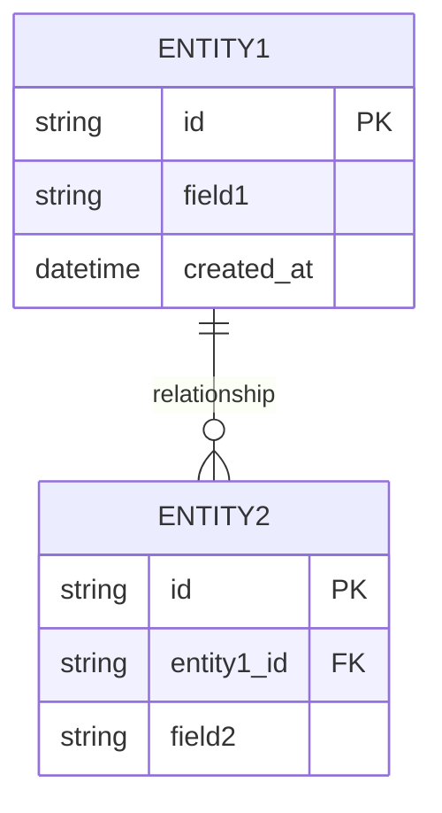
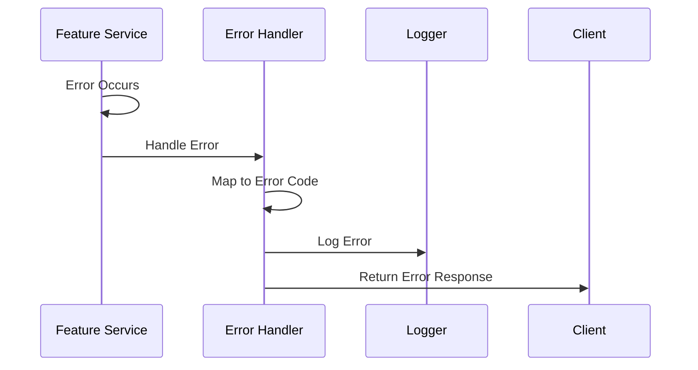

# Detail Design: <Feature Name>

> This document is the **detail spec for one feature**. It describes the detailed design and implementation approach for <Feature Name>, including component design, sequence diagrams, API specifications, database schema, UI design, and implementation considerations.
>
> For the list of all features, see [Detail Design: Feature List](feature-list-template.md).

**Source Requirements:** SRS Section 4.X - <Feature Name>

**Related Documents:**
- [Feature List](feature-list-template.md) — index of all features
- [Architecture Overview](common/architecture-overview-template.md)
- [Security Patterns](common/security-patterns-template.md)
- [Error Handling Patterns](common/error-handling-patterns-template.md)
- [Performance Standards](common/performance-standards-template.md)
- [Integration Patterns](common/integration-patterns-template.md)
- [Deployment & Infrastructure](common/deployment-infrastructure-template.md)
- [Basic Design - API Design](../../basic_design/api-design-template.md)
- [Basic Design - Database Design](../../basic_design/db-design-template.md)
- [Basic Design - Mockup Screens](../../basic_design/mockup-screens-template.md)

---

## 1. Feature Implementation Overview

### 1.1 Feature Summary

**Feature Name:** <Feature Name>

**SRS Reference:** SRS Section 4.X

**Priority:** <High/Medium/Low>

**Brief Description:**
> Provide a concise description of how this feature will be implemented at a high level.

**Implementation Approach:**
> Describe the overall approach to implementing this feature (e.g., microservice, module, component).

**Architecture Reference:**
> Reference the [Architecture Overview](common/architecture-overview-template.md) for system-wide architecture patterns.

### 1.2 Design Decisions

**Key Design Decisions:**

| Decision | Rationale | Alternatives Considered |
|----------|-----------|------------------------|
| <Decision 1> | <Why this approach> | <Alternative 1, Alternative 2> |
| <Decision 2> | <Why this approach> | <Alternative 1, Alternative 2> |

**Technology Choices:**
- <Technology 1>: <Reason>
- <Technology 2>: <Reason>

### 1.3 Dependencies

**Internal Dependencies:**
- <Feature/Module 1>: <Dependency description>
- <Feature/Module 2>: <Dependency description>

**External Dependencies:**
- <External Service 1>: <Dependency description>
- <External Service 2>: <Dependency description>

**Infrastructure Dependencies:**
- <Infrastructure Component 1>: <Dependency description>
- <Infrastructure Component 2>: <Dependency description>

---

## 2. Component Design

### 2.1 Component Overview

> Describe the components/modules needed to implement this feature.

**Component Diagram:**



### 2.2 Component Responsibilities

**<Component Name>:**
- **Purpose:** <What this component does>
- **Responsibilities:**
  - <Responsibility 1>
  - <Responsibility 2>
  - <Responsibility 3>
- **Interfaces:**
  - Input: <Input description>
  - Output: <Output description>
- **Dependencies:** <Other components/services>

### 2.3 Class Design

**Class Diagram (if applicable):**



**Key Classes:**

| Class | Purpose | Key Methods |
|-------|---------|-------------|
| `<Class Name>` | <Purpose> | `<method1()>, <method2()>` |
| `<Class Name>` | <Purpose> | `<method1()>, <method2()>` |

---

## 3. Sequence Diagrams

### 3.1 Primary Flow: <Use Case Name>

**SRS Reference:** SRS Section 4.X.X - <Use Case>

**Sequence Diagram:**



**Flow Description:**
1. <Step 1>
2. <Step 2>
3. <Step 3>

### 3.2 Alternative Flow: <Alternative Scenario>

**SRS Reference:** SRS Section 4.X.X - <Alternative Flow>

**Sequence Diagram:**



### 3.3 Error Flow: <Error Scenario>

**SRS Reference:** SRS Section 4.X.X - <Error Handling>

> Describe error handling flow. Reference [Error Handling Patterns](common/error-handling-patterns-template.md) for standard error handling.

---

## 4. API Design

### 4.1 API Overview

**Base Path:** `/api/v1/<feature>`

**Authentication:** Required (Reference [Security Patterns](common/security-patterns-template.md))

**API Reference:** See [Basic Design - API Design](../../basic_design/api-design-template.md) for API design standards.

### 4.2 Endpoints

#### 4.2.1 `POST /api/v1/<feature>`

**Summary:** <Create resource>

**SRS Reference:** SRS Section 4.X.X - <Requirement>

**Operation ID:** `create<Resource>`

**Authentication:** Required

**Request:**

**Headers:**
```
Authorization: Bearer <token>
Content-Type: application/json
```

**Body Schema:**
```json
{
  "field1": "<type>",
  "field2": "<type>",
  "field3": "<type>"
}
```

**Field Descriptions:**

| Field | Type | Required | Validation | Description |
|-------|------|----------|------------|-------------|
| `field1` | `<type>` | Yes | <Validation rules> | <Description> |
| `field2` | `<type>` | No | <Validation rules> | <Description> |

**Example Request:**
```json
{
  "field1": "value1",
  "field2": "value2"
}
```

**Responses:**

**201 Created:**
```json
{
  "id": "resource123",
  "field1": "value1",
  "field2": "value2",
  "created_at": "2025-01-15T10:30:00Z"
}
```

**400 Bad Request:**
> Reference [Error Handling Patterns](common/error-handling-patterns-template.md) for standard error format.

**401 Unauthorized:**
> Reference [Security Patterns](common/security-patterns-template.md) for authentication errors.

#### 4.2.2 `GET /api/v1/<feature>/{id}`

**Summary:** <Get resource>

**SRS Reference:** SRS Section 4.X.X - <Requirement>

**Operation ID:** `get<Resource>`

**Authentication:** Required

**Path Parameters:**

| Parameter | Type | Required | Description |
|-----------|------|----------|-------------|
| `id` | string | Yes | Resource identifier |

**Query Parameters:**

| Parameter | Type | Required | Description |
|-----------|------|----------|-------------|
| `include` | string | No | Related resources to include |
| `fields` | string | No | Fields to return |

**Responses:**

**200 OK:**
```json
{
  "id": "resource123",
  "field1": "value1",
  "field2": "value2",
  "created_at": "2025-01-15T10:30:00Z"
}
```

**404 Not Found:**
> Reference [Error Handling Patterns](common/error-handling-patterns-template.md).

### 4.3 API Security

**Security Requirements:**
> Reference [Security Patterns](common/security-patterns-template.md) for:
- Authentication mechanism
- Authorization requirements
- Input validation
- Rate limiting

**Feature-Specific Security:**
- <Security requirement 1>
- <Security requirement 2>

---

## 5. Database Design

### 5.1 Database Schema

**SRS Reference:** SRS Section 5 (Data Requirements)

**Database Reference:** See [Basic Design - Database Design](../../basic_design/db-design-template.md) for database design standards.

**Entity Relationship Diagram:**



### 5.2 Tables

#### 5.2.1 `<table_name>`

**Purpose:**
> Describe what this table stores and its role in this feature.

**Primary Key:** `<field_name>` (<data_type>)

**Fields:**

| Field Name | Data Type | Constraints | Description |
|------------|-----------|-------------|-------------|
| `<field_name>` | `<type>` | `<UNIQUE/NOT NULL>` | <Description> |
| `<field_name>` | `<type>` | `<constraints>` | <Description> |

**Indexes:**
- `<index_name>` on `<field_name>` (<purpose>)

**Foreign Keys:**
- `<field_name>` → `<referenced_table>.<referenced_field>` (<relationship description>)

**Business Rules:**
- <Business rule 1>
- <Business rule 2>

### 5.3 Data Access Patterns

**Read Patterns:**
- <Pattern 1>: <Description>
- <Pattern 2>: <Description>

**Write Patterns:**
- <Pattern 1>: <Description>
- <Pattern 2>: <Description>

**Query Optimization:**
> Reference [Performance Standards](common/performance-standards-template.md) for database optimization guidelines.

---

## 6. UI Design

### 6.1 Screen Overview

**SRS Reference:** SRS Section 6.1 (User Interfaces)

**UI Reference:** See [Basic Design - Mockup Screens](../../basic_design/mockup-screens-template.md) for UI design standards.

**Screens:**
- <Screen 1>: <Purpose>
- <Screen 2>: <Purpose>
- <Screen 3>: <Purpose>

### 6.2 Screen: <Screen Name>

**Purpose:**
> Describe the purpose of this screen and what users can accomplish.

**User Role:** <Role that uses this screen>

**SRS Reference:** SRS Section 4.X.X - <Feature/Requirement>

**Wireframe Reference:**
> Link to wireframe or mockup image, or provide ASCII wireframe.

**Layout Structure:**

| Component | Position | Width/Height | Description |
|-----------|----------|--------------|-------------|
| **Header** | Top | 100% × 60px | <Description> |
| **Main Content** | Center | flex: 1 | <Description> |
| **Sidebar** | Right | 300px × auto | <Description> |

**Key Components:**

**<Component Name>:**
- **Purpose:** <What it does>
- **Visual Representation:**
  ```
  ┌─────────────────────────────┐
  │ [Icon] Title Text            │
  │ ───────────────────────────  │
  │ Content area                 │
  │ [Button] [Button]            │
  └─────────────────────────────┘
  ```
- **Elements:**
  - <Element 1>: <Description>
  - <Element 2>: <Description>
- **Interactions:**
  - <Interaction 1>: <Description>
  - <Interaction 2>: <Description>

### 6.3 User Flows

**Primary Flow:**
1. <Step 1>
2. <Step 2>
3. <Step 3>

**Alternative Flow:**
1. <Step 1>
2. <Step 2>

### 6.4 Responsive Design

**Breakpoints:**
- Mobile: <Width>
- Tablet: <Width>
- Desktop: <Width>

**Mobile Adaptations:**
- <Adaptation 1>
- <Adaptation 2>

---

## 7. Security Considerations

### 7.1 Authentication & Authorization

**Reference:** [Security Patterns](common/security-patterns-template.md)

**Feature-Specific Requirements:**
- <Requirement 1>: <Description>
- <Requirement 2>: <Description>

**Authorization Rules:**
- <Rule 1>: <Who can do what>
- <Rule 2>: <Who can do what>

### 7.2 Data Protection

**Sensitive Data:**
- <Data type 1>: <Protection method>
- <Data type 2>: <Protection method>

**Encryption:**
- <What is encrypted>: <Method>
- <What is encrypted>: <Method>

### 7.3 Input Validation

**Validation Rules:**
- <Field 1>: <Validation rules>
- <Field 2>: <Validation rules>

**Reference:** [Security Patterns](common/security-patterns-template.md) for input validation standards.

---

## 8. Integration Details

### 8.1 Internal Integrations

**Integration with <Feature/Module>:**
- **Purpose:** <Why this integration is needed>
- **Method:** <API call/Event/Message queue>
- **Data Flow:** <Description>
- **Error Handling:** <How errors are handled>

### 8.2 External Integrations

**Integration with <External Service>:**
- **Purpose:** <Why this integration is needed>
- **Method:** <REST API/Webhook/OAuth>
- **Authentication:** <Method>
- **Data Mapping:** <How data is transformed>
- **Error Handling:** <How errors are handled>
- **Retry Strategy:** <Retry configuration>

**Reference:** [Integration Patterns](common/integration-patterns-template.md) for integration standards.

### 8.3 Event Publishing/Subscribing

**Events Published:**
- `<event.name>`: <Description>
  ```json
  {
    "event_type": "event.name",
    "data": {
      "field1": "value1"
    }
  }
  ```

**Events Subscribed:**
- `<event.name>`: <Description>
  - **Handler:** <What happens when event is received>
  - **Processing:** <How event is processed>

---

## 9. Error Handling

### 9.1 Error Scenarios

**Reference:** [Error Handling Patterns](common/error-handling-patterns-template.md) for standard error handling.

**Feature-Specific Errors:**

| Error Code | HTTP Status | Condition | User Message |
|------------|-------------|-----------|--------------|
| `<FEATURE>_VALIDATION_ERROR` | 422 | <When it occurs> | <User-friendly message> |
| `<FEATURE>_NOT_FOUND` | 404 | <When it occurs> | <User-friendly message> |
| `<FEATURE>_CONFLICT` | 409 | <When it occurs> | <User-friendly message> |

### 9.2 Error Handling Flow

**Error Handling Sequence:**



### 9.3 Recovery Strategies

**Recovery Approaches:**
- <Error type 1>: <Recovery strategy>
- <Error type 2>: <Recovery strategy>

---

## 10. Performance Considerations

### 10.1 Performance Requirements

**Reference:** [Performance Standards](common/performance-standards-template.md) for performance guidelines.

**Feature-Specific Targets:**
- API Response Time: <Target, e.g., P95 < 200ms>
- Database Query Time: <Target>
- Throughput: <Target RPS>

### 10.2 Optimization Strategies

**Caching:**
- <What is cached>: <Cache strategy, TTL>
- <What is cached>: <Cache strategy, TTL>

**Database Optimization:**
- Indexes: <List of indexes>
- Query optimization: <Optimization techniques>
- Connection pooling: <Configuration>

**API Optimization:**
- Pagination: <Pagination strategy>
- Field selection: <Allow field selection>
- Compression: <Enable compression>

### 10.3 Scalability

**Scaling Approach:**
- <Horizontal/Vertical>: <Description>
- Auto-scaling: <Configuration>
- Load distribution: <Strategy>

---

## 11. Testing Strategy

### 11.1 Unit Testing

**Components to Test:**
- <Component 1>: <Test coverage>
- <Component 2>: <Test coverage>

**Test Cases:**
- <Test case 1>
- <Test case 2>

### 11.2 Integration Testing

**Integration Points:**
- <Integration 1>: <Test scenarios>
- <Integration 2>: <Test scenarios>

### 11.3 End-to-End Testing

**E2E Scenarios:**
- <Scenario 1>: <Steps>
- <Scenario 2>: <Steps>

### 11.4 Performance Testing

**Performance Test Scenarios:**
- <Scenario 1>: <Load, expected performance>
- <Scenario 2>: <Load, expected performance>

---

## 12. Deployment Considerations

### 12.1 Deployment Requirements

**Reference:** [Deployment & Infrastructure](common/deployment-infrastructure-template.md) for deployment standards.

**Feature-Specific Requirements:**
- <Requirement 1>
- <Requirement 2>

### 12.2 Configuration

**Environment Variables:**
- `<VAR_NAME>`: <Purpose, default value>
- `<VAR_NAME>`: <Purpose, default value>

**Feature Flags:**
- `<flag_name>`: <Purpose, default value>

### 12.3 Migration Strategy

**Database Migrations:**
- <Migration 1>: <Description>
- <Migration 2>: <Description>

**Data Migration:**
- <Migration task 1>: <Description>
- <Migration task 2>: <Description>

---

## 13. Monitoring and Observability

### 13.1 Metrics

**Key Metrics:**
- <Metric 1>: <Purpose, threshold>
- <Metric 2>: <Purpose, threshold>

### 13.2 Logging

**Log Events:**
- <Event 1>: <What to log>
- <Event 2>: <What to log>

**Log Format:**
> Follow standard logging format. Include request_id, user_id, feature context.

### 13.3 Alerting

**Alerts:**
- <Alert condition 1>: <Threshold, action>
- <Alert condition 2>: <Threshold, action>

---

## 14. References

**Detail Design:**
- [Feature List](feature-list-template.md) — index of all features

**Common Design Documents:**
- [Architecture Overview](common/architecture-overview-template.md)
- [Security Patterns](common/security-patterns-template.md)
- [Error Handling Patterns](common/error-handling-patterns-template.md)
- [Performance Standards](common/performance-standards-template.md)
- [Integration Patterns](common/integration-patterns-template.md)
- [Deployment & Infrastructure](common/deployment-infrastructure-template.md)

**Basic Design Documents:**
- [API Design](../../basic_design/api-design-template.md)
- [Database Design](../../basic_design/db-design-template.md)
- [Mockup Screens](../../basic_design/mockup-screens-template.md)

**SRS References:**
- SRS Section 4.X: <Feature Name>
- SRS Section 5: Data Requirements
- SRS Section 6: External Interfaces
- SRS Section 7: Quality Attributes

---

## 15. Notes

**Implementation Notes:**
- <Note 1>
- <Note 2>

**Design Decisions:**
- <Decision 1>: <Rationale>
- <Decision 2>: <Rationale>

**Future Enhancements:**
- <Enhancement 1>
- <Enhancement 2>

**Open Questions:**
- <Question 1>
- <Question 2>
