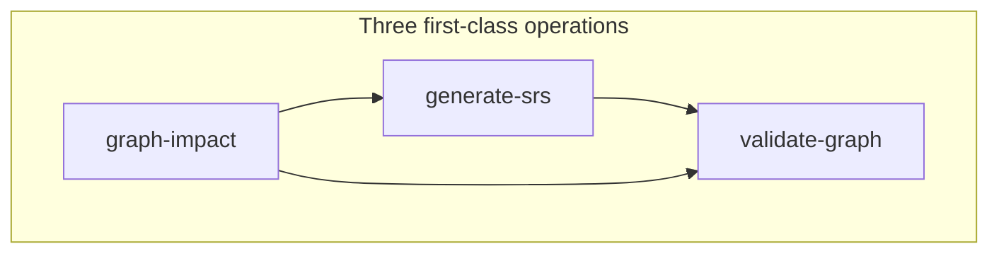
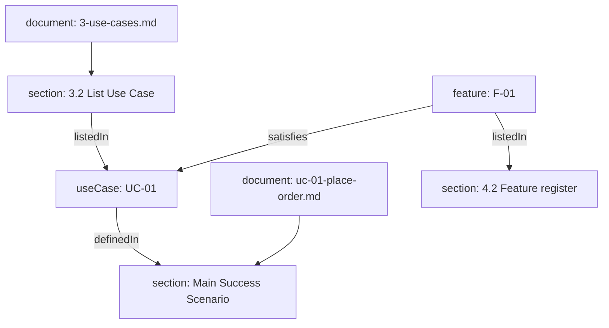
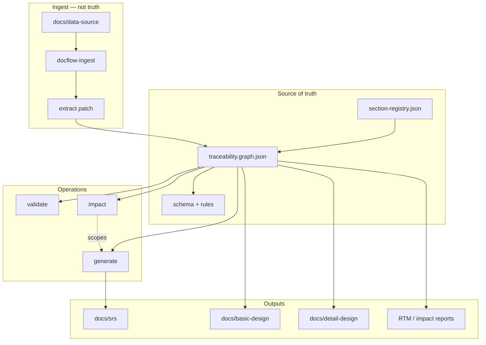
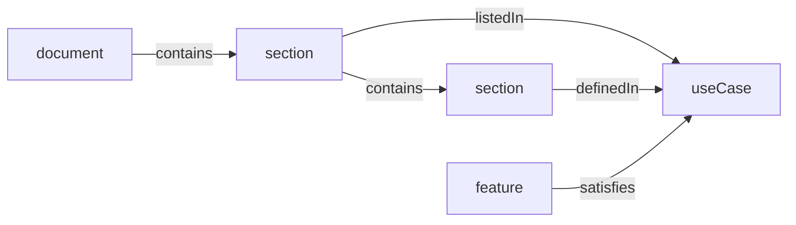
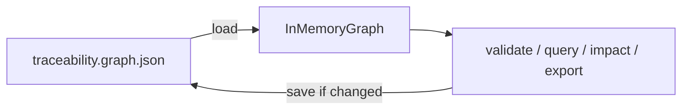
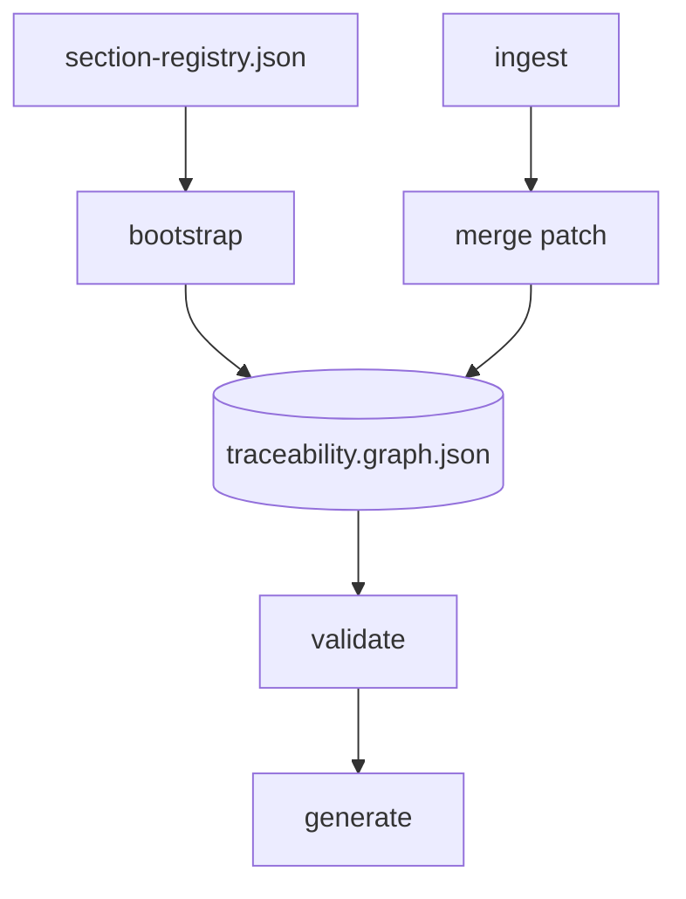

# AI Spector: Traceability Graph Architecture

**Status:** Target specification (v3)  
**Date:** 2026-05-21  
**Audience:** Implementers, Cursor agent authors, reviewers  
**Supersedes (conceptually):** file-only DAG, flat `knowledge.json`, Graphify-as-truth, manual `/summary`

---

## Table of contents

1. [Executive summary](#executive-summary)
2. [Core contract](#core-contract)
3. [Current vs target](#current-vs-target)
4. [Architecture](#architecture)
5. [Graph model](#graph-model)
6. [Document projections](#document-projections)
7. [Operations](#operations)
8. [DocFlow Graph engine](#docflow-graph-engine)
9. [Agent workflow](#agent-workflow)
10. [Validation rules](#validation-rules)
11. [Repository layout](#repository-layout)
12. [Migration roadmap](#migration-roadmap)
13. [Decisions log](#decisions-log)
14. [Glossary](#glossary)
- [Appendix A: SARA compatibility](#appendix-a-sara-compatibility)
- [Appendix B: Tool landscape](#appendix-b-tool-landscape)
- [Appendix C: Legacy mapping](#appendix-c-legacy-mapping)

---

## Executive summary

AI Spector documentation is driven by a **traceability graph** at `.ai-spector/graph/traceability.graph.json` — the **heart** of the workflow: it **stores knowledge**, links sections and domain entities, and **selects relevant context** for generate/impact. Operated by the **`ai-spector`** CLI (SARA-inspired UX). See [workflow-overview.md](./workflow-overview.md).

| Pillar | Rule |
|--------|------|
| **Sections are universal nodes** | Every meaningful `##` / `###` (from templates) is a `section` node. Files are `document` containers only. |
| **UC / F hang on sections** | Domain nodes link via `listedIn`, `definedIn`, `describedIn`. Traceability uses `satisfies`, `dependsOn`, etc. |
| **Impact is first-class** | `/graph-impact` is a peer of `/validate-graph` and `/generate-*`. Edit → impact → selective regen. |
| **Graph stores knowledge** | `/analyze` merges UC/F/actors into the graph; generation uses **graph neighbors**, not bulk file reads. |

**Engine:** Load JSON → build in-memory indexes (`nodesById`, `outEdges`, `inEdges`) → BFS for query/impact → save JSON if mutated. **No SQLite in P0–P3.**

**Build graph:** `bootstrap` (sections from registry) → `merge` extract patch (UC/F/edges) → `validate` → `generate` (markdown projections).

**Do not adopt** [SARA](https://github.com/cledouarec/sara) as the engine (~30–40% template fit). **Borrow** `check`, `query`, and matrix patterns only ([Appendix A](#appendix-a-sara-compatibility)).

---

## Core contract



**Anti-patterns**

- File-level generation without a section tree.
- UC/F only in markdown tables with no graph edges.
- Whole-document regen without `regenerate` / `review` / `downstream` from impact.

Markdown under `docs/srs/` is a **projection** of the graph, not the source of truth.

### Target traceability example



### Design principles

| Principle | Meaning |
|-----------|---------|
| Graph-first | Canonical store; markdown generated from nodes. |
| Section-primary | Default unit of meaning is `section`, not file. |
| Two layers | Structure (`document`, `section`, …) + domain (`useCase`, `feature`, …). |
| Stable IDs | `sec.srs.3.2`, `UC-01`, `F-01` — stable across regen. |
| Impact-first | Changes analyzed via graph traversal, not folder grepping. |
| Validate before generate | Broken graph blocks generation. |
| Search ≠ truth | Semantic ingest proposes; graph commits. |

---

## Current vs target

| Aspect | Current (v1) | Target (v3) |
|--------|--------------|-------------|
| Unit of planning | File (`dag.srs.json`) | **Section** + domain node |
| Context selection | `.ai-spector/index/*.md` | **`graph_neighbors` / `graph_impact`** |
| Analysis artifact | Flat `knowledge.json` | **`traceability.graph.json`** |
| Change workflow | Re-run files / guess | **`graph impact` → buckets** |
| UC list §3.2 | Static table in template | **Rendered from `listedIn`** |
| F → UC link | Table column optional | **`satisfies` edge** |
| Engine | Graphify + prompts | **`docflow-graph` CLI** + optional Graphify hints |
| Store | JSON fragments | **Single graph JSON** |

Legacy commands remain until migration phases complete ([Appendix C](#appendix-c-legacy-mapping)).

---

## Architecture



### Pipelines

**Setup (build graph)**

```text
docflow-ingest scan|chunk     → manifest, chunks.jsonl (staging)
docflow-graph bootstrap         → structure nodes from section-registry.json
/extract + docflow-graph merge  → domain nodes + traceability edges
docflow-graph validate
```

**Repeatable operations**

```text
docflow-graph validate          # gate / CI
docflow-graph impact <id>       # before regen after edits
/generate-srs                   # render impacted or planned sections only
docflow-graph export matrix     # RTM
```

**Default edit workflow**

```text
edit section or UC/F
  → docflow-graph impact <id>
  → /generate-* (regenerate bucket only)
  → docflow-graph validate
```

---

## Graph model

**Artifacts**

| File | Role |
|------|------|
| `.ai-spector/graph/traceability.graph.json` | Canonical graph (`nodes`, `edges`) |
| `.ai-spector/registry/section-registry.json` | Template → section/document ids |
| `ai-spector` package `schemas/schema.graph.json` | JSON Schema (Ajv) |
| `ai-spector` package `schemas/rules.traceability.json` | Validation rules |
| `ai-spector` package `schemas/rules.impact.json` | Impact edge whitelists per change type |
| `ai-spector` package `documents.json` | SRS document/template manifest |

### Universal section nodes

A `section` is any registered heading (`##`, `###`, optional `####`). Subsections use the same type with `partOf` → parent `section`.

| Concept | Graph |
|---------|-------|
| `3-use-cases.md` | `document` |
| `### 3.2 List Use Case` | `section` |
| UC register rows | `listedIn` on `useCase` (table optional as `table` node) |
| `uc-01-….md` + `### 2. Main Flow` | `document` + `section` |

All operations prefer **`section` ids** first.

### Two layers

| Layer | Types | Role |
|-------|-------|------|
| Structure | `document`, `section`, `table`, `diagram` | Outline and layout |
| Domain | `actor`, `useCase`, `feature`, `requirement`, `dataEntity` | Semantics; anchored to ≥1 `section` |



### UC / F anchoring (normative)

| Domain | Register | Detail body | Cross-cutting |
|--------|----------|-------------|---------------|
| `useCase` | `listedIn` → `sec.srs.3.2` | `definedIn` → sections in `doc.srs.uc-*` | `requires`; inbound `satisfies` ← F |
| `feature` | `listedIn` → `sec.srs.4.2` | `definedIn` → `doc.srs.f-*` sections | `dependsOn`; `satisfies` → UC |
| `requirement` | — | `describedIn` → UC §6 or F §3 | `derivedFrom` |

§3.2 and §4.2 tables are **projections** of `listedIn` / `satisfies`, not independent sources.

### Node types

**Structure**

| type | id example | Fields |
|------|------------|--------|
| `document` | `doc.srs.3-use-cases` | `path`, `templateId` |
| `section` | `sec.srs.3.2` | `documentId`, `heading`, `level`, `order` |
| `table` | `tbl.srs.3.2.uc-list` | `sectionId`, `role` |
| `diagram` | `diag.srs.3.1.uc` | `sectionId` |

**Domain**

| type | id example | Anchored to |
|------|------------|-------------|
| `actor` | `actor.customer` | `sec.srs.2.2` |
| `useCase` | `UC-01` | `sec.srs.3.2`, detail sections |
| `feature` | `F-01` | `sec.srs.4.2`, detail sections |
| `requirement` | `FR-UC01-01` | UC/feature detail sections |
| `dataEntity` | `ENT-Order` | `sec.srs.5.2` |

No separate `useCaseDetail` type — detail file = `document` + `section` subtree.

### Edge types

**Structure:** `partOf`, `contains`, `follows`, `references`, `rendersTo`

**Domain ↔ structure:** `listedIn`, `definedIn`, `describedIn`

**Domain ↔ domain:** `satisfies` (F→UC), `dependsOn` (F→F), `requires` (UC→UC), `tracesTo` (→ api/screen/table), `derivedFrom` (→ source chunk)

**Derived at query time:** reverse of `satisfies`, `dependsOn`, `references` (e.g. `implementedBy`, `referencedBy`)

### Section registry

`.ai-spector/registry/section-registry.json` lists every meaningful template heading before generation.

```json
{
  "documents": [
    {
      "documentId": "doc.srs.3-use-cases",
      "template": "srs/3-use-cases.md",
      "output": "docs/srs/3-use-cases.md",
      "sections": [
        { "id": "sec.srs.3.1", "heading": "### 3.1 Use Case Diagrams", "level": 3 },
        { "id": "sec.srs.3.2", "heading": "### 3.2 List Use Case", "level": 3 }
      ]
    },
    {
      "documentId": "doc.srs.uc-detail",
      "template": "srs/3-use-case-detail-template.md",
      "outputPattern": "docs/srs/03-use-cases/uc-{nn}-{slug}.md",
      "perDomain": "useCase",
      "sections": [
        { "id": "sec.uc.{id}.overview", "heading": "### 1. Use Case Overview", "level": 3 },
        { "id": "sec.uc.{id}.main-flow", "heading": "### 2. Main Success Scenario (Basic Flow)", "level": 3 }
      ]
    }
  ]
}
```

`bootstrap` expands `{id}` / `{slug}` per domain instance. Every meaningful `##` / `###` in bundled SRS templates (`ai-spector` package `templates/srs/**`) must appear here.

### Example graph fragment

```json
{
  "version": 1,
  "nodes": [
    { "id": "doc.srs.3-use-cases", "type": "document", "path": "docs/srs/3-use-cases.md" },
    { "id": "sec.srs.3.2", "type": "section", "documentId": "doc.srs.3-use-cases", "heading": "### 3.2 List Use Case", "level": 3, "order": 2 },
    { "id": "UC-01", "type": "useCase", "title": "Place order", "priority": "High" },
    { "id": "doc.srs.uc-01", "type": "document", "path": "docs/srs/03-use-cases/uc-01-place-order.md" },
    { "id": "sec.uc01.main-flow", "type": "section", "documentId": "doc.srs.uc-01", "heading": "### 2. Main Success Scenario (Basic Flow)", "level": 3 },
    { "id": "F-01", "type": "feature", "title": "Checkout" }
  ],
  "edges": [
    { "type": "contains", "from": "doc.srs.3-use-cases", "to": "sec.srs.3.2" },
    { "type": "listedIn", "from": "UC-01", "to": "sec.srs.3.2" },
    { "type": "definedIn", "from": "UC-01", "to": "sec.uc01.main-flow" },
    { "type": "partOf", "from": "sec.uc01.main-flow", "to": "doc.srs.uc-01" },
    { "type": "satisfies", "from": "F-01", "to": "UC-01" }
  ]
}
```

---

## Document projections

### Layout (`docs/srs/`)

```text
docs/srs/
  1-introduction.md
  2-overall-description.md
  3-use-cases.md
  03-use-cases/uc-01-place-order.md
  4-system-features.md
  04-system-features/f-01-checkout.md
  5-data-requirements.md … 9-other-requirements.md
```

### Section ↔ markdown

| Node | Markdown |
|------|----------|
| `document` | One file |
| `section` | Heading block until next same-level heading |
| `table` / `diagram` | Content under parent section |

Generation walks **section subtrees** depth-first by `order`.

### Sync (optional)

Document frontmatter: `documentId`, `domainId`, `domainType`.  
Section anchor: `<!-- section:sec.uc01.main-flow -->`.  
`/sync-graph` updates edges from anchors and tables.

### Generated registers

- **§3.2** — from `listedIn` on each `useCase`
- **§4.2** — from `feature` + `satisfies` → UC ids
- **UC detail — Related features** — inbound `satisfies`

---

## Operations

### validate (`docflow-graph validate`)

Answers: *Is the graph consistent?*

| Check class | Examples |
|-------------|----------|
| Schema | Ajv on `traceability.graph.json` |
| Structure | `REGISTRY-COMPLETE`, `SECTION-TREE`, `DOC-SECTION-COVERAGE` |
| Traceability | `DOMAIN-ANCHORED`, `UC-LIST-SYNC`, `UC-FEATURE-LINK` |
| Integrity | Broken refs, cycles (SARA-like `check`) |

Use before merge, after `bootstrap` / `merge`, after bulk regen.

### impact (`docflow-graph impact <id>`)

Answers: *What must regenerate, be reviewed, or flow downstream?*

```text
docflow-graph impact <nodeId> [--change <type>] [--depth N]
```

| Change type | Typical origin | Emphasis |
|-------------|------------------|----------|
| `content_change` | `section` | `definedIn`, `satisfies`, `references` in+out |
| `delete` | section / domain | inbound `listedIn`, `satisfies` |
| `move_section` | `section` | `partOf`, `references` |
| `id_change` | UC / F | all incident edges |
| `add_domain` | new UC | `listedIn` parent section |
| `dependency_change` | F | `dependsOn`, `satisfies` transitive |

**Result buckets:** `regenerate`, `review`, `downstream` → `.ai-spector/views/impact-<timestamp>.json`

```json
{
  "origin": { "id": "sec.uc01.main-flow", "type": "section", "change": "content_change" },
  "affected": {
    "regenerate": [{ "id": "doc.srs.uc-01", "reason": "definedIn target" }],
    "review": [{ "id": "F-01", "reason": "satisfies UC-01" }],
    "downstream": [{ "id": "api.checkout.submit", "reason": "tracesTo F-01", "phase": "basic-design" }]
  }
}
```

**Traversal (normative):** BFS forward (outEdges) + backward (inEdges) per `rules.impact.json`; classify; dedupe; sort by plan wave.

### query (`docflow-graph query <id>`)

Answers: *What is connected?* (SARA-like upstream/downstream trees.)

```text
docflow-graph query UC-01 --direction downstream --depth 3
```

### generate (`/generate-srs`, etc.)

Answers: *Render markdown for planned or impacted sections.*

Waves:

```text
Wave 0: bootstrap — documents + sections (empty content shells)
Wave 1: domain — UC/F stubs + listedIn / satisfies
Wave 2: index projections — §3.2, §4.2 tables
Wave 3: detail docs — UC then feature section-by-section
Wave 4: cross-chapter — data, interfaces, NFR from neighborhoods
```

### export

```text
docflow-graph export matrix -o .ai-spector/views/rtm.csv
docflow-graph export coverage
```

---

## DocFlow Graph engine

### Stack (confirmed)

| Component | Choice |
|-----------|--------|
| CLI | **`ai-spector`** (TypeScript, npm package at repo root) |
| Ingest CLI | **`docflow-ingest`** (optional split package) |
| Persistence | **`traceability.graph.json`** (P0–P3) |
| Validation | **Ajv** + `rules.*.json` |
| Runtime | **In-memory indexes** + BFS |
| SQLite | **P6+ optional cache only** — rebuild from JSON; never sole truth |
| Semantic hints | Graphify MCP or embeddings → `semantic-hints.json` |
| Code impact | GitNexus via `tracesTo` (separate graph) |

**Not used:** Neo4j, Memgraph, SARA binary, Graphify as graph store.

### JSON vs SQLite

| Criterion | JSON + in-memory | SQLite |
|-----------|------------------|--------|
| Git review | **Best** | Poor |
| SRS scale (~50–500 nodes) | **Enough** | Overkill for v1 |
| validate / impact | Maps + BFS | CTE (same semantics) |
| Agent workflow | One JSON patch | Extra sync |

**Decision:** JSON is better for **P0–P3**. SQLite only if profiling shows need (large RTM, slow load).

### In-memory runtime (every command)

```text
1. Read traceability.graph.json
2. Parse nodes[], edges[]
3. Build indexes:
     nodesById, outEdges, inEdges, sectionsByDocument
4. Run subcommand
5. Write JSON + update state.json hash if mutated
```



Custom means custom **schema and rules**, not a custom database (same role as SARA `petgraph`, persisted as JSON).

### How the graph is built



| Phase | Command | Adds |
|-------|---------|------|
| **A Structure** | `docflow-graph bootstrap` | `document`, `section`, structure edges |
| **B Domain** | `docflow-graph merge <patch.json>` | `useCase`, `feature`, `listedIn`, `satisfies`, … |
| **C Projection** | `/generate-srs` | Markdown under `docs/` |

Phase A: deterministic. Phase B: never creates sections. Phase C: read-only on structure (writes markdown only).

### CLI reference

```bash
# Structure
docflow-graph bootstrap -o .ai-spector/graph/traceability.graph.json

# Ingest (staging)
docflow-ingest scan docs/data-source
docflow-ingest chunk

# Domain
docflow-graph merge .ai-spector/.docflow/extract/patch.json

# Operations
docflow-graph validate
docflow-graph query UC-01 --direction downstream --depth 3
docflow-graph impact sec.uc01.main-flow --change content_change
docflow-graph export matrix -o .ai-spector/views/rtm.csv
docflow-graph plan srs
```

| SARA | DocFlow Graph |
|------|---------------|
| `sara check` | `docflow-graph validate` |
| `sara query` | `docflow-graph query` |
| — | `docflow-graph impact` |
| `sara report matrix` | `docflow-graph export matrix` |

Cursor slash commands wrap the same binary for agents and CI.

### Package layout

```text
ai-spector/                   # npm package root (CLI + schemas + templates)
  src/
  schemas/
  templates/
  documents.json
example/                      # sample consumer (not published)
  .ai-spector/
    docflow.config.json
    graph/traceability.graph.json
    registry/section-registry.json
```

---

## Agent workflow

**Generation:** `graph_neighbors(id, edgeTypes, direction, depth)` — load only returned `section` / `document` paths.

**After edit:**

```text
docflow-graph impact sec.uc01.main-flow --change content_change
→ regen: doc.srs.uc-01 subtree
→ review: F-01, F-02
→ downstream: api.* via tracesTo
```

**Prerequisites (target):** populated graph + `validate` pass replaces index-placeholder checks for downstream generate.

### MCP / internal tools

| Tool | Purpose |
|------|---------|
| `graph_get_node` | Node metadata |
| `graph_neighbors` | Context bundle |
| `graph_impact` | Affected set + buckets |
| `graph_validate` | CI gate |
| `graph_plan` | Regen wave order |
| `graph_section_tree` | Outline for one document |

---

## Validation rules

| Rule id | Check |
|---------|--------|
| `REGISTRY-COMPLETE` | Registry sections exist as nodes |
| `SECTION-TREE` | Single `partOf` parent; no orphans |
| `DOC-SECTION-COVERAGE` | Each `document` has child `section`s |
| `DOMAIN-ANCHORED` | Domain has `listedIn` or `definedIn` |
| `UC-LIST-SYNC` | §3.2 matches `listedIn` to `sec.srs.3.2` |
| `UC-FEATURE-LINK` | Each UC has inbound `satisfies` before detail design |
| `NO-ORPHAN-PROJECTION` | Each `docs/srs/**/*.md` has `document` node |
| `IMPACT-STALE` | Warn if projection hash ≠ graph |
| `DELETE-SAFE` | Block delete when dependents exist |

---

## Repository layout

See [Package layout](#package-layout). Generated SRS remains under `docs/srs/`; graph under `.ai-spector/graph/`.

---

## Migration roadmap

| Phase | Deliverable | Replaces (legacy) |
|-------|-------------|-------------------|
| **P0** | `section-registry.json`, `schema.graph.json`, `docflow-graph` load/save/bootstrap/validate, sample graph | — |
| **P1** | `query`, `merge`, `docflow-ingest`, `/extract` → patch | `/analyze` partial |
| **P2** | `impact`, `rules.impact.json`, `/graph-impact` command | — |
| **P3** | `/generate-srs` from graph, `export matrix` | file DAG primary |
| **P4** | Workflow prerequisites on graph; optional `/sync-graph` | `/summary` gate |
| **P5** | Basic/detail + `tracesTo`; GitNexus downstream | — |
| **P6** | Optional UI; SQLite cache if profiled | — |

---

## Decisions log

| Decision | Status |
|----------|--------|
| DocFlow Graph custom engine; borrow SARA UX | **Confirmed** |
| `traceability.graph.json` canonical P0–P3 | **Confirmed** |
| SQLite optional cache P6+ only | **Confirmed** |
| Keep ai-spector SRS templates + section registry | **Confirmed** |
| SARA: borrow only | **Confirmed** |
| Write model: graph-only vs `/sync-graph` | Open |
| Section granularity: all template `##`/`###` | Open |
| Semantic assist: Graphify vs local embeddings | Open |

---

## Glossary

| Term | Meaning |
|------|---------|
| **Section node** | Graph node for one template heading block |
| **Domain node** | `useCase`, `feature`, etc. — semantic entity |
| **Projection** | Generated markdown file derived from graph |
| **listedIn** | Domain node appears in a register section (§3.2, §4.2) |
| **definedIn** | Primary narrative for domain lives in section |
| **satisfies** | Feature realizes use case (F → UC) |
| **Impact bucket** | `regenerate`, `review`, or `downstream` from impact run |

---

## Appendix A: SARA compatibility

| Topic | SARA | ai-spector |
|-------|------|------------|
| Graph unit | One file = one item | **Section** + domain; file = container |
| UC detail | SARA `use_case.tera` (~6 headings) | **10 subsections** in template |
| Features | No `F-01` type | **`feature` + satisfies → UC** |
| Hierarchy | SOL→UC→SCEN→SYSREQ→… | **No mandatory Scenario** |
| §3.2 index | No combined index file | **`3-use-cases.md` §3.2 projection** |
| Impact | Item query trees only | **Section `graph impact` + buckets** |
| Template fit | ~30–40% drop-in | **Borrow CLI patterns only** |

Reference: [SARA smart-home example](https://github.com/cledouarec/sara/tree/main/examples/smart-home) for validate/query output quality, not folder layout.

---

## Appendix B: Tool landscape

| Tool | Use in ai-spector |
|------|-------------------|
| **docflow-graph** (build) | Engine |
| **SARA** | UX reference |
| **Graphify** | Ingest semantic hints |
| **GitNexus** | Code `tracesTo` impact |
| **Doorstop / Sphinx-Needs** | Not adopted; RM patterns reference only |
| **markedup / kgmd** | Optional ingest alternatives |
| **Neo4j / Graphiti** | Not used |

---

## Appendix C: Legacy mapping

| Legacy | Target |
|--------|--------|
| `/analyze` | `docflow-ingest` + `/extract` + `merge` |
| `knowledge.json` | `traceability.graph.json` (domain slice) |
| `dag.srs.json` | `docflow-graph plan srs` from graph |
| `/summary` | `graph_neighbors` / `export`; deprecated as gate at P4 |
| `/bootstrap-sections` | `docflow-graph bootstrap` |
| `/validate-graph` | `docflow-graph validate` |
| `/graph-impact` | `docflow-graph impact` |

---

## Related documents

- [Design index](./README.md)
- [README.md](../../README.md) — current workflow (until migration)
- [.cursor/skills/ai-spector/SKILL.md](../../.cursor/skills/ai-spector/SKILL.md)
- [templates/srs/](../../templates/srs/)
- [SARA](https://github.com/cledouarec/sara)
