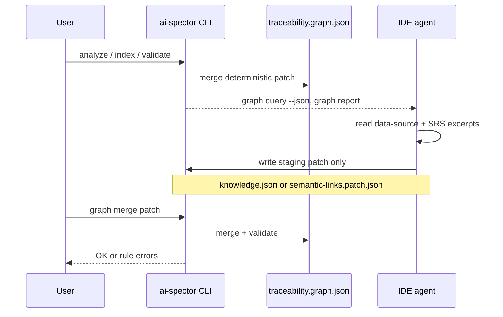
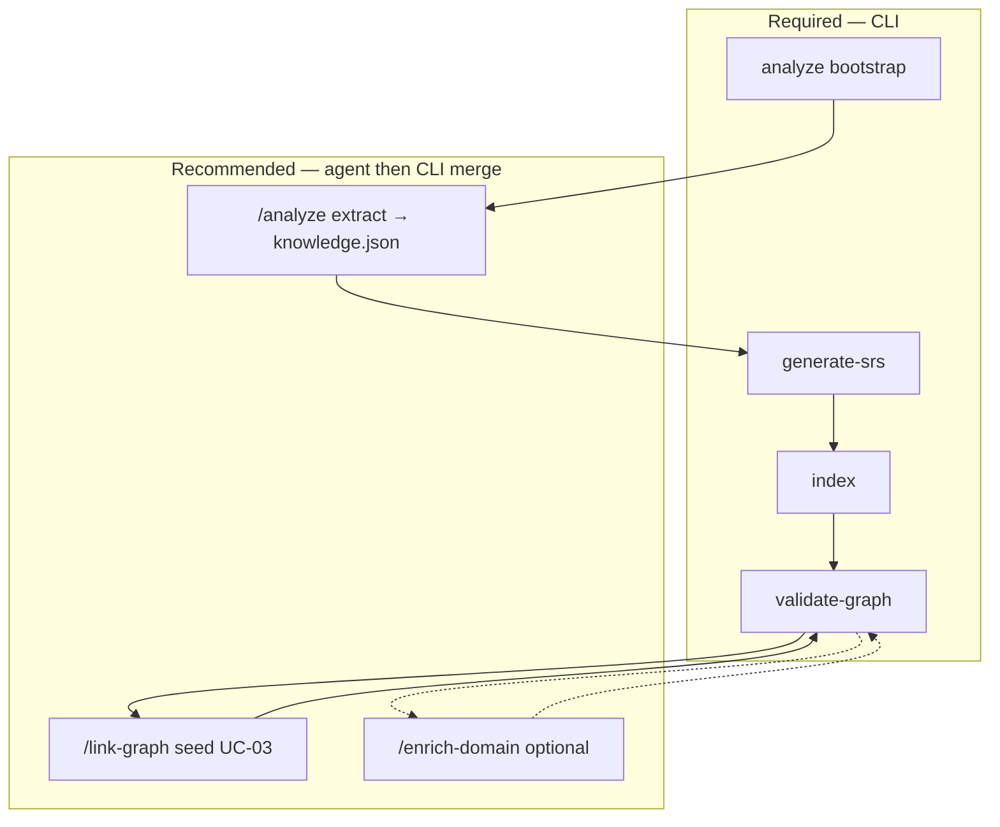
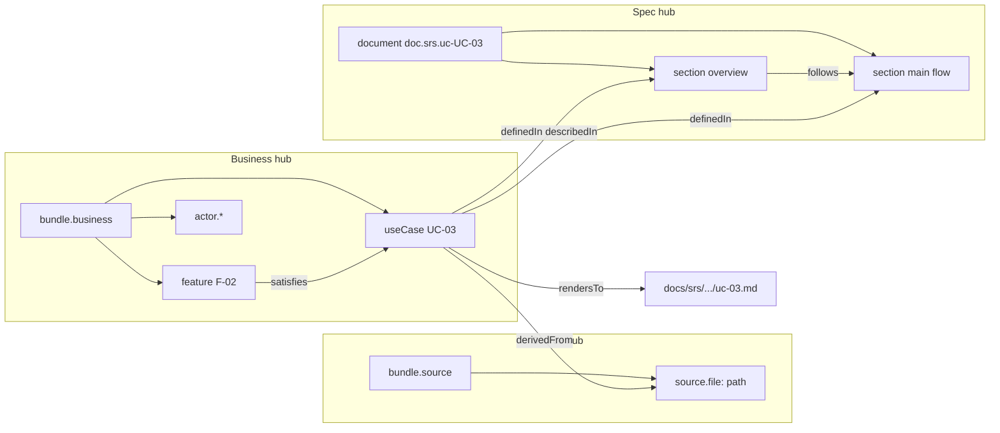
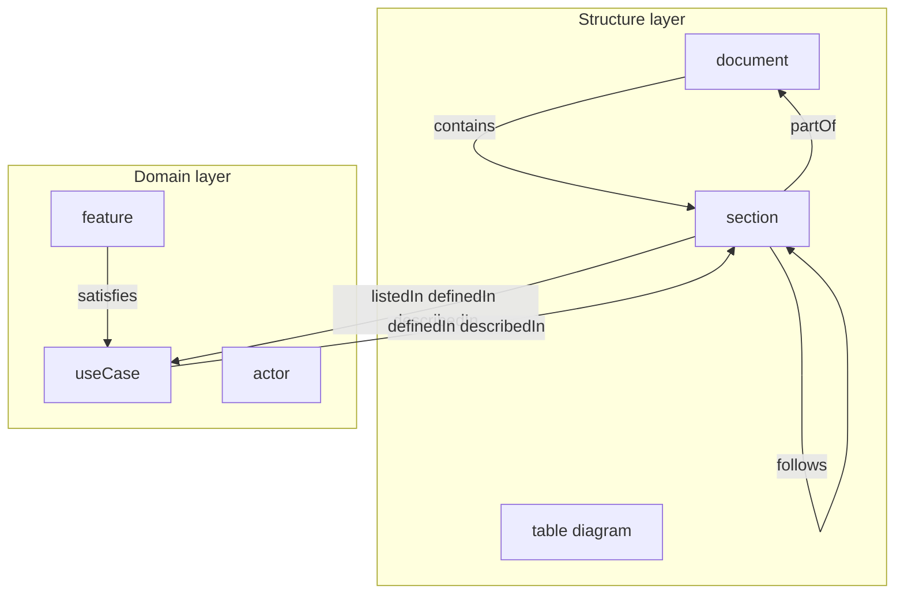
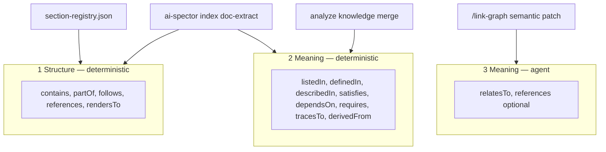
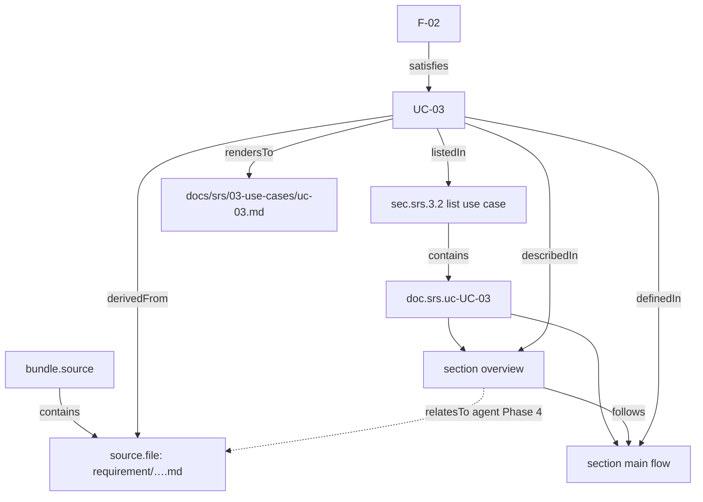
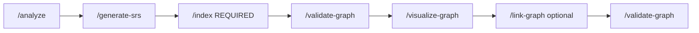

# Tri-layer traceability graph — improvement plan

**Status:** Implementation plan (draft)
**Date:** 2026-05-21
**Relates to:** [traceability-graph-redesign.md](./traceability-graph-redesign.md) (v3 target), [workflow-overview.md](./workflow-overview.md)
**Problem:** After `/generate-srs`, the graph often looks like bootstrap structure + flat domain nodes (`UC-01`, `F-01`) without per-file spec subtrees, data-source children, or meaning-based bridges — unlike the intended three-hub model.

---

## Table of contents

1. [Goal](#goal)
2. [CLI and agent collaboration](#cli-and-agent-collaboration)
3. [Graph model: hubs, nodes, and edges](#graph-model-hubs-nodes-and-edges)
4. [Edge catalog](#edge-catalog)
5. [Target shape](#target-shape)
6. [Current state vs gaps](#current-state-vs-gaps)
7. [Design decisions](#design-decisions)
8. [Phased roadmap](#phased-roadmap)
9. [Phase 0 — Workflow and observability](#phase-0--workflow-and-observability)
10. [Phase 1 — Spec layer (post-generate structure)](#phase-1--spec-layer-post-generate-structure)
11. [Phase 2 — Source layer (data-source tree)](#phase-2--source-layer-data-source-tree)
12. [Phase 3 — Business layer grouping](#phase-3--business-layer-grouping)
13. [Phase 4 — Semantic enrichment (agent + CLI)](#phase-4--semantic-enrichment-agent--cli)
14. [Phase 5 — Visualization and query](#phase-5--visualization-and-query)
15. [Schema and validation changes](#schema-and-validation-changes)
16. [CLI and Cursor commands](#cli-and-cursor-commands)
17. [File change map](#file-change-map)
18. [Acceptance criteria (UAT)](#acceptance-criteria-uat)
19. [Risks and non-goals](#risks-and-non-goals)
20. [Plan additions (recommended)](#plan-additions-recommended)

---

## Goal

After SRS (and later BD/DD) documents exist, the traceability graph should present **three readable hubs** with **cross-layer edges**:

| Hub | Contains | Example |
|-----|----------|---------|
| **Data source** | Inputs under `docs/data-source/` | requirement outline → sections/chunks/symbols |
| **Business** | Domain semantics | `UC-03`, `F-01`, `actor.employee`, `ENT-Order` |
| **Spec** | Generated markdown as structure | `doc.srs.uc-UC-03` → `### 1. Use Case Overview` section nodes |

**Cross-hub bridges:** `derivedFrom` (business → source), `definedIn` / `describedIn` / `listedIn` (business ↔ spec), `satisfies` / `requires` / `tracesTo` (business ↔ business), plus **agent-proposed** `relatesTo` / `references` when deterministic rules are insufficient.

**Principles (from v3, applied to tri-layer):**

| Principle | Rule |
|-----------|------|
| Graph-first | `traceability.graph.json` is canonical; markdown is a projection. |
| Section-primary | Default unit of meaning is `section`, not file. |
| Three edge buckets | **Structure** (layout), **meaning (deterministic)** (parse/knowledge), **meaning (agent)** (patch merge). |
| CLI + agent | CLI alone cannot assign full semantic meaning; **agents propose**, **CLI validates and merges**. |
| No hand-edited graph | Agents write **staging artifacts** only; CLI merges into `traceability.graph.json`. |

Canonical edge taxonomy: [Edge catalog](#edge-catalog). Division of labor: [CLI and agent collaboration](#cli-and-agent-collaboration). Visual model: [Graph model](#graph-model-hubs-nodes-and-edges).

---

## CLI and agent collaboration

**Running CLI commands is necessary but not sufficient** for a complete traceability graph. Deterministic CLI steps (bootstrap, index, provenance) build **structure** and **parseable meaning**. Richer semantics — evidence links, entity usage, nuanced cross-references, titles/descriptions when templates are ambiguous — require an **IDE agent** guided by **CLI outputs**, with results committed only through **CLI merge + validate**.

The agent is not an alternative graph store. It is a **semantic enrichment layer** on top of the same JSON graph.

### What CLI does reliably (no agent)

| CLI / command | Graph outcome | Limit |
|---------------|---------------|-------|
| `ai-spector analyze` → bootstrap | Registry `document` / `section` tree, structure edges | Template headings only; no judgment |
| `graph merge --from-knowledge` | Domain nodes, `satisfies`, `listedIn`, … from `knowledge.json` | Only what analyze already extracted |
| `ai-spector index` | Per-UC/F `document` + `section` subtrees, `definedIn`, `derivedFrom`, snippets | Regex/heading parse; no “this bullet evidences that paragraph” |
| `linkProvenance` | `derivedFrom` when `sourceRef` / `Source:` is explicit | No inferred provenance |
| `graph validate` | Schema + rules gate | Does not invent missing semantics |

### What agents add (via CLI-backed workflow)

| Agent pass | Staging artifact | CLI commit step | Semantic value |
|------------|------------------|-----------------|----------------|
| **`/analyze`** (Graphify + extract) | `knowledge.json` | `graph merge --from-knowledge` | UC/F/actor ids, `satisfies`, priorities, `sourceRef` from unstructured inputs |
| **`/link-graph`** (Phase 4) | `semantic-links.patch.json` | `graph merge --semantic` | `relatesTo` with `role` (evidence, usesEntity, …) across source ↔ spec ↔ business |
| **`/enrich-domain`** (recommended, Phase 4+) | `domain-enrich.patch.json` | `graph merge --semantic` | Refine `title`, `description`, `priority` on nodes when body text is implicit |
| **Generate commands** (`/generate-srs`, …) | Markdown files | then **`/index`** | Projection from graph; agent writes prose, CLI re-parses structure |

Agents **read** graph context through CLI (`graph query`, `graph report`, `graph impact`) — not by opening `traceability.graph.json` and editing it directly.

### Collaboration loop (normative)



**Invariant:** Every graph mutation path ends in `graph merge` (or index’s internal merge) + `graph validate`. Agents never skip validation.

### Node semantics: CLI baseline vs agent enrichment

| Node / field | CLI baseline | Agent can enrich (patch) |
|--------------|--------------|---------------------------|
| `useCase` / `feature` `title` | Heading or `**Use Case Name:**` line | Better label from context; disambiguate duplicates |
| `description` | First prose/snippet under `###` | Summary across multiple sections or source files |
| `priority` | `**Priority:**` line if present | Infer from source outline when SRS omits it |
| `section.description` | `snippetAfterHeading` | Deeper summary; link to source quotes (via `relatesTo`, not new section ids) |
| Cross-hub links | `derivedFrom` if `sourceRef` set | `relatesTo` evidence between section ↔ `source.file` ↔ chunk |
| `satisfies` / `requires` | Tables + knowledge merge | Additional edges when relationship is narrative, not tabular |

### When to run which pass



| Project maturity | Minimum | For full semantic graph |
|------------------|---------|-------------------------|
| After data-source drop | `analyze` + merge knowledge | Agent `/analyze` extract (not empty knowledge) |
| After SRS generate | **`index`** (mandatory) | `/link-graph` per UC or feature batch |
| Before impact-driven regen | `validate` | Agent links + `graph impact` review |

### Design rules for agent authors

1. **Query first** — `ai-spector graph query <id> --json` before proposing edges; use existing node ids only.
2. **Patch only** — write `semantic-links.patch.json` or extend `knowledge.json`; never edit `traceability.graph.json`.
3. **Edges only by default** — semantic patches add `relatesTo` / domain fields; do not create `section` / `document` nodes (enforced in merge).
4. **Cite evidence in `role` or patch `meta`** — e.g. `"role": "evidence"`, `"meta": { "quote": "…", "sourceLine": 42 }`.
5. **Re-run validate after merge** — agent treats CLI errors as hard failures to fix in the patch.

### Reporting semantic completeness (Phase 0 extension)

`ai-spector graph report` should expose agent-completeness hints, for example:

| Field | Meaning |
|-------|---------|
| `semanticLinks.count` | Number of `relatesTo` edges |
| `domainsWithoutSemanticLinks[]` | UCs with `derivedFrom` but no `relatesTo` to source |
| `suggestedAgentCommand` | `/link-graph UC-03` or re-run `/analyze` |

---

## Graph model: hubs, nodes, and edges

The graph is **one JSON file** organized as **three hubs** plus **bridges**. Do not treat it as a flat list of `UC-*` nodes.

### Three hubs (target)



| Hub | Node types (today → planned) | Role |
|-----|------------------------------|------|
| **Source** | `sourceFile` under `bundle.source` (Phase 2) | Inputs: requirements, specs, code roots under `docs/data-source/` |
| **Business** | `useCase`, `feature`, `actor`, `requirement`, `dataEntity` under `bundle.business` (Phase 3) | Product semantics |
| **Spec** | `document`, `section`, `table`, `diagram` | Generated SRS/BD/DD outline and per-UC/F detail trees |

**Norm:** A generated UC detail file is **not** a special node type. It is `document` (`doc.srs.uc-UC-NN`) + `section` children per `###` heading. The business node `UC-NN` links to **sections**, not only to the file node.

### Two node layers (v3)



| Layer | Types | Role |
|-------|-------|------|
| **Structure** | `document`, `section`, `table`, `diagram` | Outline, heading tree, layout, reading order |
| **Domain** | `useCase`, `feature`, `actor`, `requirement`, `dataEntity` | Semantics; anchored to ≥1 `section` via bridge edges |

### Three edge buckets

Edges fall into **three buckets**. When implementing or reviewing a graph, classify every edge this way.



| Bucket | What it answers | Built by | Agent may create? |
|--------|-----------------|----------|-----------------|
| **Structure** | Where in the doc tree? What file on disk? What order? | `bootstrap`, `index` / `doc-extract` | **No** |
| **Meaning (deterministic)** | Which UC is in §3.2? Which ### defines the flow? Which F satisfies UC? Which source file? | `analyze`, `knowledge.json` merge, `index`, `provenance` | **No** |
| **Meaning (agent)** | This paragraph *evidences* that requirement; this entity *uses* that data model | `semantic-links.patch.json` → `graph merge --semantic` | **Yes** (patch only) |

### Quick decision rule

| Question | Bucket | Typical edge |
|----------|--------|--------------|
| Parent/child in doc or bundle tree? | Structure | `contains` / `partOf` |
| Next sibling heading at same level? | Structure | `follows` |
| Which path is the markdown file? | Structure | `rendersTo` |
| UC listed in §3.2 register? | Meaning (deterministic) | `listedIn` |
| Which ### holds the main flow / overview? | Meaning (deterministic) | `definedIn` / `describedIn` |
| Feature realizes use case? | Meaning (deterministic) | `satisfies` |
| Product dependency between Fs or UCs? | Meaning (deterministic) | `dependsOn` / `requires` |
| UC grounded in data-source input? | Meaning (deterministic) | `derivedFrom` |
| Judgment link across hubs without a parse rule? | Meaning (agent) | `relatesTo` |

**Do not confuse dependency types:** file/section layout uses `contains` / `partOf` / `follows`. Product dependencies use `dependsOn` (F→F) and `requires` (UC→UC).

### `definedIn` vs `describedIn` (normative)

| Edge | Use when | Example target |
|------|----------|----------------|
| `describedIn` | Overview, metadata, brief description | `### 1. Use Case Overview` |
| `definedIn` | Narrative body: flows, preconditions, requirements in detail | `### 2. Main Success Scenario`, `### 6. …` |

`detailFileToPatch` may emit both to all sections initially; Phase 1.4 should tighten roles per heading class. Validation rule `DEFINED-DESCRIBED-ROLE` (recommended) can warn on misuse.

### Merge allowlist (structure targets)

`mergePatch` rejects edges that target `document` / `section` unless the edge type is allowlisted (`src/graph/merge.ts`). Structure edges such as `follows` must be on this list — bootstrap writes them directly; **index/doc-extract** goes through merge.

Allowed today: `listedIn`, `definedIn`, `describedIn`, `references`, `dependsOn`, `contains`, `partOf`, `follows`.

Path-target edges (`rendersTo`, `derivedFrom`) use a separate code path and may target path strings or `sourceFile` ids (Phase 2).

---

## Edge catalog

Authoritative matrix for implementers and agents. “Allowed endpoints” are normative targets; validation rules may tighten further.

### Structure edges (bucket 1)

| Edge | Direction | From types | To types | Created by | Notes |
|------|-----------|------------|----------|------------|-------|
| `contains` | parent → child | `document`, `section`, `bundle`, list `section` | `section`, `document`, `sourceFile` | bootstrap, index | Tree membership |
| `partOf` | child → parent | `section`, `document`, `sourceFile` | `document`, `section`, `bundle` | bootstrap, index | Inverse of `contains` |
| `follows` | prev → next | `section` | `section` | bootstrap, index | Same `level` siblings only |
| `references` | ref → target | `section`, `document` | `section`, `document` | bootstrap, parse | In-doc structural cross-ref |
| `rendersTo` | node → path | `document`, `section`, domain | path string | bootstrap, index, knowledge | Projection to repo file |

### Meaning edges — deterministic (bucket 2)

| Edge | Direction | From types | To types | Created by | Notes |
|------|-----------|------------|----------|------------|-------|
| `listedIn` | domain → spec | `useCase`, `feature`, … | `section` (register) | analyze, index | §3.2 / §4.2 register row |
| `definedIn` | domain → spec | domain | `section` (detail) | index | Narrative sections |
| `describedIn` | domain → spec | domain | `section` or `document` | index | Overview / metadata |
| `satisfies` | F → UC | `feature` | `useCase` | analyze, knowledge | Feature realizes UC |
| `dependsOn` | F → F | `feature` | `feature` | analyze, knowledge | Feature dependency |
| `requires` | UC → UC | `useCase` | `useCase` | analyze, knowledge | UC dependency |
| `tracesTo` | domain → artifact | domain | api/screen/table id | analyze, knowledge | Implementation trace |
| `derivedFrom` | domain → source | domain | path or `source.file:*` | index, provenance | Provenance; Phase 2 prefers file node id |

### Meaning edges — agent (bucket 3, Phase 4)

| Edge | Direction | From types | To types | Created by | Notes |
|------|-----------|------------|----------|------------|-------|
| `relatesTo` | any | domain, `section`, `sourceFile`, `sourceChunk`, `dataEntity` | same set | semantic patch merge | Optional `role`: `evidence`, `usesEntity`, … |
| `references` | optional | `section` | `sourceFile` / chunk | agent | Use when narrower than `relatesTo` |

### Cross-hub bridge diagram (one UC)



### RTM / export vs internal-only

| Edge | Show in human RTM / trace matrix | Internal graph only |
|------|----------------------------------|---------------------|
| `satisfies`, `derivedFrom`, `listedIn`, `definedIn`, `describedIn` | Yes | — |
| `requires`, `dependsOn`, `tracesTo` | Yes | — |
| `relatesTo` | Yes (with `role`) | — |
| `contains`, `partOf`, `follows` | Optional (structure) | Often omitted to reduce noise |
| Hub `bundle.*` | No (grouping) | Yes |

---

## Target shape

### Example: one use case end-to-end

**Source file** `docs/data-source/requirement/SAKUSEN_TOKYO_Development_Request_Outline_v1.en.md`

- `source.root` (bundle) `contains` → `source.file:docs/data-source/requirement/….md`
- Optional: `source.section` or `graphify:<id>` children from ingest

**Business**

- `useCase: UC-03` — title, description, priority from detail body
- `actor.employee` — from `**Primary Actor:**` in overview
- `derivedFrom`: `UC-03` → `docs/data-source/requirement/….md` (and/or `graphify:…`)

**Spec** `docs/srs/03-use-cases/uc-03-employee-dashboard.md`

- `document: doc.srs.uc-UC-03` (`output`, `perDomain: useCase`)
- `section: sec.srs.uc-UC-03.l3.….use-case-overview` — heading + snippet `description` (overview block text)
- `section: …main-success-scenario…`
- `contains`: list section `sec.srs.3-use-cases.l3.3.32-list-use-case` → `doc.srs.uc-UC-03`
- `definedIn` / `describedIn`: `UC-03` → each detail **section** (not only the document node)
- `rendersTo`: `UC-03` → repo path

**Cross-hub (agent, Phase 4)**

- `references` or `relatesTo`: overview section ↔ requirement chunk in source
- `satisfies` already: `F-xx` → `UC-03` from §4.2 / knowledge

See [Cross-hub bridge diagram](#edge-catalog) for the full edge-level view. After **generate + index**, a healthy project should satisfy the [Phase 1 spec layer checklist](#spec-layer-node-checklist-per-uc-detail-file) for every `docs/srs/03-use-cases/uc-*.md`.

---

## Current state vs gaps

| Capability | Code / command today | Typical user graph (`graphj.json`) | Gap |
|------------|----------------------|-------------------------------------|-----|
| Registry structure | `ai-spector analyze` → bootstrap | Template `doc.srs.uc-detail` + chapter sections | OK |
| Domain from analyze | `graph merge --from-knowledge` | `UC-01`…`UC-06`, actors, features | OK |
| Spec instances + sections | `runDocSemanticMerge` in **`ai-spector index`** | Often **missing** if index not run after generate | **Workflow** |
| Provenance `derivedFrom` | `linkProvenance` in index | Often **zero** edges | **Workflow** + stronger source nodes |
| Overview block as section | `detailFileToPatch` + `parseDetailSections` | Works when index runs | OK; field-level nodes optional |
| Source hub parent | Viz-only `source:` nodes in HTML | Not in `traceability.graph.json` | **Phase 2** |
| Business hub parent | Flat domain nodes | No `bundle.business` | **Phase 3** |
| Agent meaning links | `/analyze` → `knowledge.json`; no `/link-graph` merge | `relatesTo` sparse or missing | **Phase 4** — agent + `graph merge --semantic` |
| Semantic completeness report | — | No `suggestedAgentCommand` in report | **Phase 0.3** extension |
| Grouped visualization | `domain` / `structure` / `all` | No tri-layer layout | **Phase 5** |

**Immediate user action (no code):** After `/generate-srs`, run **`/index`** (or `npx ai-spector index`). Re-visualize. Expect `doc.srs.uc-UC-*`, section nodes, and `derivedFrom` if `sourceRef` / `Source:` lines exist.

---

## Design decisions

| # | Decision | Recommendation | Rationale |
|---|----------|----------------|------------|
| D1 | Hub node types | Add `bundle` type with `role: source \| business \| spec` | Single parent per layer; avoids overloading `document` |
| D2 | Field-level nodes (Name, Priority, …) | **Defer**; keep one `section` per `###` heading | Matches v3 section-primary; less noise |
| D3 | Source file children | Phase 2a: `sourceFile` nodes; Phase 2b: optional `sourceChunk` from ingest manifest | Progressive; chunks need stable ids |
| D4 | Agent + CLI | Agents write staging patches only; CLI merges + validates | See [CLI and agent collaboration](#cli-and-agent-collaboration); CLI alone insufficient for full meaning |
| D5 | `relatesTo` edge | Add to schema in Phase 4 if `references` is too narrow | Agent-friendly generic bridge |
| D6 | Merge order | documents → sections → domain → bundles → edges | Already partially enforced; see `merge.ts` + [Merge allowlist](#merge-allowlist-structure-targets) |
| D7 | Edge catalog | Single matrix in this doc ([Edge catalog](#edge-catalog)) | Avoids split truth across redesign + merge + phases |
| D8 | `bundle.spec` | **Optional** (Phase 3.1): `bundle.spec` with `role: spec` grouping template + instance docs | Symmetric tri-layer viz; not required for correctness |
| D9 | Staleness | Re-`index` upserts structure + deterministic meaning; agent `relatesTo` preserved across semantic merge | Document in index + merge policy |
| D10 | Impact rules | `rules.impact.json` must include cross-hub edges (`derivedFrom`, `definedIn`, `relatesTo`) for `content_change` on sections | Phase 4.5 / plan additions |

---

## Phased roadmap

| Phase | Focus | User-visible outcome | Depends on |
|-------|--------|----------------------|------------|
| **0** | Workflow + diagnostics | Generate always suggests index; graph report shows missing layers | — |
| **1** | Spec layer hardening | Every generated UC/F detail file → doc + sections + domain links | Existing `doc-extract` |
| **2** | Source layer | `bundle.source` + file nodes + `derivedFrom` targets as nodes | provenance, graphify index |
| **3** | Business layer | `bundle.business` + `contains` all domain nodes | Phase 1 |
| **4** | Semantic enrichment | Agent patches (`knowledge`, `semantic-links`, optional `domain-enrich`) → CLI merge | Phases 1–3 |
| **5** | Viz + query | Tri-layer view, `graph query` from any hub | Phases 1–3 |

Phases 0–1 are **high priority** (close most of the expectation gap with little schema change). Phases 2–5 complete the mental model.

---

## Phase 0 — Workflow and observability

**Objective:** Users reliably reach a “good” graph without knowing implementation details.

### Tasks

| ID | Task | Owner | Files |
|----|------|-------|-------|
| 0.1 | Append to `/generate-srs` success checklist: **must run `/index`** before validate/visualize as “complete” | docs | `scaffold/cursor/commands/generate-srs.md` |
| 0.2 | `ai-spector graph report` (or extend `validate --json`) with layer checklist | CLI | `src/commands/graph-report.ts`, `src/cli.ts` |
| 0.3 | Report fields: `specInstances`, `detailSections`, `derivedFromCount`, `missingProvenanceForDomain[]` | graph | `src/graph/layer-audit.ts` |
| 0.4 | Warn in visualize payload when `specInstances === 0` but `docs/srs/03-use-cases/*.md` exist on disk | viz | `src/visualize/stats.ts`, `html.ts` |
| 0.5 | Example project: run index after generate in `example/` workflow doc | docs | `example/README.md` |

### Report output (example)

```json
{
  "layers": {
    "structure": { "documents": 12, "sections": 180, "ok": true },
    "specInstances": { "useCaseDocs": 6, "featureDocs": 8, "sections": 94, "ok": false },
    "domain": { "useCases": 6, "features": 10, "ok": true },
    "provenance": { "derivedFrom": 0, "domainsWithoutSource": ["UC-01", "UC-02"], "ok": false }
  },
  "suggestedCommand": "ai-spector index"
}
```

### Done when

- Running report on a post-generate project without index shows `specInstances.ok: false` and suggests `ai-spector index`.
- `/generate-srs` command text explicitly lists index as required step.

---

## Phase 1 — Spec layer (post-generate structure)

**Objective:** Generated SRS detail markdown is always reflected as **spec hub** subtrees linked to business nodes.

### Already implemented (verify & harden)

- `detailFileToPatch` — per-path `doc.srs.uc-UC-NN`, sections, `definedIn`/`describedIn`, `contains` from list chapter
- `buildDocExtractPatch` — scans `docs/srs` + `docs/basic-design`
- `mergePatch` — merge order: documents before sections
- Tests: `tests/graph/doc-extract.test.ts`

### Tasks

| ID | Task | Details |
|----|------|---------|
| 1.1 | **Auto-run doc semantics after generate** | Optional flag on generate command path: `ai-spector index --docs-only` or hook in CLI after `generate-srs` completes (config in `docflow.config.json`: `postGenerateIndex: true`) |
| 1.2 | **Registry alignment** | Ensure every template heading in `documents.json` has registry entry; bootstrap + detail parse share same slug rules (`sectionIdFromHeading`) |
| 1.3 | **Overview snippet quality** | Include field block text in section `description` when no prose paragraph (parse `**Brief Description:**` blockquote under overview section) — extend `snippetAfterHeading` or overview-specific extractor in `detail-sections.ts` |
| 1.4 | **`definedIn` vs `describedIn`** | Apply [normative roles](#definedin-vs-describedin-normative) in `detailFileToPatch`; add validation warn rule `DEFINED-DESCRIBED-ROLE` |
| 1.5 | **Basic-design spec paths** | Extend `classifySrsDetailFile` or parallel classifier for `docs/basic-design/**` instance docs |
| 1.6 | **Integration test** | Fixture: minimal `docs/srs/03-use-cases/uc-03.md` + run `buildDocExtractPatch` + `mergePatch` → assert graph contains doc, ≥2 sections, `UC-03` edges |

### Spec layer node checklist (per UC detail file)

- [ ] `document` id `doc.srs.uc-UC-NN` with `output` path
- [ ] `useCase` node updated with `title` / `description` / `priority`
- [ ] ≥1 `section` per `###` heading in file
- [ ] `partOf` / `contains` tree under detail document
- [ ] `listedIn` on UC → `sec.srs.3-use-cases.l3.3.32-list-use-case` (from list file or detail merge)
- [ ] `contains` list section → detail document
- [ ] `definedIn` / `describedIn` UC → sections
- [ ] `rendersTo` UC → file path

### Done when

- `ai-spector graph report` shows `specInstances.ok: true` for example project after generate + index.
- Visualization **structure** view shows `doc.srs.uc-UC-*` trees under list chapter.

---

## Phase 2 — Source layer (data-source tree)

**Objective:** Data source is a **first-class hub** in JSON, not only viz-derived `source:` ids.

### Model

```json
{
  "id": "bundle.source",
  "type": "bundle",
  "role": "source",
  "title": "Data source"
}
```

```json
{
  "id": "source.file:docs/data-source/requirement/outline.en.md",
  "type": "sourceFile",
  "path": "docs/data-source/requirement/outline.en.md",
  "title": "SAKUSEN TOKYO Development Request Outline"
}
```

Edges:

- `contains`: `bundle.source` → each `sourceFile`
- `derivedFrom`: `UC-03` → `source.file:…` (prefer node id over bare path string)
- Optional Phase 2b: `contains`: `source.file:…` → `sourceChunk:…` from `.ai-spector/.docflow/ingest/chunks.jsonl`

### Tasks

| ID | Task | Details |
|----|------|---------|
| 2.1 | Schema: add `bundle`, `sourceFile`; optional `sourceChunk` | `schemas/schema.graph.json`, `src/types.ts` |
| 2.2 | `bootstrapSourceBundle(projectRoot)` | Discover files under `docs/data-source/` (reuse `discoverSourceFingerprints` / manifest) |
| 2.3 | `provenance.ts` | Emit `derivedFrom` **to** `source.file:…` ids; migrate existing path-only targets on merge |
| 2.4 | Graphify bridge | When single symbol in file: `derivedFrom` also to `graphify:<id>`; `sourceFile` `references` graphify node (optional) |
| 2.5 | Merge rules | Allow `derivedFrom` to `sourceFile` without target being domain node |
| 2.6 | Index step | After provenance: ensure bundle + all referenced files exist as nodes |

### Done when

- `graph query bundle.source --depth 2` returns file children.
- Every `UC-*` with `sourceRef` in knowledge has `derivedFrom` to a `source.file:*` node.
- Domain view shows source hub connected to UCs.

---

## Phase 3 — Business layer grouping

**Objective:** Explicit **business hub** containing domain nodes (optional but matches user mental model).

### Model

```json
{
  "id": "bundle.business",
  "type": "bundle",
  "role": "business",
  "title": "Business domain"
}
```

Edges: `contains` from `bundle.business` → each `useCase`, `feature`, `actor`, `requirement`, `dataEntity` (not sections).

Sub-grouping (optional P3.1):

- `bundle.business.useCase` → all UCs
- `bundle.business.feature` → all Fs

### Tasks

| ID | Task | Details |
|----|------|---------|
| 3.1 | `ensureBusinessBundle(graph)` on index / merge | Idempotent create + `contains` edges |
| 3.2 | Validation rule `BUNDLE-DOMAIN-MEMBER` | Every domain node has `partOf` or incoming `contains` from business bundle |
| 3.3 | Do not attach sections to business bundle | Sections stay under spec `document` only |

### Done when

- Tri-layer report lists `bundle.business` with child count = domain node count.
- Removing a UC removes only domain edges; bundle remains.

---

## Phase 4 — Semantic enrichment (agent + CLI)

**Objective:** Close the gap between **CLI-parseable** graph state and **full semantic meaning** of nodes. IDE agents propose meaning (edges + optional field updates); **CLI** queries context, merges patches, and validates — same contract as `/analyze` → `knowledge.json`.

This phase is **recommended for production traceability**, not optional polish. See [CLI and agent collaboration](#cli-and-agent-collaboration).

### Scope

| In scope | Out of scope |
|----------|--------------|
| `relatesTo` cross-hub evidence links | Replacing `index` or bootstrap |
| Optional domain field enrichment via patch | Agent-created `section` / `document` ids |
| Cursor commands that wrap CLI query + merge | Hand-editing `traceability.graph.json` |
| `graph merge --semantic` guardrails | Fully automatic embedding/ML linker (separate future) |

### Staging artifact

`.ai-spector/.docflow/extract/semantic-links.patch.json`

```json
{
  "version": 1,
  "meta": { "seed": "UC-03", "generatedAt": "…", "agent": "cursor" },
  "nodes": [],
  "edges": [
    { "type": "relatesTo", "from": "sec.srs.uc-UC-03.….overview", "to": "source.file:docs/data-source/…", "role": "evidence" },
    { "type": "relatesTo", "from": "UC-03", "to": "ENT-Employee", "role": "usesEntity" }
  ]
}
```

### Agent workflows (all commit through CLI)

#### A — `/analyze` (existing, strengthen)

1. **CLI:** `ai-spector analyze` (structure bootstrap)
2. **Agent:** Graphify ingest + extract → `knowledge.json` (domain nodes, `satisfies`, `sourceRef`, …)
3. **CLI:** `ai-spector graph merge --from-knowledge`
4. **CLI:** `ai-spector graph validate`

Without step 2–3, the graph has structure but thin business semantics.

#### B — `/link-graph` (cross-hub meaning)

1. **Inputs:** seed id (e.g. `UC-03`) or `--file` + `--heading`
2. **CLI:** `ai-spector graph query <seed> --direction both --depth 3 --json`
3. **CLI (optional):** `ai-spector graph report --json` for missing semantic links
4. **Agent reads:** query JSON + `docs/data-source/**` excerpts (paths from `derivedFrom` / `sourceRef` only)
5. **Agent writes:** `semantic-links.patch.json` (edges only unless new `sourceChunk` justified)
6. **CLI:** `ai-spector graph merge --semantic .ai-spector/.docflow/extract/semantic-links.patch.json`
7. **CLI:** `ai-spector graph validate`

#### C — `/enrich-domain` (recommended, Phase 4+)

1. **CLI:** `ai-spector graph query UC-03 --json`
2. **Agent writes:** `domain-enrich.patch.json` — updates to `title`, `description`, `priority` on existing domain nodes only
3. **CLI:** `ai-spector graph merge --semantic <patch>`
4. **CLI:** `ai-spector graph validate`

### Guardrails

| Rule | Enforcement |
|------|-------------|
| No new `section` ids from agent | Merge rejects structure creates in semantic patch |
| `relatesTo` whitelist endpoints | domain, section, sourceFile, sourceChunk, dataEntity |
| Confidence / evidence | Optional edge `role` + node `evidence` string in patch meta |
| Human review | Cursor command shows diff summary before merge (user confirms) |

### Tasks

| ID | Task | Details |
|----|------|---------|
| 4.1 | Schema: `relatesTo` edge + optional `role` | `schema.graph.json`, `rules.traceability.json` |
| 4.2 | `mergePatch` mode `semanticOnly` | Reject `document`/`section` in patch |
| 4.3 | Scaffold `link-graph.md`, `enrich-domain.md` | Prompt: query → read files → patch; never edit graph JSON |
| 4.4 | `ai-spector graph merge --semantic` | Allow `relatesTo` + domain field updates; reject structure creates |
| 4.5 | Impact rules | `relatesTo` in `rules.impact.json` for `content_change` on sections |
| 4.6 | `graph report` semantic fields | `semanticLinks.count`, `domainsWithoutSemanticLinks`, `suggestedAgentCommand` |
| 4.7 | Document agent necessity in `index.md`, `analyze.md` | “CLI index alone ≠ full semantics; run `/link-graph` when …” |

### Done when

- Agent can link `UC-03` overview section to requirement file node with one `/link-graph` cycle (CLI query → patch → merge → validate).
- `graph report` suggests `/link-graph` when `derivedFrom` exists but `relatesTo` count is zero for that UC.
- Validate passes; impact from section includes related business + source via `relatesTo`.

---

## Phase 5 — Visualization and query

**Objective:** Graph UI matches three hubs; query API navigates across layers.

### Visualization

| ID | Task | Details |
|----|------|---------|
| 5.1 | New view mode `tri-layer` | Filter: `bundle.*` + children + cross-layer edges only |
| 5.2 | Hierarchical layout | vis.js hierarchical: sources left, business center, spec right |
| 5.3 | Edge styling | Color by `derivedFrom`, `definedIn`, `relatesTo`, `satisfies` |
| 5.4 | Node detail panel | Show layer, path, snippet, inbound/outbound counts |

### Query extensions

| ID | Task | Details |
|----|------|---------|
| 5.5 | `graph query bundle.business --layer spec` | Filter neighbors to spec types only |
| 5.6 | `graph neighbors` MCP tool (future) | Wrap query for Cursor |

### Done when

- User selects **Tri-layer** in HTML viz and sees three roots with UC-03 spec subtree and source file linked.
- Clicking `UC-03` highlights path to source file and detail sections.

---

## Schema and validation changes

### Edge types summary (by bucket)

| Bucket | Edge types in schema today | Planned (Phase 4) |
|--------|---------------------------|-------------------|
| Structure | `partOf`, `contains`, `follows`, `references`, `rendersTo` | — |
| Meaning (deterministic) | `listedIn`, `definedIn`, `describedIn`, `satisfies`, `dependsOn`, `requires`, `tracesTo`, `derivedFrom` | — |
| Meaning (agent) | — (use `references` narrowly today) | `relatesTo` |

Full matrix: [Edge catalog](#edge-catalog).

### New node types (Phase 2–3)

| type | Required fields | Notes |
|------|-----------------|-------|
| `bundle` | `id`, `role` | `role`: `source` \| `business` \| `spec` |
| `sourceFile` | `id`, `path` | id convention `source.file:<path>` |
| `sourceChunk` | `id`, `path`, `range` or `chunkId` | Phase 2b |

### New edge types (Phase 4)

| type | from | to |
|------|------|-----|
| `relatesTo` | domain, section, sourceFile, sourceChunk | same set |

### Validation rules (add)

| Rule id | Phase | Check |
|---------|-------|-------|
| `SPEC-INSTANCE-COVERAGE` | 1 | Each `docs/srs/03-use-cases/uc-*.md` has `document` node with matching `output` |
| `UC-DETAIL-SECTIONS` | 1 | Each per-domain UC doc has ≥1 child `section` |
| `DERIVED-FROM-RESOLVES` | 2 | `derivedFrom`.to targets `sourceFile` or `graphify:*` |
| `BUNDLE-SOURCE-FILES` | 2 | All `source.file:*` have `partOf`/`contains` from `bundle.source` |
| `BUNDLE-DOMAIN-MEMBER` | 3 | Domain nodes contained in `bundle.business` |
| `SEMANTIC-NO-STRUCTURE` | 4 | Semantic patch must not add `document`/`section` |
| `DEFINED-DESCRIBED-ROLE` | 1 | Overview sections prefer `describedIn`; flow sections prefer `definedIn` |
| `FOLLOWS-SIBLING-LEVEL` | 1 | `follows` only between sections with same `level` |
| `MERGE-STRUCTURE-TARGET` | 0 | Disallowed edge types cannot target `section`/`document` (enforced in `merge.ts`) |

---

## CLI and Cursor commands

### Deterministic CLI (structure + parseable meaning)

| Command | Phase | Purpose |
|---------|-------|---------|
| `ai-spector analyze` | 0 | Bootstrap structure from registry |
| `ai-spector graph merge --from-knowledge` | 0 | Merge `knowledge.json` from agent `/analyze` |
| `ai-spector index` | 0–2 | Doc semantics + provenance (**required** after generate) |
| `ai-spector graph validate` | 0 | Gate before generate / after any merge |
| `ai-spector graph query <id> --json` | 0+ | **Agent input** — neighborhood context |
| `ai-spector graph report` | 0 | Layer health + semantic completeness hints |
| `ai-spector graph bootstrap-source` | 2 | Create source bundle + file nodes |
| `ai-spector graph ensure-bundles` | 2–3 | Idempotent all hub bundles |

### Agent-assisted (Cursor → staging file → CLI merge)

| Command | Staging artifact | CLI commit |
|---------|------------------|------------|
| `/analyze` | `knowledge.json` | `graph merge --from-knowledge` |
| `/link-graph` | `semantic-links.patch.json` | `graph merge --semantic` |
| `/enrich-domain` (planned) | `domain-enrich.patch.json` | `graph merge --semantic` |

| Command | Phase | Purpose |
|---------|-------|---------|
| `/visualize-graph` | 5 | Tri-layer view |

### Recommended user workflow (target)



| Step | Produces (edge buckets) |
|------|------------------------|
| `/analyze` | Structure (bootstrap) + meaning deterministic (knowledge merge) |
| `/generate-srs` | Markdown on disk only |
| `/index` | Structure (detail doc + sections) + meaning (`definedIn`, `derivedFrom`, …) |
| `/analyze` (agent extract) | Rich `knowledge.json` → deterministic merge |
| `/link-graph` | Meaning (agent) `relatesTo` patch → CLI merge |
| `/enrich-domain` (optional) | Domain field refinements → CLI merge |

---

## File change map

| Area | Files to touch |
|------|----------------|
| Doc extract / sections | `src/graph/doc-extract.ts`, `src/graph/detail-sections.ts` |
| Provenance / source bundle | `src/graph/provenance.ts`, `src/graph/source-bundle.ts` (new) |
| Bundles | `src/graph/bundles.ts` (new), `src/graph/merge.ts` |
| Layer audit | `src/graph/layer-audit.ts` (new) |
| Index pipeline | `src/commands/index.ts`, `src/index/doc-semantics.ts` |
| Schema / rules | `schemas/schema.graph.json`, `schemas/rules.traceability.json`, `schemas/rules.impact.json` |
| CLI | `src/cli.ts`, `src/commands/graph-report.ts` (new) |
| Viz | `src/visualize/html.ts`, `src/visualize/stats.ts` |
| Cursor scaffold | `scaffold/cursor/commands/generate-srs.md`, `link-graph.md` (new), `index.md` |
| Tests | `tests/graph/doc-extract.test.ts`, `tests/graph/layer-audit.test.ts` (new), `tests/graph/source-bundle.test.ts` (new) |
| Docs | `README.md`, `CHANGELOG.md`, this file |

---

## Acceptance criteria (UAT)

### UAT-1 — Post-generate spec tree

Given generated `docs/srs/03-use-cases/uc-03-*.md` with `### 1. Use Case Overview` and `**Use Case Name:**` block:

1. Run `ai-spector index`.
2. Graph contains `doc.srs.uc-UC-03` and section node for overview with non-empty `description`.
3. `UC-03` has `definedIn` or `describedIn` to that section.
4. `graph validate` passes.

### UAT-2 — Source linkage

Given `UC-03` with `sourceRef` in `knowledge.json` pointing to `docs/data-source/requirement/….md`:

1. After index, `derivedFrom` exists from `UC-03` to `source.file:docs/data-source/requirement/….md`.
2. `bundle.source` contains that file node.
3. Tri-layer viz shows edge UC → source file.

### UAT-3 — Business hub

1. `bundle.business` exists and `contains` all `useCase` nodes.
2. Domain view or tri-layer view shows business root with UC children.

### UAT-4 — Agent semantic link

1. Run `/link-graph UC-03` with agent producing patch.
2. After merge, at least one `relatesTo` edge connects a spec section to a source file or entity.
3. `graph impact` on overview section includes linked UC and source in `review` bucket.

### UAT-5 — Report without index

1. On graph with domain nodes but no detail docs, `ai-spector graph report` fails `specInstances` and prints `suggestedCommand: ai-spector index`.

### UAT-6 — Agent semantic enrichment (CLI + agent)

Given `UC-03` with `derivedFrom` to a source file after index, and no `relatesTo` edges:

1. `ai-spector graph report` lists `UC-03` under `domainsWithoutSemanticLinks` and suggests `/link-graph UC-03`.
2. Agent runs `/link-graph`, writes `semantic-links.patch.json`, user runs `ai-spector graph merge --semantic` + `validate`.
3. Graph has ≥1 `relatesTo` from a spec section or `UC-03` to `source.file:*` with non-empty `role`.
4. Agent did not add new `section` ids; validate passes.

---

## Risks and non-goals

### Risks

| Risk | Mitigation |
|------|------------|
| Bundle nodes clutter validate/export | Bundles excluded from RTM export; domain edges unchanged |
| Duplicate paths as ids vs nodes | Migration: merge pass upgrades path-only `derivedFrom` to `source.file:*` |
| Agent invents invalid ids | Strict merge + schema validation on patch |
| Large graphs slow viz | Tri-layer view caps nodes (e.g. depth 2 per hub) |

### Non-goals (this plan)

- Field-level graph nodes for every `**Label:**` line in overview
- Neo4j / external graph DB
- Replacing Graphify; still hints + code index only
- Full automatic semantic linking without agent (ML embeddings pipeline is separate; **agent + CLI merge** is the supported path for rich meaning)

---

## Implementation order (suggested sprints)

| Sprint | Phases | Est. focus |
|--------|--------|------------|
| S1 | 0 + 1 | Report, docs, index hardening, integration test |
| S2 | 2 | Source bundle + provenance target nodes |
| S3 | 3 + 5.1–5.3 | Business bundle + tri-layer viz |
| S4 | 4 + 5.5 | `/link-graph` + semantic merge + impact rules |

---

## Plan additions (recommended)

Items not yet assigned to a phase but needed for a coherent tri-layer model:

| ID | Item | Rationale | Suggested phase |
|----|------|-----------|-----------------|
| P-A | **Edge catalog in code comments** | Link `merge.ts` allowlist to this doc | 0 |
| P-B | **Index lifecycle doc** | What `index` replaces vs preserves (agent edges) | 0 / 4 |
| P-C | **Query seed conventions** | `graph query UC-03 --depth 3`, `bundle.business`, `bundle.source` | 5 |
| P-D | **Basic-design spec classifier** | Same structure/meaning split for `docs/basic-design/**` | 1.5 |
| P-E | **Impact whitelist for cross-hub edges** | Section edit → UC + source in impact buckets | 4.5 |
| P-F | **Optional `bundle.spec`** | Third hub root for viz symmetry | 3.1 |
| P-G | **`/enrich-domain` command** | Agent updates domain fields when CLI parse is thin | 4 |
| P-H | **Semantic completeness in `graph report`** | Drive users to agent when CLI-only graph is incomplete | 0.3 / 4.6 |

---

## Related documents

- [traceability-graph-redesign.md](./traceability-graph-redesign.md) — v3 canonical model (two layers; tri-layer extends with hubs)
- [workflow-overview.md](./workflow-overview.md) — graph as heart of workflow
- [README.md](./README.md) — design index
