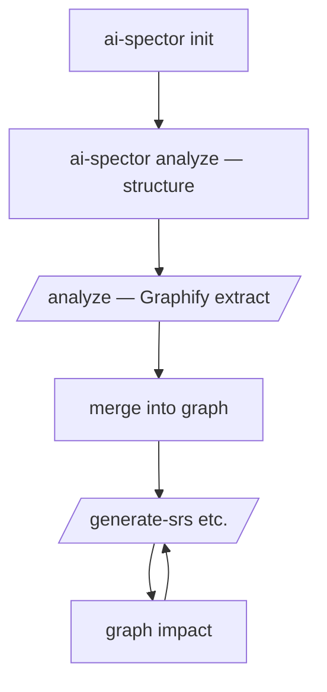

# Workflow overview — graph at the center

**Status:** Normative intent for AI Spector  
**Canonical store:** `.ai-spector/graph/traceability.graph.json`

The traceability graph is not a side artifact. It is the **heart** of the workflow: it holds structure, extracted knowledge, and traceability; generation and impact analysis **query the graph** for what is relevant.

---

## One store, three jobs

| Job | How the graph does it |
|-----|------------------------|
| **Remember** | Domain nodes (`useCase`, `feature`, `actor`, `requirement`, …) and facts anchored to `section` nodes |
| **Connect** | Edges: `listedIn`, `definedIn`, `satisfies`, `dependsOn`, `references`, `tracesTo` |
| **Find relevant** | BFS / `graph_neighbors(id)` — only load sections and docs in the subgraph for the current task |

Markdown under `docs/srs/` is a **projection** of the graph. `knowledge.json` is a **staging** format during `/analyze` until merged into the graph (see migration below).

---

## End-to-end flow

### 1. Init

`ai-spector init` → `.ai-spector/`, Cursor commands/skill, `docs/data-source/`.

### 2. Structure (CLI)

`ai-spector analyze` → `section-registry.json` + bootstrap → every template section exists as a `section` node with `partOf` / `contains` tree.

### 3. Ingest knowledge (Cursor + Graphify)

`/analyze` reads `docs/data-source/`, extracts actors, use cases, features, requirements, entities, interfaces.

### 4. Commit to graph (heart)

Extracted entities become **graph nodes and edges**, not loose JSON:

- `useCase` + `listedIn` → §3.2 section
- `feature` + `listedIn` → §4.2 section  
- `satisfies` → F → UC  
- optional `derivedFrom` / `references` → source chunks  

After `/analyze`, run **`ai-spector graph merge --from-knowledge`** (or merge `extract/patch.json`). Agents must not bulk-edit `traceability.graph.json` by hand.

### 5. Generate (graph-guided context)

`/generate-srs` (and downstream commands) must:

1. `ai-spector graph validate` (or fail fast)
2. Resolve planned sections from graph plan / registry
3. **`ai-spector graph query <sectionId> --json`** — load only `projectionPaths` and nodes from CLI output
4. Fill templates; write markdown; link projection nodes with `rendersTo` when implemented

**Do not** bulk-read all of `docs/srs/` or implement BFS in the IDE agent.

### 6. Impact (graph-guided regen)

After edits, `graph impact <nodeId>` → `regenerate` / `review` / `downstream` buckets → selective `/generate-*`.

---

## Context selection (replaces index-first long term)

| Legacy (v1) | Graph-centric (target) |
|-------------|-------------------------|
| Read `.ai-spector/index/srs.md`, open listed files | `ai-spector graph query sec.srs.4.2 --json` |
| Grep folders for related UC | `graph query` on `UC-01` with `--edges satisfies,listedIn` |
| Guess what regen after edit | `ai-spector graph impact <id> --json` |

Index files remain a **transition** aid until P4; prefer graph queries when nodes exist.

---

## Implementation phases (graph as heart)

| Phase | Graph role |
|-------|------------|
| **P0** (now) | Structure nodes; validate; manual/agent merge of knowledge |
| **P1** | `graph merge`, `/analyze` → patch → graph; `graph query` |
| **P2** | `graph impact` drives regen scope |
| **P3** | `/generate-*` reads plan from graph only |
| **P4** | Deprecate index-first gates; graph prerequisites |

See [traceability-graph-redesign.md](./traceability-graph-redesign.md) for schema and operations detail.
