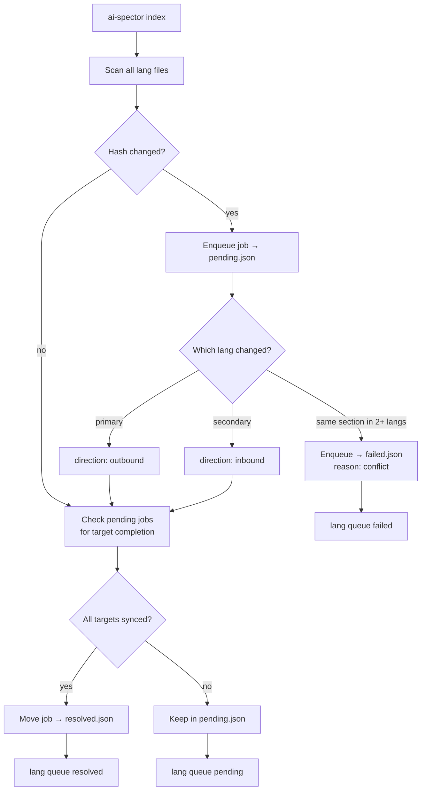

# Translation Queue Plan

## Overview

Add an automatic **translation queue** that detects document changes in **any language** during `index` (via file fingerprints), enqueues sync **jobs**, and moves them through three lifecycle states stored in **separate files** — so AI and CLI consult the queue instead of scanning the whole repo.

**Job lifecycle:**

```
detect change → pending.json → (sync work) → resolved.json
                              ↘ (conflict / error / dismiss) → failed.json
```

**Two sync directions per job:**

| Direction | Trigger | Work needed |
|-----------|---------|-------------|
| **outbound** | Primary language file changed | Push update to secondary translations |
| **inbound** | Secondary language file changed | Sync back to primary, then propagate to other translations |

---

## Problem

Multi-language docs in ai-spector live as Markdown under `docs/{docType}/{lang}/`. Today staleness is inferred ad hoc:

- [`ai-spector-lang-status`](../scaffold/cursor/skills/ai-spector-lang-status/SKILL.md) compares git mtimes across all language folders
- [`graph impact`](../src/graph/impact.ts) returns `staleTranslations[]` only when a graph origin is provided

Neither gives a **durable, queryable job queue**. Teams edit files in any language (primary or translation) and need a single place to see **pending jobs**, **resolved jobs**, and **failed jobs** — not one mixed JSON file and not a full-repo scan.

---

## Solution

Introduce a project-local queue directory:

```
.ai-spector/.docflow/translation-queue/
  fingerprints.json   # last-seen content hash per doc file (scan state, not jobs)
  pending.json        # jobs waiting to be synced
  resolved.json       # jobs completed successfully
  failed.json         # jobs that could not be synced
```

| File | Purpose |
|------|---------|
| `fingerprints.json` | Scan baseline — detects new/changed files |
| `pending.json` | Open jobs — AI processes these |
| `resolved.json` | Completed jobs — audit trail of what was synced |
| `failed.json` | Failed jobs — conflicts, errors, dismissed work |



**Key behavior (auto-detection):**

- Reconciliation runs as part of `index` (and `lang queue scan`)
- Scans **all configured languages**, not just primary
- Re-scan is idempotent: same hashes → no duplicate jobs
- **Outbound:** primary changes → job with all secondary langs as targets
- **Inbound:** secondary changes → job with primary + other secondaries as targets
- **Conflict** (same **section** changed in 2+ langs before sync) → job goes directly to `failed.json`
- Granularity is **section-level**, not file-level — primary and secondary can be edited in the same file without conflict if they touch different sections
- Origin changes again while job is pending → update job in place (reset targets)
- Adding a language via [`lang add`](../src/commands/lang.ts) → next scan adds that lang as target on open jobs

---

## Data schema

New types in [`src/lang/queue-types.ts`](../src/lang/queue-types.ts):

```ts
type SyncDirection = "outbound" | "inbound";
type JobStatus = "pending" | "resolved" | "failed";
type FailReason = "conflict" | "dismissed" | "sync_error" | "timeout";

/** Shared job shape — same fields across pending / resolved / failed */
interface TranslationJob {
  id: string;                    // uuid
  docType: "srs" | "basic-design";
  relativePath: string;          // e.g. 01-overview.md
  sectionId: string;             // e.g. sec.srs.overview.l2.1.actors — job scope
  direction: SyncDirection;
  origin: {
    lang: string;
    path: string;                // e.g. docs/srs/jp/01-overview.md
    hash: string;
    changedAt: string;
  };
  targets: TranslationTarget[];
  createdAt: string;
  updatedAt: string;
}

interface TranslationTarget {
  lang: string;
  path: string;
  status: "pending" | "synced";
  syncedAt?: string;
  hash?: string;
}

/** File wrappers */
interface PendingQueueFile {
  version: 1;
  jobs: TranslationJob[];
}

interface ResolvedQueueFile {
  version: 1;
  jobs: ResolvedTranslationJob[];
}

interface FailedQueueFile {
  version: 1;
  jobs: FailedTranslationJob[];
}

interface ResolvedTranslationJob extends TranslationJob {
  resolvedAt: string;
  syncedLangs: string[];
}

interface FailedTranslationJob extends TranslationJob {
  failedAt: string;
  reason: FailReason;
  message: string;
  /** For conflict failures */
  changedLangs?: string[];
}

interface FingerprintsFile {
  version: 1;
  /** Key: "{filePath}#{sectionId}" → section content hash */
  sections: Record<string, { hash: string; scannedAt: string }>;
}
```

### File-level granularity (v1 — implemented)

**v1 choice:** fingerprint and queue per **whole file**, not per section. Simpler to implement and use; AI re-translates the full document when a job is pending.

**Trade-off:** if user edits different parts of the same file in EN and JP before sync, both langs merge into one job (latest wins). Section-level auto-sync is deferred, but **version history** helps AI/humans merge manually (see below).

**Fingerprint key:** `docs/srs/en/01-overview.md` → whole-file SHA-256 hash.

**Per-file reconcile:**

| Changed langs for same `relativePath` | Action |
|---------------------------------------|--------|
| EN only | 1 outbound job — JP, VI, … need full file sync |
| JP only | 1 inbound job — EN + other langs need full file sync |
| EN + JP (same file, before sync) | 1 merged pending job — **latest file wins** as origin; sync to all other langs |

**Sync work for AI:** read/write the **entire file** at `origin.path` and each pending target path — unless `changes[]` shows parallel edits; then compare versions and merge content manually.

### Version history (implemented)

Each file tracks a monotonic `version` in `fingerprints.json`. Every detected change records:

| Field | Meaning |
|-------|---------|
| `previousVersion` → `version` | e.g. v2→v3 |
| `previousHash` → `hash` | content before/after |
| `lang`, `path` | which language file |

Stored in two places:

1. **`job.changes[]`** — per pending job (what contributed to this sync)
2. **`change-history.json`** — append-only audit log (all file edits)

When EN edits “section A” and JP edits “section B” (same file, file-level merge):

- Job has `mergedLangs: ["en", "jp"]` and two `changes` entries
- AI reads both files + version info, merges content, writes all targets
- Section-level detection can be added later to auto-split changes

**Hash strategy:** SHA-256 of full file content (via `discoverMarkdownFiles` `contentHash`).

**Path resolution:**

```
docs/srs/en/01-overview.md  ↔  docs/srs/jp/01-overview.md  ↔  docs/srs/vi/01-overview.md
```

Helper: `resolveDocPath(docType, lang, relativePath)`.

---

## Core module

New file [`src/lang/queue.ts`](../src/lang/queue.ts):

| Function | Responsibility |
|----------|----------------|
| `queuePaths(projectRoot)` | Resolve paths to all four queue files |
| `loadPendingQueue` / `loadResolvedQueue` / `loadFailedQueue` / `loadFingerprints` | Read or init each file |
| `paths.ts` | `resolveDocPath`, `jobGroupKey`, file path parsing |
| `reconcileTranslationQueue(projectRoot, config)` | Scan files → enqueue / resolve / fail jobs |
| `moveJobToResolved(job)` | Append to `resolved.json`, remove from `pending.json` |
| `moveJobToFailed(job, reason, message)` | Append to `failed.json`, remove from `pending.json` |
| `listJobs(file, opts?)` | Filter by lang / docType / direction |
| `formatQueueTable(jobs, config)` | CLI/skill-friendly output |

**Reconcile algorithm (runs on every `index`):**

1. Load `docflow.config.json`; skip if `languages.length < 2`
2. Load `fingerprints.json`, `pending.json`
3. For each `docType` × each `lang`, glob `docs/{docType}/{lang}/**/*.md`
4. Hash each file; compare vs `fingerprints.files`
5. Group by `relativePath`; for each file with changes:
   - **1 lang changed** → upsert job in `pending.json` (outbound or inbound)
   - **2+ langs changed on same file** → job in `failed.json` with `reason: conflict`
6. For each job in `pending.json`, check each target with `status: pending`:
   - Target **file** hash changed vs baseline → mark target `synced`
7. Job with all targets `synced` → `moveJobToResolved`
8. Update `fingerprints.json`; write all modified queue files

**Inbound sync workflow (for AI/skills):**

When job `direction: inbound`, origin e.g. JP:

1. Read origin file
2. Backport to primary
3. Propagate to remaining pending targets
4. Run `index` → reconcile resolves job

**Failing a job manually:**

```bash
npx ai-spector lang queue fail <jobId> --reason dismissed --message "local-only JP edit"
```

Moves job from `pending.json` → `failed.json`.

---

## CLI commands

Extend [`src/cli.ts`](../src/cli.ts) with a `lang queue` subcommand group:

```bash
npx ai-spector lang queue pending              # open jobs
npx ai-spector lang queue pending --lang jp    # filter: jobs affecting JP
npx ai-spector lang queue pending --json

npx ai-spector lang queue resolved [--limit 20]  # completed jobs
npx ai-spector lang queue resolved --json

npx ai-spector lang queue failed [--limit 20]    # failed jobs
npx ai-spector lang queue failed --json

npx ai-spector lang queue scan                   # reconcile without full index
npx ai-spector lang queue fail <jobId> --reason <reason> [--message <text>]
npx ai-spector lang queue retry <jobId>          # move failed job back to pending (optional)
```

Implementation in [`src/commands/lang-queue.ts`](../src/commands/lang-queue.ts).

**Example `lang queue pending` output:**

```
ID       Document            Section              Dir       Origin  Targets
a1b2     srs/02-actors.md    sec.srs.actors...    outbound  en      jp, vi
c3d4     srs/02-actors.md    sec.srs.actors...    inbound   jp      en, vi
```

**Example `lang queue failed` output:**

```
ID       Document          Reason    Message
e5f6     srs/04-scope.md   conflict  en and jp both changed before sync
```

---

## Integrate into `index`

Hook at end of [`runIndex`](../src/commands/index.ts):

```ts
const queueResult = await reconcileTranslationQueue(projectRoot, docflowConfig);
// print: "Translation queue: 2 pending, 1 resolved, 1 failed this run"
```

Also call reconcile from [`runLangAdd`](../src/commands/lang.ts).

---

## Skill and workflow updates

### [`ai-spector-lang-status`](../scaffold/cursor/skills/ai-spector-lang-status/SKILL.md)

1. Run `npx ai-spector lang queue pending --json` — primary work list
2. Run `npx ai-spector lang queue failed --json` — show blocked/conflict jobs
3. Render tables by `direction`
4. **Inbound:** "Sync back: read `{origin.path}` → update pending targets"
5. **Failed/conflict:** ask user to pick source of truth, then `lang queue retry` or create new job
6. Git-mtime fallback only when queue directory is missing

### [`generate-workflow.md`](../scaffold/cursor/skills/ai-spector/references/generate-workflow.md)

- After any language write + `index`, jobs are enqueued automatically
- Deferring translation (reply 3) → job stays in `pending.json`
- After sync work + `index`, job moves to `resolved.json`

### [`cli-reference.md`](../scaffold/cursor/skills/ai-spector/references/cli-reference.md)

Document `lang queue` commands and the four queue file paths.

---

## Relationship to existing `staleTranslations`

Keep [`staleTranslations`](../src/graph/impact.ts) for graph-origin impact. The translation queue answers "which doc files have open sync jobs?" They complement each other:

- Graph impact → source/graph change propagation
- Translation queue → file-level sync job tracking across all languages

---

## Scaffold and init

Add scaffold templates:

```
scaffold/.ai-spector/.docflow/translation-queue/
  fingerprints.json   # { "version": 1, "files": {} }
  pending.json        # { "version": 1, "jobs": [] }
  resolved.json       # { "version": 1, "jobs": [] }
  failed.json         # { "version": 1, "jobs": [] }
```

[`runInit`](../src/commands/init.ts) copies the directory. First `index` on existing projects creates missing files (migration-safe).

---

## Tests

New vitest suite [`tests/lang/queue.test.ts`](../tests/lang/queue.test.ts):

- **Outbound:** primary change → job in `pending.json`
- **Inbound:** secondary change → job in `pending.json` with primary as target
- All targets synced → job moved to `resolved.json`, removed from pending
- Same section changed in 2 langs → job in `failed.json`
- Different sections changed in different langs → 2 independent pending jobs, no conflict
- `lang queue fail` → job moved to `failed.json` with reason
- `lang queue retry` → job moved back to `pending.json`
- Origin changes again → pending job updated in place
- `lang add` → open jobs gain new lang target
- Single-language project → reconcile is no-op

---

## Implementation order

1. **Types + schemas + queue file I/O** — four files, load/save helpers
2. **`reconcileTranslationQueue` + tests** — enqueue, resolve, fail logic
3. **CLI `lang queue pending | resolved | failed | scan | fail | retry`**
4. **Hook into `index` + `lang add`**
5. **Update skills + cli-reference**
6. **Scaffold templates + init**

---

## Out of scope (later)

- Git post-commit hook
- Section-level granularity (future — reduces false conflicts when EN/JP edit different parts of same file)
- Auto-seeding jobs from `staleTranslations` graph paths
- Pruning old resolved/failed jobs (`lang queue prune --older-than 30d`)
- Three-way merge / diff UI for conflict resolution
