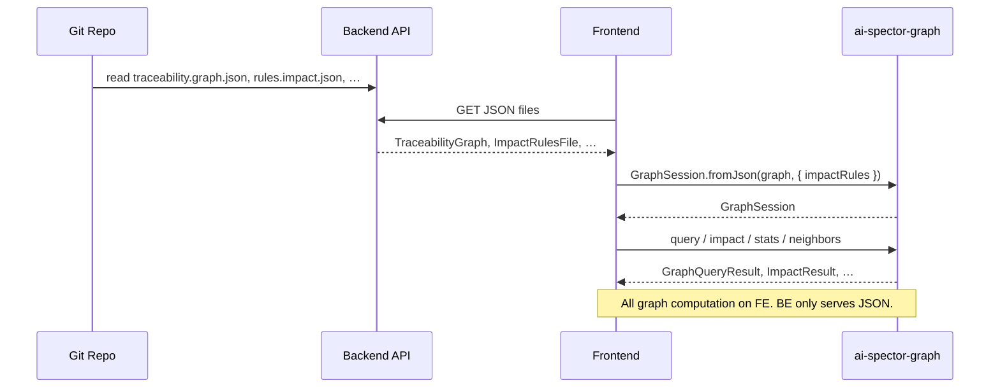

# `ai-spector-graph` SDK Plan

## Overview

Publish **only** `ai-spector-graph` — a browser SDK for read-only traceability graph work.

**Backend** reads files from the repo and exposes them as JSON over HTTP.  
**Frontend** fetches those JSON files and passes them into the SDK.  
**SDK** builds the in-memory graph and runs query, impact, and navigation — no fetch, no UI, no filesystem.

```
Repo files                    Backend API                 Frontend
─────────                     ───────────                 ────────
traceability.graph.json  →    GET …/traceability    →    fetch JSON
rules.impact.json        →    GET …/rules/impact    →    fetch JSON
(other json as needed)   →    GET …/…               →    fetch JSON
                                                          ↓
                                              GraphSession.fromJson(graph, { impactRules })
                                                          ↓
                                              query · impact · stats · neighbors · …
```

The Node CLI remains the **writer**. The SDK is a **read-only consumer** of the same JSON the CLI already reads/writes.

---

## Scope

### In scope (publish)

| Layer | Responsibility |
|-------|----------------|
| **Backend** (your service, not this package) | Fetch repo files; return JSON to FE |
| **`ai-spector-graph`** (this package) | Parse JSON → `InMemoryGraph`; query; impact; stats; resolve |
| **Frontend** (your app) | `fetch` JSON from API; call SDK; render your own UI |

### Out of scope

- Graph viewer app, vis-network bundle, reference SPA
- HTTP client inside the SDK (`fetch` stays in FE)
- Graph writes (`merge`, `bootstrap`, patches)
- Doc parsing, git, filesystem (all stay on BE or CLI)

---

## FE workflow (3 steps)

### Step 1 — Fetch JSON from your API

Backend serves files the SDK needs. You already have these as JSON today:

| File (repo path) | API example | SDK input |
|------------------|-------------|-----------|
| `.ai-spector/graph/traceability.graph.json` | `GET /api/files/traceability.graph.json` | **Required** — main graph |
| `schemas/rules.impact.json` (or project copy) | `GET /api/files/rules.impact.json` | **Required for impact** — or use bundled `DEFAULT_IMPACT_RULES` |
| `.ai-spector/registry/section-registry.json` | `GET /api/files/section-registry.json` | Optional — labels/context in your UI only |
| `.ai-spector/.docflow/analysis/knowledge.json` | `GET /api/files/knowledge.json` | Optional — not used by core graph engine |

```ts
// FE owns fetch — SDK does not call your API
const graph = await fetch("/api/files/traceability.graph.json").then((r) => r.json());
const rules = await fetch("/api/files/rules.impact.json").then((r) => r.json());
```

Backend can use one generic endpoint, e.g. `GET /api/repo/file?path=.ai-spector/graph/traceability.graph.json` — path shape is up to you; SDK only sees parsed JSON.

### Step 2 — Build graph (feed JSON to SDK)

```ts
import { GraphSession, parseImpactRules } from "ai-spector-graph";

const session = GraphSession.fromJson(graph, {
  impactRules: parseImpactRules(rules),
});
// InMemoryGraph is ready — same structure CLI uses after loadGraph()
```

Or without impact rules (query/stats only):

```ts
import { GraphSession, DEFAULT_IMPACT_RULES } from "ai-spector-graph";

const session = GraphSession.fromJson(graph, {
  impactRules: DEFAULT_IMPACT_RULES, // bundled in SDK
});
```

### Step 3 — Query and interact via SDK

All graph logic runs in the browser on the session:

```ts
// Subgraph — same as `ai-spector graph query <id>`
const result = session.query("UC-01", { depth: 2, direction: "both" });
// → { seed, nodes, edges, projectionPaths }

// Impact — same as `ai-spector graph impact --from <id>`
const impact = session.impactFromNode("F-01", { change: "updated" });
// → { regenerate, review, affectedOutputPaths, … }

// Impact from file path — same as `graph impact --file`
const origins = session.resolveOrigins({ file: "docs/srs/en/02-actors.md" });
const impact2 = session.impactFromOrigins(origins);

// Stats, neighbors, lookup
const stats = session.stats();
const out = session.graph.neighbors("UC-01", "out");
const node = session.graph.nodesById.get("F-01");

// Path-target edges (rendersTo / derivedFrom) → synthetic nodes for your canvas
import { expandPathTargetNodes } from "ai-spector-graph";
const vis = expandPathTargetNodes(session.graph);
```

Projection paths in impact/query results are strings. If your UI shows file content, FE fetches that separately from your API — SDK does not fetch files.

---

## Architecture



---

## SDK public API

### Package: `ai-spector-graph`

```
ai-spector-graph
├── .           → GraphSession, types, re-exports
├── ./query     → querySubgraph, projectionPathForNode, …
├── ./impact    → computeImpact, parseImpactRules, DEFAULT_IMPACT_RULES
└── ./stats     → computeGraphStats
```

**No `./client` or fetch helpers** — FE fetches; SDK computes.

### `GraphSession` (main entry)

```ts
class GraphSession {
  static fromJson(
    graph: TraceabilityGraph,
    options?: { impactRules?: ImpactRulesFile },
  ): GraphSession;

  readonly graph: InMemoryGraph;

  query(seedId: string, options?: QueryOptions): GraphQueryResult;
  stats(): GraphStats;

  resolveOrigins(hints: {
    id?: string;
    file?: string;
    heading?: string;
    text?: string;
  }): ResolvedOrigin[];

  impactFromNode(nodeId: string, options?: { change?: string }): ImpactResult;
  impactFromOrigins(origins: ResolvedOrigin[], options?: { change?: string }): ImpactResult;
  mergeImpacts(results: ImpactResult[]): ImpactResult;
}
```

### Lower-level exports (when you do not need the facade)

```ts
import { InMemoryGraph, querySubgraph, computeImpact, parseImpactRules } from "ai-spector-graph";
```

### Types (stable JSON contract)

```ts
interface TraceabilityGraph {
  version: number;
  nodes: GraphNode[];
  edges: GraphEdge[];
}
```

Matches on-disk `traceability.graph.json` and sample `graphj.json`.

---

## What goes in the SDK vs CLI

| In SDK | CLI-only |
|--------|----------|
| `types`, `InMemoryGraph`, `path-target-edges` | `merge`, `knowledgeToPatch` |
| `query`, `impact` (`computeImpact`, `parseImpactRules`) | `doc-extract`, `bundles`, `provenance` |
| `resolve` (file / heading / id — no git) | `loadGraph`, `loadImpactRules` (fs) |
| `stats`, `expandPathTargetNodes` | `resolveFromGitDiff`, git hooks |
| `GraphSession` | `validate` (Ajv + fs), `layer-audit` (fs checks) |

```ts
// SDK — pure
export function parseImpactRules(json: unknown): ImpactRulesFile;
export const DEFAULT_IMPACT_RULES: ImpactRulesFile;

// CLI — thin fs wrapper
export async function loadImpactRules(path: string) {
  return parseImpactRules(await readJson(path));
}
```

---

## Monorepo layout

```
ai-spector/
├── packages/
│   └── graph/                      # ONLY published npm package
│       ├── src/
│       │   ├── index.ts
│       │   ├── session.ts
│       │   ├── core/types.ts
│       │   ├── core/InMemoryGraph.ts
│       │   ├── core/path-target-edges.ts
│       │   ├── query.ts
│       │   ├── impact.ts
│       │   ├── resolve.ts
│       │   ├── stats.ts
│       │   ├── expand-path-nodes.ts
│       │   └── rules/default-impact.json
│       ├── package.json
│       └── README.md               # 3-step FE guide + JSON file list
├── src/                            # CLI → depends on ai-spector-graph
└── docs/plan-web-graph-viewer.md
```

---

## Backend contract (for your team — not implemented in SDK)

Document for BE/FE alignment. Example minimal set:

| GET | Returns |
|-----|---------|
| `/api/files/traceability.graph.json` | `TraceabilityGraph` |
| `/api/files/rules.impact.json` | `ImpactRulesFile` |

Or single proxy:

| GET | Returns |
|-----|---------|
| `/api/repo/file?path={repoRelativePath}` | Raw file body (JSON or markdown) |

BE responsibilities: auth, repo access, CORS, path allowlist (`..` rejected).  
SDK responsibilities: none of the above.

---

## FE example (React)

```tsx
import { useMemo } from "react";
import { useQuery } from "@tanstack/react-query";
import { GraphSession, parseImpactRules } from "ai-spector-graph";

async function loadSession() {
  const [graph, rules] = await Promise.all([
    fetch("/api/files/traceability.graph.json").then((r) => r.json()),
    fetch("/api/files/rules.impact.json").then((r) => r.json()),
  ]);
  return GraphSession.fromJson(graph, { impactRules: parseImpactRules(rules) });
}

function GraphPage({ seedId }: { seedId: string }) {
  const { data: session } = useQuery({ queryKey: ["graph"], queryFn: loadSession });

  const subgraph = useMemo(
    () => (session ? session.query(seedId, { depth: 2 }) : null),
    [session, seedId],
  );

  const impact = useMemo(
    () => (session ? session.impactFromNode(seedId) : null),
    [session, seedId],
  );

  // Render subgraph.nodes, impact.regenerate, etc. with your components
}
```

---

## Build & publish

```json
{
  "name": "ai-spector-graph",
  "type": "module",
  "sideEffects": false,
  "exports": {
    ".": { "types": "./dist/index.d.ts", "import": "./dist/index.js" },
    "./query": { "types": "./dist/query.d.ts", "import": "./dist/query.js" },
    "./impact": { "types": "./dist/impact.d.ts", "import": "./dist/impact.js" },
    "./stats": { "types": "./dist/stats.d.ts", "import": "./dist/stats.js" }
  },
  "files": ["dist", "README.md"]
}
```

| Requirement | Value |
|-------------|-------|
| Runtime dependencies | **Zero** |
| Node built-ins in `dist/` | **None** (`node:fs`, etc.) |
| Format | ESM + `.d.ts` |
| Consumers | Browser FE; CLI via workspace dep |

**Publish:** `ai-spector-graph` only. `ai-spector` CLI stays separate; not required for FE installs.

---

## Implementation phases

### Phase 1 — Extract SDK

- [ ] `packages/graph` with pure modules from `src/graph/`, `src/types.ts`, `src/visualize/stats.ts`
- [ ] `GraphSession` facade
- [ ] `parseImpactRules` + `DEFAULT_IMPACT_RULES` (from `schemas/rules.impact.json`)
- [ ] `expandPathTargetNodes` (from `src/visualize/html.ts`)
- [ ] CLI imports `ai-spector-graph`; `tests/graph/*` pass

### Phase 2 — Document & ship

- [ ] `packages/graph/README.md` — 3-step flow, JSON file table, API notes for BE team
- [ ] JSDoc on public exports
- [ ] CI: grep `dist/` for `node:` → fail
- [ ] Parity test: SDK vs CLI on `graphj.json`
- [ ] `npm publish` `ai-spector-graph`

---

## Success criteria

- [ ] FE: `fetch` graph JSON → `GraphSession.fromJson()` → `query()` / `impactFromNode()` works in browser
- [ ] SDK results match CLI for same `traceability.graph.json` + `rules.impact.json`
- [ ] Published package has no Node-only code; installs in Vite/Next without polyfills
- [ ] No viewer app, no fetch helper in the package — SDK is graph logic only

---

## References

| Artifact | Path |
|----------|------|
| Graph JSON sample | `graphj.json`, `.ai-spector/graph/traceability.graph.json` |
| Impact rules | `schemas/rules.impact.json` |
| Engine | `src/graph/InMemoryGraph.ts`, `query.ts`, `impact.ts`, `resolve.ts` |
| Stats | `src/visualize/stats.ts` |
| Tests | `tests/graph/` |
