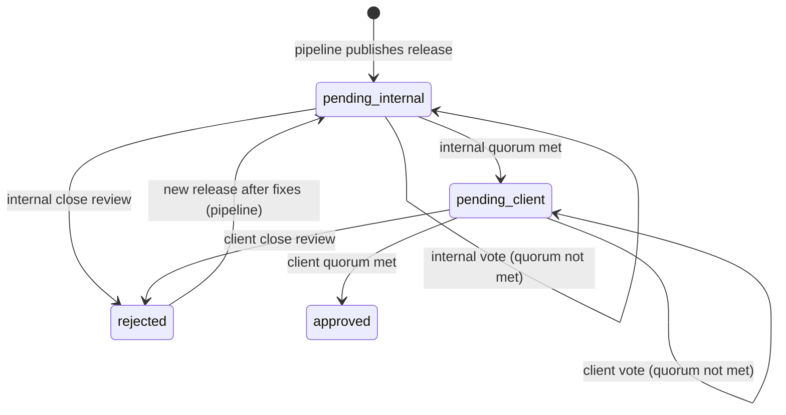

# Document Review System — Web Integration Handover

> **Audience:** Web team implementing the review UI on the **release branch**.
> **Source of truth (schemas):** `src/core/reviews/` and `src/core/operations/review.ts` in this repository.
> **Package version:** ai-spector ≥ 0.8.60
> **Design spec:** `docs/superpowers/specs/2026-06-15-multi-reviewer-review-design.md`

---

## 1. Overview

### Two environments

| Environment | Who | Purpose |
|-------------|-----|---------|
| **Authoring** (main / feature branches) | ai-spector CLI, MCP, internal devs | Edit docs, run `review check`, compute hashes, build snapshots/diffs, populate queue |
| **Release** (release branch, read-only) | Web app — internal team + client | Display final documents, **cast review votes** |

```
Authoring branch                         Release branch (web)
─────────────────                        ────────────────────
edit docs → review check → vote   →      publish final docs + review-queue
(ai-spector owns hashes, diffs, queue)     (web owns vote clicks only)
```

### Review flow

```
Internal review (2/3 quorum)  →  Client review (2/3 quorum)  →  Fully approved
```

Each track uses **multi-reviewer voting**:

- Reviewers are added **dynamically** when they first vote (no pre-configured roster).
- A track passes when **≥ ⌈2/3 × voters⌉** cast an **approve** vote.
- **Declines do not auto-reject** — the track stays pending until quorum is met or someone **closes** the review.
- One vote per person per track (keyed by email); a new action **updates** their existing vote until the track closes.

On the **web app**, both tracks use vote buttons:

| Role | Actions |
|------|---------|
| **Internal** | Approve, Decline, Close review (while internal track is pending) |
| **Client** | Approve, Decline, Close review (while client track is pending) |

The release branch documents are **read-only**. Content does not change during web review, so there is no need for hash re-validation on the web side.

---

## 2. Web Scope — What You Implement

The web app is a **thin vote layer**. Implement only:

| Feature | Action |
|---------|--------|
| List documents + review status | Read `registry.json`, `pending.json` |
| Show document content | Read markdown from `docPath` on release branch (read-only) |
| Show vote list + quorum progress | Read `internal.votes` / `client.votes`; compute quorum (§6.4) |
| Internal approve / decline vote | Upsert vote in `registry.json`; on internal quorum met → move job to client track |
| Internal close review | Set `internal.status: rejected` when quorum cannot be reached |
| Client approve / decline vote | Upsert vote in `registry.json`; on client quorum met → fully approved |
| Client close review | Set `client.status: rejected` when quorum cannot be reached |

On every vote or close: update `registry.json` + `pending.json` (when track advances) + append `history.jsonl` + archive when a job is removed.

Use role-based access: internal users see internal-track actions; client users see client-track actions.

---

## 3. Web Scope — What You Do NOT Implement

Do **not** build any of the following on the web backend:

| Out of scope | Owner |
|--------------|-------|
| Creating `registry.json` entries for new documents | ai-spector / release pipeline |
| `review check`, hash computation, content fingerprinting | ai-spector |
| `fingerprints.json` | ai-spector |
| Snapshots (`snapshots/`) | ai-spector |
| Diffs (`changes/`) | ai-spector |
| Detecting content changes / staleness checks | ai-spector (not needed on release branch) |
| Pre-configured reviewer rosters | Not in v1 — voters are discovered from votes |
| Indexing or search over review data | Not required for v1 |
| Editing document markdown | Release branch is read-only |

If a document is missing from `registry.json` on the release branch, that is a **pipeline bug** — the web app should show an error, not try to initialise review state.

---

## 4. State Machine

Each document has an `overallStatus` in `registry.json` (derived from both tracks):

| `overallStatus`    | Meaning                                      | Who acts next |
|--------------------|----------------------------------------------|---------------|
| `pending_internal` | Internal track open — quorum not yet met     | Internal (web) |
| `pending_client`   | Internal quorum met; client track open       | Client (web) |
| `approved`         | Both tracks reached quorum                   | — |
| `rejected`         | Either track manually closed                 | Authoring fixes, then new release |

### Track-level status

| Track `status` | Meaning |
|----------------|---------|
| `pending` | Accepting votes; quorum not yet met |
| `approved` | Quorum met (`quorumMetAt` set) |
| `rejected` | Manually closed (`closedAt`, `closedBy`, `closeReason` set) |
| `needs_review` | Content changed on authoring — web ignores on release branch |

### Transitions (web actions)



**Internal quorum met:** `internal.status → approved`, remove `{path}:internal` job, add `{path}:client` job, archive internal job.

**Client quorum met:** `client.status → approved`, remove `{path}:client` job, archive client job.

**Manual close:** set track `status → rejected`, remove that track's pending job, archive to `*-rejected.json`.

> Content invalidation (hash change) happens only on the **authoring branch** via ai-spector `review check`. The release branch does not need this logic.

---

## 5. Directory Structure (read from release branch)

All review state lives under `.ai-spector/.docflow/review-queue/`:

```
.ai-spector/.docflow/review-queue/
  registry.json          ← web reads + updates status + votes
  pending.json           ← web reads + moves jobs between tracks
  history.jsonl          ← web appends events
  client-resolved.json   ← web appends on client quorum met
  client-rejected.json   ← web appends on client close
  internal-resolved.json ← web appends on internal quorum met
  internal-rejected.json ← web appends on internal close (+ authoring dismissals)
  internal-failed.json   ← read-only (authoring failures — web ignores)
  fingerprints.json      ← read-only (ignore on web)
  snapshots/             ← read-only (optional display)
  changes/               ← read-only (optional diff display; one file per logical path)
  .session.json          ← agent-only session gate (do not commit; local IDE review state)
```

`.session.json` gates `review_approve` in the CLI/MCP (approve votes only). The web app ignores it.

The pipeline must ship a complete `registry.json` (version **3**) and `pending.json` before the web app goes live. Web never creates these files from scratch.

---

## 6. File Schemas

### 6.1 `registry.json` (version 3)

```json
{
  "version": 3,
  "documents": {
    "srs/01-overview": {
      "version": 3,
      "logicalPath": "srs/01-overview",
      "docPath": "docs/srs/vi/01-overview.md",
      "contentHash": "abc123def456ef78",
      "overallStatus": "pending_internal",
      "internal": {
        "status": "pending",
        "votes": [
          {
            "by": "alice@company.com",
            "username": "Alice",
            "role": "user",
            "decision": "approve",
            "at": "2026-06-15T10:00:00.000Z",
            "note": "LGTM"
          },
          {
            "by": "bob@company.com",
            "username": "Bob",
            "role": "user",
            "decision": "decline",
            "at": "2026-06-15T10:30:00.000Z",
            "note": "Section 2 unclear"
          }
        ],
        "quorumMetAt": null,
        "closedAt": null,
        "closedBy": null,
        "invalidatedAt": null
      },
      "client": {
        "status": "pending",
        "votes": [],
        "quorumMetAt": null,
        "closedAt": null,
        "closedBy": null
      },
      "snapshotRef": ".ai-spector/.docflow/review-queue/snapshots/srs__01-overview.md",
      "lastEventAt": "2026-06-15T10:30:00.000Z"
    }
  }
}
```

| Field | Web reads | Web writes |
|-------|-----------|------------|
| `overallStatus` | ✓ | ✓ (derived from track updates) |
| `internal.votes`, `client.votes` | ✓ | ✓ (upsert on vote) |
| `internal.status`, `client.status` | ✓ | ✓ |
| `quorumMetAt`, `closedAt`, `closedBy`, `closeReason` | ✓ | ✓ (on quorum met / close) |
| `lastEventAt` | ✓ | ✓ |
| `contentHash`, `docPath`, `snapshotRef` | ✓ | ✗ never |

Enum values:

| Field | Values |
|-------|--------|
| `overallStatus` | `pending_internal` \| `pending_client` \| `approved` \| `rejected` |
| `internal.status` | `pending` \| `approved` \| `rejected` \| `needs_review` |
| `client.status` | `pending` \| `approved` \| `rejected` |
| `vote.decision` | `approve` \| `decline` |
| `vote.role` | `user` (internal) \| `client` |

### 6.2 Vote record

```json
{
  "by": "alice@company.com",
  "username": "Alice",
  "role": "user",
  "decision": "approve",
  "at": "2026-06-15T10:00:00.000Z",
  "note": "Optional on approve; recommended on decline"
}
```

- **Upsert rule:** match on `by` (email). If the voter already has a row, replace it; otherwise append.
- Votes are only accepted while the track `status === "pending"`.

### 6.3 Quorum computation (implement in web backend)

```javascript
function requiredApprovals(voterCount) {
  if (voterCount <= 0) return 0;
  return Math.ceil((2 / 3) * voterCount);
}

function computeQuorum(votes) {
  const voterCount = votes.length;
  const approveCount = votes.filter((v) => v.decision === "approve").length;
  const declineCount = voterCount - approveCount;
  const required = requiredApprovals(voterCount);
  return {
    voterCount,
    approveCount,
    declineCount,
    required,
    met: voterCount > 0 && approveCount >= required,
  };
}
```

| Votes | Required | Track result |
|-------|----------|--------------|
| 1 approve | 1 | Quorum met |
| 2 approve, 1 decline | 2 | Quorum met |
| 1 approve, 1 decline | 2 | Pending |
| 1 approve, 2 declines | 2 | Pending (until close) |

Reference implementation: `src/core/reviews/quorum.ts`.

### 6.4 `pending.json`

Unchanged from v2 — filter jobs by `track` to build each queue view.

```json
{
  "version": 2,
  "jobs": [
    {
      "id": "srs/01-overview:internal",
      "logicalPath": "srs/01-overview",
      "track": "internal",
      "reason": "first_review",
      "queuedAt": "2026-06-11T09:00:00.000Z",
      "baselineHash": null,
      "currentHash": "abc123def456ef78"
    }
  ]
}
```

A document stays in the internal queue until **internal quorum is met**, not after the first approve vote.

### 6.5 Archive files (`*-resolved.json`, `*-rejected.json`)

Append to the `entries` array — same shape as before. Create with `{ "version": 1, "entries": [] }` on first write.

### 6.6 `history.jsonl`

Append one JSON line per action.

**Audit identity fields:**

| Field | Meaning |
|-------|---------|
| `by` | Actor email (required) |
| `username` | Display name (recommended) |
| `role` | `"user"` (internal) or `"client"` |

**Event types (v3):**

| `event` | When | Who writes |
|---------|------|------------|
| `registered` | Doc first registered | Pipeline / ai-spector |
| `internal_vote` | Each internal approve/decline | Web or ai-spector |
| `internal_quorum_met` | Internal track passes | Web or ai-spector |
| `internal_closed` | Internal manual close | Web or ai-spector |
| `client_vote` | Each client approve/decline | Web |
| `client_quorum_met` | Client track passes | Web |
| `client_closed` | Client manual close | Web |
| `invalidated` | Content changed | ai-spector (authoring) |
| `rejected` | Dismiss re-review (trivial change) | ai-spector (authoring) |

Legacy events (`approved`, `client_approved`, `client_rejected`) may appear in old history lines — **do not emit them** for new actions.

```jsonl
{"event":"internal_vote","logicalPath":"srs/01-overview","track":"internal","decision":"approve","at":"2026-06-15T10:00:00.000Z","by":"alice@company.com","username":"Alice","role":"user","hash":"abc123def456ef78","note":"LGTM"}
{"event":"internal_quorum_met","logicalPath":"srs/01-overview","track":"internal","at":"2026-06-15T11:00:00.000Z","by":"carol@company.com","username":"Carol","role":"user","hash":"abc123def456ef78","meta":{"voterCount":3,"approveCount":2,"required":2}}
{"event":"client_vote","logicalPath":"srs/01-overview","track":"client","decision":"approve","at":"2026-06-15T12:00:00.000Z","by":"client@client.com","username":"Client User","role":"client","hash":"abc123def456ef78"}
{"event":"client_quorum_met","logicalPath":"srs/01-overview","at":"2026-06-15T13:00:00.000Z","by":"client2@client.com","role":"client","hash":"abc123def456ef78"}
```

---

## 7. Web Actions

All actions: **read-modify-write** the full `registry.json` and `pending.json`. Preserve all fields you do not own. No hash checks required.

Shared vote algorithm:

1. Load document from `registry.json`.
2. Assert track `status === "pending"`.
3. Upsert vote for current user in `track.votes[]`.
4. Recompute quorum (§6.3).
5. Append `internal_vote` or `client_vote` to `history.jsonl`.
6. If quorum **not** met: update `lastEventAt`, save — done.
7. If quorum **met**: set `track.status = "approved"`, `quorumMetAt = now`, derive `overallStatus`, run track completion steps below.

---

### 7.1 Internal approve / decline vote

**Precondition:** `internal.status === "pending"` and `overallStatus === "pending_internal"`.

**On each vote:**

1. Upsert vote with `decision: "approve"` or `"decline"`.
2. Append `history.jsonl` event `internal_vote` with `decision`, `by`, `username`, `role`, `hash`, optional `note`.

**When quorum met (additional steps):**

Update `registry.json`:

```json
{
  "internal": {
    "status": "approved",
    "quorumMetAt": "<ISO-8601>",
    "...votes unchanged..."
  },
  "client": { "status": "pending", "votes": [], "...": "..." },
  "overallStatus": "pending_client",
  "lastEventAt": "<ISO-8601>"
}
```

Update `pending.json`:

1. Remove job `{logicalPath}:internal`
2. Add job `{logicalPath}:client` with `reason: "awaiting_client_signoff"`, copy `contentHash` to `baselineHash` and `currentHash`

Append `internal_quorum_met` to `history.jsonl`. Archive removed internal job to `internal-resolved.json`.

Do **not** change `contentHash`, `docPath`, or `snapshotRef`.

---

### 7.2 Internal close review

**Precondition:** `internal.status === "pending"`, quorum **not** met.

**Requires:** non-empty `closeReason`.

1. Set `internal.status = "rejected"`, `closedAt`, `closedBy`, `closeReason`.
2. `overallStatus → rejected`, update `lastEventAt`.
3. Remove `{logicalPath}:internal` from `pending.json` if present.
4. Append `internal_closed` to `history.jsonl`.
5. Archive job to `internal-rejected.json`.

---

### 7.3 Client approve / decline vote

**Precondition:** `client.status === "pending"` and `overallStatus === "pending_client"`.

Same vote algorithm as §7.1, but on `client` track with `role: "client"` and `client_vote` history events.

**When client quorum met:**

```json
{
  "client": {
    "status": "approved",
    "quorumMetAt": "<ISO-8601>"
  },
  "overallStatus": "approved",
  "lastEventAt": "<ISO-8601>"
}
```

Remove `{logicalPath}:client` from `pending.json`. Append `client_quorum_met`. Archive to `client-resolved.json`.

---

### 7.4 Client close review

**Precondition:** `client.status === "pending"`, quorum **not** met. Requires `closeReason`.

Same pattern as §7.2 but on client track → `client_closed` event → `client-rejected.json` archive.

After rejection, the **authoring team** fixes documents and publishes a **new release**. Web does not re-queue internal jobs.

---

## 8. UI Guidelines

### Queues

| View | Data source |
|------|-------------|
| Internal queue | `pending.json` jobs where `track === "internal"` |
| Client queue | `pending.json` jobs where `track === "client"` |
| All documents + status | `registry.json` → `documents` |

### Quorum progress (show on document detail)

```
Internal: 2 / 2 required (3 voters)     [████████░░] 
Client:   1 / 2 required (2 voters)     [████░░░░░░]
```

Compute from `track.votes` using §6.3.

### Vote list

Show each voter with decision badge, name, email, timestamp, and note:

```
✓ Alice <alice@co.com>  — "LGTM"
✗ Bob   <bob@co.com>    — "Section 2 unclear"
✓ Carol <carol@co.com>
```

### Status badges

| `overallStatus`    | Internal UI label       | Client UI label        |
|--------------------|-------------------------|------------------------|
| `pending_internal` | Awaiting internal       | Not yet available      |
| `pending_client`   | Sent to client          | Awaiting your review   |
| `approved`         | Approved                | Approved               |
| `rejected`         | Review closed           | Rejected               |

### Buttons by role

| Role | Available actions (track pending) |
|------|-------------------------------------|
| Internal | **Approve**, **Decline** (optional note), **Close review** (reason required) |
| Client | **Approve**, **Decline** (optional note), **Close review** (reason required) |

Hide vote/close buttons once the track `status` is `approved` or `rejected`.

### Document display

- Read markdown from `docPath` on the release branch (read-only)
- Optional: show pre-computed diff from `changes/<safe-name>.json`
- Show vote list + quorum progress for the active track
- Show `closeReason` when `overallStatus === "rejected"`

---

## 9. Write Boundary Summary

| File | Web reads | Web writes |
|------|-----------|------------|
| `registry.json` → status, votes | ✓ | ✓ |
| `registry.json` → `contentHash`, `docPath`, `snapshotRef` | ✓ | ✗ |
| `pending.json` | ✓ | ✓ (move jobs when quorum met) |
| `history.jsonl` | ✓ | ✓ (append only) |
| `client-resolved.json`, `client-rejected.json` | ✓ | ✓ (append to `entries[]`) |
| `internal-resolved.json`, `internal-rejected.json` | ✓ | ✓ (append to `entries[]`) |
| `internal-failed.json` | optional | ✗ (authoring only) |
| `fingerprints.json`, `snapshots/`, `changes/` | optional | ✗ |
| Document markdown (`docPath`) | ✓ | ✗ |

---

## 10. Release Pipeline Responsibilities

Before deploying the web app for a release, the pipeline must:

1. Merge final document content into the **release branch**
2. Run ai-spector review workflow on authoring (or CI) to produce a consistent `review-queue/`
3. Ship `registry.json` at **version 3** with `votes: []` on new documents
4. Copy/commit `registry.json`, `pending.json`, and related files to the release branch
5. Ensure every published document has a `registry.json` entry and correct `docPath`

Web team consumes the output; web team does not run `review check` or `review migrate`.

---

## 11. Edge Cases

### Concurrent clicks

Use optimistic locking or file-level locking on `registry.json` / `pending.json`. If track status or vote list changed between page load and submit, show "Status changed — please refresh."

### Same user votes twice

Upsert by `by` — the second click replaces the first vote, does not add a duplicate row.

### Declines without quorum

Declines alone never reject a track. Show **Close review** when stakeholders agree quorum cannot be reached.

### Missing data

| Situation | Web response |
|-----------|--------------|
| Document not in `registry.json` | Error — contact ops / pipeline |
| `registry.version` ≠ 3 | Error — pipeline must ship v3 |
| `pending.json` missing | Treat as empty queue; status still readable from registry |
| `docPath` file missing | Error — broken release |
| `history.jsonl` missing | Create on first append |

### New release after rejection

Old release branch keeps `rejected` state. New release ships updated docs and a fresh `review-queue/` from the pipeline.

---

## 12. Quick Reference

### Paths (relative to release branch root)

| Path | Web use |
|------|---------|
| `.ai-spector/.docflow/review-queue/registry.json` | Status + votes for all documents |
| `.ai-spector/.docflow/review-queue/pending.json` | Internal + client queues |
| `.ai-spector/.docflow/review-queue/history.jsonl` | Audit log |
| `documents[*].docPath` | Read-only markdown content |

### ai-spector reference (authoring only — not web)

`review_approve` casts an **internal approve vote** (not instant sign-off). Client voting is implemented by the web app (§7.3–7.4). Agents must complete the review runbook before `review_approve`.

| Command / MCP tool | Purpose |
|------------------|---------|
| `review check` / `review_check` | Detect content changes, invalidate approvals, register new docs |
| `review begin` / `review_begin` | Start agent review session; with `logicalPath` loads status + readiness |
| `review status` / `review_status` | Per-document status, votes, quorum, diff, history |
| `review queue` / `review_queue` | List pending/resolved/rejected jobs by track |
| `review list` / `review_list` | All documents with `overallStatus` filter |
| `review approve` / `review_approve` | Cast internal **approve** vote; moves to client queue when quorum met |
| `review decline` / `review_decline` | Cast internal **decline** vote |
| `review close` / `review_close` | Manually close internal review (reason required) |
| `review reject` / `review_reject` | Dismiss internal re-review job — not vote close, not client reject |
| `review session start` / `review_session_start` | Reset agent session gate |
| `review_session_ack_review` | Agent acknowledges written review; unlocks `review_approve` |
| `review migrate` / `review_migrate` | Migrate legacy `reviews/` layout |

Schema: `src/core/reviews/types.ts` (v3). Quorum: `src/core/reviews/quorum.ts`. Operations: `src/core/operations/review.ts`.

---

## 13. Example: Multi-reviewer internal → client → approved

**Release ships** with `srs/01-overview` at `pending_internal`, internal job in `pending.json`.

1. **Bob declines** → 1 voter, 0 approves, need 1 — still pending
2. **Alice approves** → 2 voters, 1 approve, need 2 — still pending
3. **Carol approves** → 3 voters, 2 approves, need 2 — **internal quorum met** → `pending_client`, client job added
4. **Client A approves** → 1 voter, 1 approve, need 1 — **client quorum met** → `approved`

No hash computation on any web step — `contentHash` was set by ai-spector before release and stays unchanged on the release branch.
