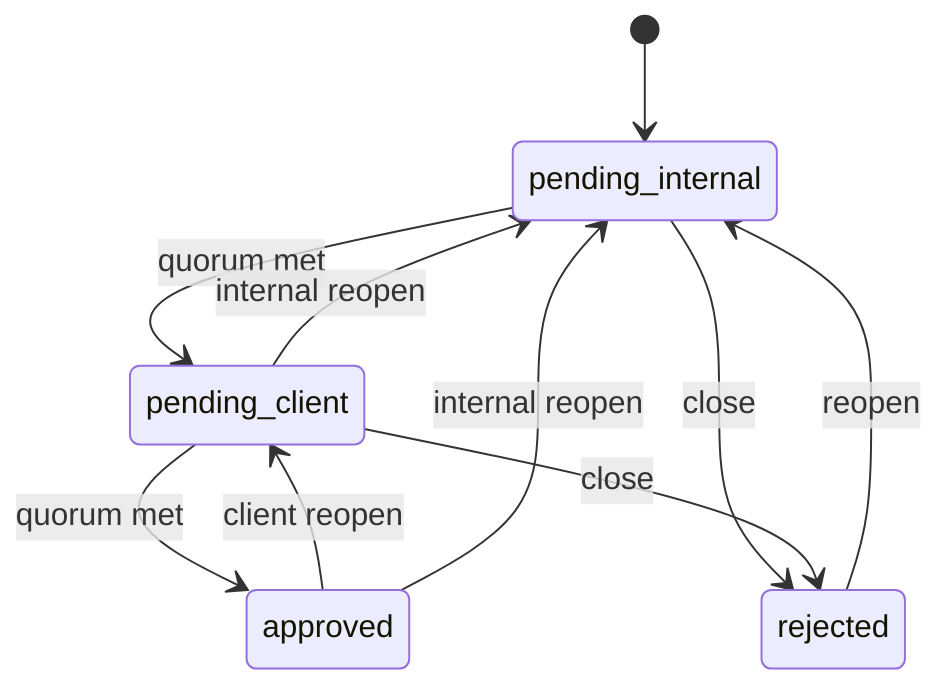

# Document Review — Web Handover

> **Audience:** Web team building the review UI on the **release branch**.
> **Your job:** Read shipped JSON files, display docs, handle vote / withdraw / reopen / close.
> **Not your job:** Doc editing, hashes, queue bootstrap, authoring tooling.

Release branch is **read-only** for markdown. You mutate only review state files under `.ai-spector/.docflow/`.

---

## 1. Flow

```
Internal review (minApprovals)  →  Client review (minApprovals)  →  approved
```

| Rule | Detail |
|------|--------|
| Voters | Added on first vote; one row per email (`by`); upsert while track is `pending` |
| Pass | `approveCount >= minApprovals` from `review-queue.json` |
| Decline | Does not reduce approve count; track stays open until pass or **close** |
| Withdraw | User removes their own vote (open track only) |
| Reopen | Reopens a closed track; keeps votes; needs a **new** vote after `reopenedAt` before auto-close again |
| Internal reopen | Also clears client votes and client queue job |

| Role | Track open | Track closed |
|------|------------|--------------|
| Internal (`role: user`) | Approve, Decline, Withdraw, Close (reason required) | Reopen internal |
| Client (`role: client`) | Approve, Decline, Withdraw, Close (reason required) | Reopen client |

---

## 2. What you build

| UI | Data |
|----|------|
| Internal / client queues | `pending.json` (filter `track`) |
| Document list + status | `registry.json` |
| Markdown body | `docPath` (read-only) |
| Quorum progress | `votes[]` + `review-queue.json` |
| Vote list | `track.votes[]` |

**On every action:** read-modify-write `registry.json`, update `pending.json` when jobs move, append `history.jsonl`, append to archive files when a job is removed.

**Do not build:** registry creation, hash/fingerprint logic, snapshot/diff generation, content invalidation, reviewer roster config, search.

If a document is missing from `registry.json` → show error (ops / pipeline issue).

---

## 3. State machine

| `overallStatus` | Meaning | Who acts |
|-----------------|---------|----------|
| `pending_internal` | Internal track open | Internal users |
| `pending_client` | Internal passed; client open | Client users |
| `approved` | Both tracks passed | — |
| `rejected` | Someone closed a track | — (new release from ops) |

Per-track `status`: `pending` | `approved` | `rejected`. Ignore `needs_review` on release branch.



| Action | `registry.json` | `pending.json` | `history.jsonl` |
|--------|-----------------|----------------|-----------------|
| Internal quorum met | `internal → approved`, `overallStatus → pending_client` | remove `:internal`, add `:client` | `internal_quorum_met` + archive resolved |
| Client quorum met | `client → approved`, `overallStatus → approved` | remove `:client` | `client_quorum_met` + archive resolved |
| Close | track `→ rejected`, `overallStatus → rejected` | remove job | `internal_closed` / `client_closed` + archive rejected |
| Withdraw | remove caller's vote | — | `vote_withdrawn` |
| Reopen | track `→ pending`, clear closure, set `reopenedAt` | re-add job | `track_reopened` |
| Internal reopen | reset `client` (empty `pending`) | remove `:client`, add `:internal` | `client_reset` |

Keep full `votes[]` after quorum — never truncate. **Never write** `contentHash`, `docPath`, or `snapshotRef`.

---

## 4. Files on release branch

```
.ai-spector/.docflow/
  config/review-queue.json
  review-queue/
    registry.json
    pending.json
    history.jsonl
    internal-resolved.json, internal-rejected.json
    client-resolved.json, client-rejected.json
```

Optional read-only (display only): `changes/`, `snapshots/`. Ignore: `fingerprints.json`, `.session.json`.

### `review-queue.json`

```json
{ "version": 1, "internal": { "minApprovals": 2 }, "client": { "minApprovals": 1 } }
```

If missing, default `minApprovals` to `1` per track.

### `registry.json` (version 3)

```json
{
  "version": 3,
  "documents": {
    "srs/01-overview": {
      "logicalPath": "srs/01-overview",
      "docPath": "docs/srs/vi/01-overview.md",
      "contentHash": "abc123def456ef78",
      "overallStatus": "pending_internal",
      "internal": {
        "status": "pending",
        "votes": [
          { "by": "alice@co.com", "username": "Alice", "role": "user", "decision": "approve", "at": "2026-06-15T10:00:00.000Z", "note": "LGTM" }
        ],
        "quorumMetAt": null, "closedAt": null, "closedBy": null, "closeReason": null,
        "reopenedAt": null, "invalidatedAt": null
      },
      "client": {
        "status": "pending", "votes": [],
        "quorumMetAt": null, "closedAt": null, "closedBy": null, "closeReason": null, "reopenedAt": null
      },
      "lastEventAt": "2026-06-15T10:00:00.000Z"
    }
  }
}
```

| You write | You read only |
|-----------|---------------|
| `overallStatus`, track status, `votes[]`, closure fields, `reopenedAt`, `lastEventAt` | `contentHash`, `docPath`, `snapshotRef` |

Vote shape: `by` (email), `username`, `role` (`user` | `client`), `decision` (`approve` | `decline`), `at` (ISO), optional `note`.

Do not use legacy `approvedBy` / `approvedAt` — use `votes[]` only.

### `pending.json` (version 2)

```json
{
  "version": 2,
  "jobs": [
    {
      "id": "srs/01-overview:internal",
      "logicalPath": "srs/01-overview",
      "track": "internal",
      "reason": "first_review",
      "queuedAt": "2026-06-11T09:00:00.000Z",
      "baselineHash": null,
      "currentHash": "abc123def456ef78"
    }
  ]
}
```

Job id: `"{logicalPath}:{track}"`. On internal pass, add client job with `reason: "awaiting_client_signoff"` and copy `contentHash` to `baselineHash` / `currentHash`.

### Archives

Append to `entries[]` in `internal-resolved.json`, `client-resolved.json`, `*-rejected.json`. Create `{ "version": 1, "entries": [] }` on first write.

### `history.jsonl`

Append one JSON object per line. Include `event`, `at`, `by`, `logicalPath`, `track`, `hash` (= `contentHash`), `username`, `role`.

| Emit on web | Do not emit |
|-------------|-------------|
| `internal_vote`, `client_vote`, `internal_quorum_met`, `client_quorum_met`, `internal_closed`, `client_closed`, `vote_withdrawn`, `track_reopened`, `client_reset` | `registered`, `invalidated`, `rejected`, legacy `approved` / `client_*` |

---

## 5. Quorum logic

```javascript
function computeQuorum(votes, minApprovals) {
  const approveCount = votes.filter((v) => v.decision === "approve").length;
  return {
    voterCount: votes.length,
    approveCount,
    required: minApprovals,
    met: approveCount >= minApprovals,
  };
}

function shouldAutoCloseTrack(track, quorum, actionAt) {
  if (!quorum.met) return false;
  if (!track.reopenedAt) return true;
  return actionAt > track.reopenedAt;
}
```

Display: `approveCount / minApprovals required (N voters)`.

---

## 6. Actions

Use file locking or optimistic concurrency; stale state → ask user to refresh.

| Action | When | Do |
|--------|------|-----|
| **Approve / Decline** | track `pending` | Upsert vote → history `{track}_vote` → if `shouldAutoCloseTrack`, apply §3 row |
| **Withdraw** | track `pending`, user has vote | Remove vote → `vote_withdrawn` |
| **Close** | track `pending`, quorum not met, reason provided | track `rejected` → §3 close row |
| **Reopen** | track `approved` or `rejected` | track `pending`, `reopenedAt = now`, re-add job → `track_reopened` (+ client reset if internal) |

On internal quorum: set `closedBy` to tipping voter email; `quorumMetAt` = `closedAt` = action time.

---

## 7. UI notes

| `overallStatus` | Internal sees | Client sees |
|-----------------|---------------|-------------|
| `pending_internal` | Awaiting internal | Not available |
| `pending_client` | Sent to client | Awaiting review |
| `approved` | Approved | Approved |
| `rejected` | Closed (+ `closeReason`) | Rejected |

Buttons: vote/withdraw/close when track `pending`; reopen when `approved` or `rejected`. Role-gate internal vs client actions.

---

## 8. Edge cases

| Case | Handling |
|------|----------|
| Same user votes again | Upsert replaces previous vote |
| Only declines | Stay pending; show Close |
| Missing registry / v3 / doc file | Error UI |
| `pending.json` missing | Treat queue as empty |
| Rejected document | No self-heal; wait for new release from ops |

---

## 9. Walkthrough

Config: `internal.minApprovals = 2`, `client.minApprovals = 1`.

1. Alice approves → 1/2, still `pending_internal`
2. Bob declines → still 1/2
3. Carol approves → internal met → `pending_client`, client job added
4. Client approves → 1/1 → `approved`

**Reopen:** After step 3, internal user reopens → client cleared → Bob withdraws → 1/2 → team re-votes.

---

## 10. Release inputs (from ops)

Expect on every deploy:

- v3 `registry.json` with every published doc
- `review-queue.json`, `pending.json`
- Valid `docPath` files for each registry entry
- Empty or pre-filled `history.jsonl` and archive files

You consume these artifacts; you do not produce the initial queue.
