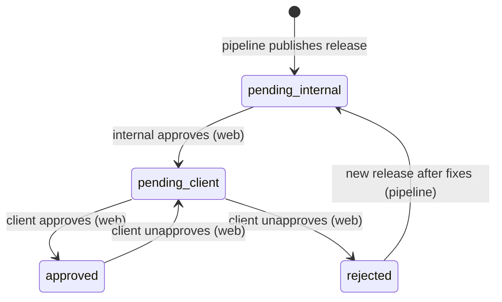

# Document Review System — Web Integration Handover

> **Audience:** Web team implementing the review UI on the **release branch**.
> **Source of truth (schemas):** `src/core/reviews/` and `src/core/operations/review.ts` in this repository.
> **Package version:** ai-spector ≥ 0.8.x

---

## 1. Overview

### Two environments

| Environment | Who | Purpose |
|-------------|-----|---------|
| **Authoring** (main / feature branches) | ai-spector CLI, MCP, internal devs | Edit docs, run `review check`, compute hashes, build snapshots/diffs, populate queue |
| **Release** (release branch, read-only) | Web app — internal team + client | Display final documents, **toggle review status only** |

```
Authoring branch                         Release branch (web)
─────────────────                        ────────────────────
edit docs → review check → approve  →    publish final docs + review-queue
(ai-spector owns hashes, diffs, queue)     (web owns status clicks only)
```

### Review flow

```
Internal Review  →  Client Review  →  Fully Approved
```

On the **web app**, both tracks are handled by button clicks:

- **Internal team** — approve documents waiting for internal sign-off
- **Client** — approve or unapprove (reject) documents waiting for client sign-off

The release branch documents are **read-only**. Content does not change during web review, so there is no need for hash re-validation on the web side.

---

## 2. Web Scope — What You Implement

The web app is a **thin status layer**. Implement only:

| Feature | Action |
|---------|--------|
| List documents + review status | Read `registry.json`, `pending.json` |
| Show document content | Read markdown from `docPath` on release branch (read-only) |
| Internal approve | Update `registry.json` + `pending.json` + `history.jsonl` |
| Client approve | Update `registry.json` + `pending.json` + `history.jsonl` + archive |
| Client unapprove / reject | Update `registry.json` + `pending.json` + `history.jsonl` + archive |

Use role-based access: internal users see internal queue actions; client users see client queue actions.

---

## 3. Web Scope — What You Do NOT Implement

Do **not** build any of the following on the web backend:

| Out of scope | Owner |
|--------------|-------|
| Creating `registry.json` entries for new documents | ai-spector / release pipeline |
| `review check`, hash computation, content fingerprinting | ai-spector |
| `fingerprints.json` | ai-spector |
| Snapshots (`snapshots/`) | ai-spector |
| Diffs (`changes/`) | ai-spector |
| Detecting content changes / staleness checks | ai-spector (not needed on release branch) |
| Indexing or search over review data | Not required for v1 |
| Editing document markdown | Release branch is read-only |

If a document is missing from `registry.json` on the release branch, that is a **pipeline bug** — the web app should show an error, not try to initialise review state.

---

## 4. State Machine

Each document has an `overallStatus` in `registry.json`:

| `overallStatus`    | Meaning                                      | Who acts next |
|--------------------|----------------------------------------------|---------------|
| `pending_internal` | Waiting for internal review                  | Internal (web) |
| `pending_client`   | Internal approved, waiting for client        | Client (web) |
| `approved`         | Both tracks approved                         | — |
| `rejected`         | Client unapproved / rejected                 | Internal (authoring) fixes, then new release |

### Transitions (web actions only)



**Internal approve (web):** `pending_internal` → `pending_client`, move job from internal to client track in `pending.json`.

**Client approve (web):** `pending_client` → `approved`, remove client job, archive to `client-resolved.json`.

**Client unapprove / reject (web):** `pending_client` or `approved` → `rejected`, remove client job (if any), archive to `client-rejected.json`. Requires a comment/reason.

> Content invalidation (hash change) happens only on the **authoring branch** via ai-spector `review check`. The release branch does not need this logic.

---

## 5. Directory Structure (read from release branch)

All review state lives under `.ai-spector/.docflow/review-queue/`:

```
.ai-spector/.docflow/review-queue/
  registry.json          ← web reads + updates status fields
  pending.json           ← web reads + moves jobs between tracks
  history.jsonl          ← web appends events
  client-resolved.json   ← web appends on client approve
  client-rejected.json   ← web appends on client unapprove
  internal-resolved.json ← web appends on internal approve
  fingerprints.json      ← read-only (ignore on web)
  snapshots/             ← read-only (optional display)
  changes/               ← read-only (optional diff display)
```

The pipeline must ship a complete `registry.json` and `pending.json` before the web app goes live. Web never creates these files from scratch.

---

## 6. File Schemas

### `registry.json`

```json
{
  "version": 2,
  "documents": {
    "srs/01-overview": {
      "version": 2,
      "logicalPath": "srs/01-overview",
      "docPath": "docs/srs/vi/01-overview.md",
      "contentHash": "abc123def456ef78",
      "overallStatus": "pending_client",
      "internal": {
        "status": "approved",
        "approvedAt": "2026-06-11T10:00:00.000Z",
        "approvedBy": "alice",
        "invalidatedAt": null
      },
      "client": {
        "status": "pending",
        "approvedAt": null,
        "comment": null
      },
      "snapshotRef": ".ai-spector/.docflow/review-queue/snapshots/srs__01-overview.md",
      "lastEventAt": "2026-06-11T10:00:00.000Z"
    }
  }
}
```

| Field | Web reads | Web writes |
|-------|-----------|------------|
| `overallStatus` | ✓ | ✓ (derived from track updates) |
| `internal.*` | ✓ | ✓ (internal approve only) |
| `client.*` | ✓ | ✓ (client approve / unapprove) |
| `lastEventAt` | ✓ | ✓ |
| `contentHash`, `docPath`, `snapshotRef` | ✓ | ✗ never |

Enum values:

| Field | Values |
|-------|--------|
| `overallStatus` | `pending_internal` \| `pending_client` \| `approved` \| `rejected` |
| `internal.status` | `pending` \| `approved` \| `needs_review` |
| `client.status` | `pending` \| `approved` \| `rejected` |

### `pending.json`

Filter jobs by `track` to build each queue view.

```json
{
  "version": 2,
  "jobs": [
    {
      "id": "srs/01-overview:internal",
      "logicalPath": "srs/01-overview",
      "track": "internal",
      "reason": "first_review",
      "queuedAt": "2026-06-11T09:00:00.000Z",
      "baselineHash": null,
      "currentHash": "abc123def456ef78"
    },
    {
      "id": "srs/02-scope:client",
      "logicalPath": "srs/02-scope",
      "track": "client",
      "reason": "awaiting_client_signoff",
      "queuedAt": "2026-06-11T10:00:00.000Z",
      "baselineHash": "def456abc7890123",
      "currentHash": "def456abc7890123"
    }
  ]
}
```

| Field | Description |
|-------|-------------|
| `id` | `{logicalPath}:{track}` — use this to add/remove jobs |
| `track` | `"internal"` or `"client"` |
| `reason` | Informational — show in UI, do not compute |

Common `reason` values: `first_review`, `awaiting_client_signoff`, `content_changed`, `client_rejected`.

### `history.jsonl`

Append one JSON line per action. Filter by `logicalPath` for per-document audit.

```jsonl
{"event":"approved","logicalPath":"srs/01-overview","track":"internal","at":"2026-06-11T10:00:00.000Z","by":"alice@company.com"}
{"event":"client_approved","logicalPath":"srs/01-overview","at":"2026-06-11T11:00:00.000Z","by":"client-user@client.com","hash":"abc123def456ef78"}
{"event":"client_rejected","logicalPath":"srs/02-scope","at":"2026-06-12T09:00:00.000Z","by":"client-user@client.com","reason":"Section 3 needs more detail"}
```

---

## 7. Web Actions

All actions: **read-modify-write** the full `registry.json` and `pending.json`. Preserve all fields you do not own. No hash checks required.

### 7.1 Internal Approve

**Precondition:** `overallStatus === "pending_internal"` (or internal job exists in `pending.json`).

**Update `registry.json`:**

```json
{
  "internal": {
    "status": "approved",
    "approvedAt": "<ISO-8601>",
    "approvedBy": "<userId>",
    "invalidatedAt": null
  },
  "client": {
    "status": "pending",
    "approvedAt": null,
    "comment": null
  },
  "overallStatus": "pending_client",
  "lastEventAt": "<ISO-8601>"
}
```

Do NOT change `contentHash`, `docPath`, `snapshotRef`.

**Update `pending.json`:**

1. Remove job `{logicalPath}:internal`
2. Add job `{logicalPath}:client` with `reason: "awaiting_client_signoff"`, copy `currentHash` to both `baselineHash` and `currentHash`

**Append `history.jsonl`:**

```jsonl
{"event":"approved","logicalPath":"srs/01-overview","track":"internal","at":"<ISO>","by":"<userId>","hash":"<contentHash from registry>"}
```

**Archive (optional):** append removed internal job entry to `internal-resolved.json`.

---

### 7.2 Client Approve

**Precondition:** `overallStatus === "pending_client"`.

**Update `registry.json`:**

```json
{
  "client": {
    "status": "approved",
    "approvedAt": "<ISO-8601>",
    "comment": "<optional note or null>"
  },
  "overallStatus": "approved",
  "lastEventAt": "<ISO-8601>"
}
```

**Update `pending.json`:** remove job `{logicalPath}:client`.

**Append `history.jsonl`:**

```jsonl
{"event":"client_approved","logicalPath":"srs/01-overview","at":"<ISO>","by":"<userId>","hash":"<contentHash>"}
```

**Archive:** append to `client-resolved.json`:

```json
{
  "logicalPath": "srs/01-overview",
  "queuedAt": "<from removed job>",
  "reason": "awaiting_client_signoff",
  "approvedHash": "<contentHash>",
  "currentHash": "<contentHash>"
}
```

---

### 7.3 Client Unapprove / Reject

**Precondition:** `overallStatus === "pending_client"` or `overallStatus === "approved"` (client revokes prior approval).

**Update `registry.json`:**

```json
{
  "client": {
    "status": "rejected",
    "approvedAt": null,
    "comment": "<reason — required>"
  },
  "overallStatus": "rejected",
  "lastEventAt": "<ISO-8601>"
}
```

**Update `pending.json`:** remove job `{logicalPath}:client` if present.

**Append `history.jsonl`:**

```jsonl
{"event":"client_rejected","logicalPath":"srs/01-overview","at":"<ISO>","by":"<userId>","reason":"<comment>"}
```

**Archive:** append to `client-rejected.json` (same entry shape as §7.2 archive).

After client rejection, the **authoring team** fixes documents and publishes a **new release**. Web does not re-queue internal jobs.

---

## 8. UI Guidelines

### Queues

| View | Data source |
|------|-------------|
| Internal queue | `pending.json` jobs where `track === "internal"` |
| Client queue | `pending.json` jobs where `track === "client"` |
| All documents + status | `registry.json` → `documents` |

### Status badges

| `overallStatus`    | Internal UI label       | Client UI label        |
|--------------------|-------------------------|------------------------|
| `pending_internal` | Awaiting internal       | Not yet available      |
| `pending_client`   | Sent to client          | Awaiting your review   |
| `approved`         | Approved                | Approved               |
| `rejected`         | Client rejected         | Rejected               |

### Document display

- Read markdown from `docPath` on the release branch
- Render read-only — no edit controls
- Optional: show pre-computed diff from `changes/<safe-name>.json` if the pipeline included one (display only, do not recompute)
- Optional: show `client.comment` from a prior rejection when `reason === "client_rejected"`

### Buttons by role

| Role | Available actions |
|------|-------------------|
| Internal | Approve (when `pending_internal`) |
| Client | Approve, Unapprove/Reject (when `pending_client` or `approved`) |

---

## 9. Write Boundary Summary

| File | Web reads | Web writes |
|------|-----------|------------|
| `registry.json` → status fields | ✓ | ✓ |
| `registry.json` → `contentHash`, `docPath`, `snapshotRef` | ✓ | ✗ |
| `pending.json` | ✓ | ✓ (move jobs between tracks) |
| `history.jsonl` | ✓ | ✓ (append only) |
| `client-resolved.json`, `client-rejected.json` | ✓ | ✓ (append) |
| `internal-resolved.json` | ✓ | ✓ (append, optional) |
| `fingerprints.json`, `snapshots/`, `changes/` | optional | ✗ |
| Document markdown (`docPath`) | ✓ | ✗ |

---

## 10. Release Pipeline Responsibilities

Before deploying the web app for a release, the pipeline must:

1. Merge final document content into the **release branch**
2. Run ai-spector review workflow on authoring (or CI) to produce a consistent `review-queue/`
3. Copy/commit `registry.json`, `pending.json`, and related files to the release branch
4. Ensure every published document has a `registry.json` entry and correct `docPath`
5. Set initial `overallStatus` (typically `pending_internal` or `pending_client` depending on whether internal already approved during authoring)

Web team consumes the output; web team does not run `review check` or `review migrate`.

---

## 11. Edge Cases

### Concurrent clicks

Use optimistic locking or file-level locking on `registry.json` / `pending.json`. If `overallStatus` changed between page load and submit, show "Status changed — please refresh."

### Missing data

| Situation | Web response |
|-----------|--------------|
| Document not in `registry.json` | Error — contact ops / pipeline |
| `pending.json` missing | Treat as empty queue; status still readable from registry |
| `docPath` file missing | Error — broken release |
| `history.jsonl` missing | Create on first append |

### New release after client rejection

Old release branch keeps `rejected` state. New release ships updated docs and a fresh `review-queue/` from the pipeline. Web shows the new release independently.

---

## 12. Quick Reference

### Paths (relative to release branch root)

| Path | Web use |
|------|---------|
| `.ai-spector/.docflow/review-queue/registry.json` | Status of all documents |
| `.ai-spector/.docflow/review-queue/pending.json` | Internal + client queues |
| `.ai-spector/.docflow/review-queue/history.jsonl` | Audit log |
| `documents[*].docPath` | Read-only markdown content |

### ai-spector reference (authoring only — not web)

| Command | Purpose |
|---------|---------|
| `review check` | Detect content changes, invalidate approvals |
| `review approve` | Internal approve during authoring (CLI/MCP) |
| `review queue` | List pending jobs |
| `review migrate` | Migrate legacy `reviews/` layout |

Schema definitions: `src/core/reviews/types.ts`.

---

## 13. Example: Internal → Client → Approved

**Release ships** with `srs/01-overview` at `pending_internal`, internal job in `pending.json`.

1. **Internal clicks Approve** → `overallStatus: pending_client`, client job added
2. **Client clicks Approve** → `overallStatus: approved`, client job removed, archived
3. Document shows ✅ Approved for both sides

No hash computation on any web step — `contentHash` was set by ai-spector before release and stays unchanged on the release branch.
