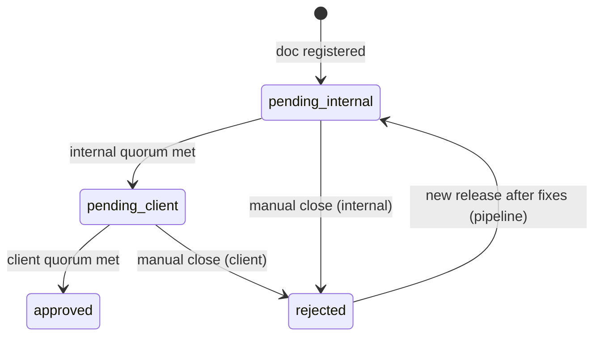

# Multi-Reviewer Document Review — Design Spec

> **Status:** Implemented (core + CLI/MCP)  
> **Date:** 2026-06-15  
> **Scope:** ai-spector core + web handover contract

---

## 1. Problem

Today each document review track (internal, client) is **single-approver**: one `approvedBy` on internal sign-off, one client approve/reject. Teams need **multiple reviewers per track** with a **2/3 quorum** — reviewers are added dynamically when they vote, and a track passes when enough approves are recorded.

## 2. Decisions (locked)

| Topic | Decision |
|-------|----------|
| Tracks | Both **internal** and **client**, each with its own votes and quorum |
| Reviewer list | **Dynamic** — no pre-configured roster; a person is added to `votes[]` when they first vote |
| Quorum rule | `requiredApprovals = ceil(2/3 × votes.length)`; track passes when `count(approve) >= requiredApprovals` |
| Can't reach quorum | **Stay pending** — no auto-reject; someone must **manually close** the track |
| Vote changes | One vote per person per track (keyed by `by`); upsert updates decision until track closes |
| Storage | **Inline in `registry.json`** (Approach A) — `votes[]` on each track |
| Migration | **None** — greenfield v3 schema; no v2→v3 upgrade path required |

## 3. Data model

### 3.1 Types

```typescript
type ReviewDecision = "approve" | "decline";

interface ReviewVote {
  by: string;              // email (required)
  username?: string;       // display name
  role: "user" | "client";
  decision: ReviewDecision;
  at: string;              // ISO-8601
  note?: string | null;    // optional on approve; recommended on decline
}

type TrackStatus = "pending" | "approved" | "rejected" | "needs_review";

interface InternalTrack {
  status: TrackStatus;
  votes: ReviewVote[];
  quorumMetAt: string | null;
  closedAt: string | null;
  closedBy: string | null;
  closeReason?: string | null;
  invalidatedAt: string | null;
}

interface ClientTrack {
  status: "pending" | "approved" | "rejected";
  votes: ReviewVote[];
  quorumMetAt: string | null;
  closedAt: string | null;
  closedBy: string | null;
  closeReason?: string | null;
}

interface ApprovalRecord {
  version: 3;
  logicalPath: string;
  docPath?: string;
  contentHash: string;
  overallStatus: OverallStatus;
  internal: InternalTrack;
  client: ClientTrack;
  snapshotRef?: string;
  lastEventAt?: string;
}
```

`registry.json` version bumps to **3**. New documents are created at v3 only.

### 3.2 Quorum helper (`src/core/reviews/quorum.ts`)

```typescript
function requiredApprovals(voterCount: number): number {
  return Math.ceil((2 / 3) * voterCount);
}

function computeQuorum(votes: ReviewVote[]): {
  voterCount: number;
  approveCount: number;
  declineCount: number;
  required: number;
  met: boolean;
} {
  const voterCount = votes.length;
  const approveCount = votes.filter((v) => v.decision === "approve").length;
  const declineCount = voterCount - approveCount;
  const required = requiredApprovals(voterCount);
  return {
    voterCount,
    approveCount,
    declineCount,
    required,
    met: approveCount >= required,
  };
}
```

**Examples:**

| Votes | Required | Result |
|-------|----------|--------|
| 1 approve | 1 | Met |
| 2 approve, 1 decline | 2 | Met |
| 1 approve, 1 decline | 2 | Pending |
| 1 approve, 2 decline | 2 | Pending (until manual close) |

### 3.3 Example `registry.json` entry

```json
{
  "version": 3,
  "documents": {
    "srs/01-overview": {
      "version": 3,
      "logicalPath": "srs/01-overview",
      "docPath": "docs/srs/vi/01-overview.md",
      "contentHash": "abc123def456ef78",
      "overallStatus": "pending_internal",
      "internal": {
        "status": "pending",
        "votes": [
          {
            "by": "alice@company.com",
            "username": "Alice",
            "role": "user",
            "decision": "approve",
            "at": "2026-06-15T10:00:00.000Z",
            "note": "LGTM"
          },
          {
            "by": "bob@company.com",
            "username": "Bob",
            "role": "user",
            "decision": "decline",
            "at": "2026-06-15T10:30:00.000Z",
            "note": "Section 2 unclear"
          }
        ],
        "quorumMetAt": null,
        "closedAt": null,
        "closedBy": null,
        "invalidatedAt": null
      },
      "client": {
        "status": "pending",
        "votes": [],
        "quorumMetAt": null,
        "closedAt": null,
        "closedBy": null
      },
      "lastEventAt": "2026-06-15T10:30:00.000Z"
    }
  }
}
```

## 4. State machine

### 4.1 Overall status (`deriveOverallStatus`)

| Condition | `overallStatus` |
|-----------|-----------------|
| `internal.status === "rejected"` OR `client.status === "rejected"` | `rejected` |
| `internal.status !== "approved"` | `pending_internal` |
| `client.status !== "approved"` | `pending_client` |
| both `approved` | `approved` |

`needs_review` on internal is treated as not approved (same as today).

### 4.2 Transitions



### 4.3 Actions

#### Cast vote (approve / decline)

- **Internal:** internal users (`role: user`) while `internal.status` is `pending` or `needs_review`
- **Client:** client users (`role: client`) while `client.status` is `pending`

Steps:

1. Upsert vote in `track.votes[]` (match on `by`)
2. Recompute quorum via `computeQuorum`
3. If quorum met: set `track.status = "approved"`, `quorumMetAt = now`
4. Side effects on quorum met:
   - **Internal:** remove `{path}:internal` job, archive, add `{path}:client` job, write snapshot
   - **Client:** remove `{path}:client` job, archive
5. Append per-vote history event; append quorum-met event when applicable

Declines do **not** auto-reject. Track stays pending until quorum is met or manual close.

#### Manual close

- **Who:** any user on the matching track (internal users for internal; clients for client)
- **When:** track is `pending` and quorum not yet met
- **Requires:** `closeReason` (non-empty string)

Steps:

1. Set `track.status = "rejected"`, `closedAt`, `closedBy`, `closeReason`
2. Remove pending job for that track; archive to `*-rejected.json`
3. `overallStatus → rejected`

#### Content invalidation (authoring — `review_check`)

When live hash differs from approved snapshot:

1. Clear `internal.votes[]` (or reset track to pending with empty votes)
2. `internal.status → needs_review`, set `invalidatedAt`
3. If client track was pending, remove client job; if client was approved, reset client votes and pull back to `pending_client` or `pending_internal` per existing reconcile rules
4. Re-queue internal job with `reason: content_changed`

## 5. API changes

### 5.1 CLI / MCP

| Tool | Behavior |
|------|----------|
| `review_approve` | Cast **approve** vote on **internal** track (was: instant sign-off) |
| `review_decline` *(new)* | Cast **decline** vote on **internal** track |
| `review_close` *(new)* | Manual close internal track when quorum not met |
| `review_reject` | **Unchanged** — dismiss internal re-review job (`needs_review`, trivial change); not client reject, not quorum close |

Agent session gate (`.session.json`) applies before **approve** votes via MCP, not before decline/close.

Web app implements the same three actions per role for client track (and internal if exposed in web).

### 5.2 `review_status` / `review_queue` output

Include quorum summary per track:

```json
{
  "quorum": {
    "voterCount": 3,
    "approveCount": 2,
    "declineCount": 1,
    "required": 2,
    "met": true
  }
}
```

## 6. History events

New event types (append to `history.jsonl`):

| Event | When |
|-------|------|
| `internal_vote` | Each internal approve/decline |
| `client_vote` | Each client approve/decline |
| `internal_quorum_met` | Internal track passes |
| `client_quorum_met` | Client track passes |
| `internal_closed` | Manual close (internal) |
| `client_closed` | Manual close (client) |

Legacy events (`approved`, `client_approved`, `client_rejected`) are not emitted for new actions.

Example vote line:

```jsonl
{"event":"internal_vote","logicalPath":"srs/01-overview","track":"internal","decision":"approve","at":"2026-06-15T10:00:00.000Z","by":"alice@company.com","username":"Alice","role":"user","note":"LGTM"}
```

## 7. Web handover updates

Update `docs/plan/review-system-handover.md` to reflect v3:

| UI element | Content |
|------------|---------|
| Vote list | Show each reviewer + decision + note |
| Progress | `2 / 2 required (2/3 of 3 voters)` |
| Buttons (pending) | Approve, Decline, Close review |
| Buttons (quorum met) | None for that track |

Web read-modify-writes `registry.json` + `pending.json` + `history.jsonl` — same as today, with vote upsert logic added.

## 8. Implementation modules

| Module | Change |
|--------|--------|
| `src/core/reviews/types.ts` | v3 types |
| `src/core/reviews/quorum.ts` | **new** — quorum math |
| `src/core/reviews/storage.ts` | `makeApproval`, `deriveOverallStatus` |
| `src/core/operations/review.ts` | vote-based approve; `runDecline`, `runClose` |
| `src/core/reviews/errors.ts` | preconditions for vote vs close |
| `src/core/reviews/workflow-guidance.ts` | quorum-pending messaging |
| `src/core/reviews/session.ts` | gate on approve vote only |
| `src/core/reviews/reconcile.ts` | invalidation clears votes |
| `src/cli.ts` + MCP tools | new commands / descriptions |
| `docs/plan/review-system-handover.md` | v3 web contract |

**Not in scope:** v2→v3 migration (`migrate.ts` unchanged).

## 9. Testing

| File | Cases |
|------|-------|
| `tests/reviews/quorum.test.ts` | `requiredApprovals` for 0–5 voters; `computeQuorum` |
| `tests/reviews/multi-vote.test.ts` | upsert; quorum triggers queue move; internal→client |
| `tests/reviews/manual-close.test.ts` | close pending → rejected; declines alone don't reject |
| `tests/reviews/approve-precondition.test.ts` | vote allowed while pending; blocked after track approved |
| `tests/reviews/review-session.test.ts` | session gate on approve vote only |
| `tests/reviews/invalidate-votes.test.ts` | content change clears votes, re-queues internal |

## 10. Out of scope (v1)

- Configurable quorum ratio (hardcoded `2/3` in `quorum.ts`)
- Pre-assigned reviewer roster
- Auto-reject when quorum becomes mathematically impossible
- Reviewer notifications / reminders
- v2 schema backward compatibility or migration
