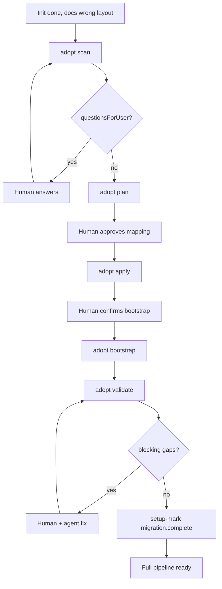

# Project Adopt — Migrate Existing Docs to AI Spector — Design Spec

> **Status:** Approved (brainstorming)  
> **Date:** 2026-06-15  
> **Scope:** ai-spector core, CLI/MCP, agent skill (`ai-spector-adopt`)

---

## 1. Problem

Many projects already ran `npx ai-spector init` but never moved SRS, basic design, or prototype files into the canonical layout. Docs sit in team-specific paths (flat `docs/srs/*.md`, custom folders, disconnected prototype trees).

Without migration:

- `workspace_check` fails STRUCT-003/004
- `index` / doc-semantics cannot build a reliable graph
- Generate, resolve-task, review, prototype sync, and translation workflows are blocked or unreliable

There is no workflow today that:

1. Scans and classifies mixed legacy layouts
2. Produces an auditable move plan with human approval
3. Bootstraps graph and task state from **existing** SRS/BD (not regeneration)
4. Validates readiness for the full pipeline

**Related but out of scope:** `ai-spector-template-import` imports **empty templates** for future generation — not filled-in project docs.

---

## 2. Goals

| Goal | Detail |
|------|--------|
| **Canonical layout** | SRS → `docs/srs/{lang}/`, BD → `docs/basic-design/{lang}/`, prototype → `prototype/` |
| **Full pipeline after adopt** | generate/regen, resolve-task, graph impact, review, translations |
| **Mixed projects** | Auto-detect doc structure, languages, prototype type; branch when custom |
| **Human in the loop** | Plan-before-move; explicit approval gates; no silent file moves |
| **SRS/BD is canonical** | Graph bootstrapped from migrated markdown; data-source supplements gaps only |

---

## 3. Approach

**Hybrid (CLI + agent + human)** — same three-factor model as template-import:

| Actor | Responsibility |
|-------|----------------|
| **CLI** (`npx ai-spector adopt`) | Deterministic scan, plan JSON, apply moves, bootstrap hooks, validate gate |
| **Agent** (`ai-spector-adopt` skill) | Explain findings, resolve ambiguities, branch to template-import when needed |
| **Human** | Approve plan, confirm bootstrap options, accept or fix validate gaps |

---

## 4. Human gates (hard stops)

Agent must not proceed past these without explicit user confirmation:

| Gate | Trigger | Human action |
|------|---------|--------------|
| **Gate 1** | `adopt scan` complete | Read classification summary; answer blocking `questionsForUser` |
| **Gate 2** | `adopt plan` shown | Review mapping table; edit low-confidence rows; say **approve plan** |
| **Gate 3** | Before `adopt bootstrap` | Confirm graph/prototype bootstrap options |
| **Gate 4** | `adopt validate` passed (no blocking gaps) | Say **migration complete** → `adopt setup-mark migration.complete` |

After Gate 4, normal workflows unlock.

---

## 5. CLI commands

| Command | Purpose |
|---------|---------|
| `adopt scan [--json]` | Classify project; inventory files; write scan result |
| `adopt plan [--json]` | Build move plan from scan + stored human answers |
| `adopt apply` | Execute approved plan (git mv when in git repo) |
| `adopt bootstrap [--json]` | Post-move: index, optional analyze, prototype, review registry, adopt tasks |
| `adopt validate [--json] [--sync]` | Readiness gate (like `template verify`) |
| `adopt setup-mark <item-id>` | Mark human-confirmed setup item done |

**MCP parity:** `adopt_scan`, `adopt_plan`, `adopt_apply`, `adopt_bootstrap`, `adopt_validate`, `adopt_setup_mark`.

**Artifact directory:** `.ai-spector/.docflow/adopt/`

```
.adopt/
├── scan-result.json
├── plan.json
├── adopt-setup.json
├── context.json          ← human answers from Gate 1 (like clarifications)
└── history.jsonl         ← audit log of apply/bootstrap actions
```

---

## 6. Scan & classify

### 6.1 Command

```bash
npx ai-spector adopt scan [--json]
```

### 6.2 Output shape (`scan-result.json`)

```jsonc
{
  "scannedAt": "2026-06-15T10:00:00Z",
  "classification": {
    "srs": "builtin-aligned | reshaped | custom | missing",
    "basicDesign": "builtin-aligned | reshaped | custom | missing",
    "prototype": "static-html | spa | disconnected | missing",
    "languages": {
      "detected": ["en", "vi"],
      "strategy": "per-lang-folders | flat | mixed"
    },
    "dataSource": "present | partial | absent",
    "activePack": "builtin | <pack-name>"
  },
  "inventory": [
    {
      "path": "docs/srs/01-intro.md",
      "layer": "srs",
      "signals": {
        "headings": [{ "depth": 1, "text": "Introduction" }],
        "ids": ["UC-01", "F-02"]
      }
    }
  ],
  "questionsForUser": [
    {
      "id": "lang-primary",
      "prompt": "Docs are flat under docs/srs/ — treat as language 'en'?",
      "blocking": true
    }
  ]
}
```

### 6.3 Classification heuristics

| Class | Detection |
|-------|-----------|
| **builtin-aligned** | Filename + H1 similarity to `documents.json` / `documents-basic-design.json` |
| **reshaped** | UC/F/API/screen IDs in body but file split or naming differs from builtin |
| **custom** | Low builtin score; headings match installed pack manifest |
| **prototype disconnected** | HTML/SPA exists but screen slugs do not match basic-design list |

### 6.4 Custom-template branch

If `classification.srs === "custom"` (or basicDesign) and no matching pack is installed:

- Agent offers **install pack first** (`ai-spector-template-import`) **or**
- Adopt as **reshaped** with manual mapping (human confirms every row)

Scan with non-empty `questionsForUser` → stop at Gate 1. Agent asks one blocking question at a time; answers stored in `context.json`; re-run scan when resolved.

---

## 7. Plan & apply

### 7.1 Plan command

```bash
npx ai-spector adopt plan [--json]
```

Reads `scan-result.json` + `context.json` → writes `plan.json`.

### 7.2 Plan shape

```jsonc
{
  "version": 1,
  "status": "draft",
  "approvedAt": null,
  "approvedBy": null,
  "moves": [
    {
      "from": "docs/srs/01-introduction.md",
      "to": "docs/srs/en/1-introduction.md",
      "layer": "srs",
      "documentId": "doc.srs.introduction",
      "confidence": "high",
      "reason": "filename + heading match"
    }
  ],
  "configPatches": [
    { "path": ".ai-spector/docflow.config.json", "set": { "languages": [{ "code": "en", "label": "English" }] } }
  ],
  "prototypeActions": [
    { "action": "relocate", "from": "docs/prototype/", "to": "prototype/" },
    { "action": "emit-manifest", "after": "basic-design migrated" }
  ],
  "warnings": [],
  "blockingIssues": []
}
```

**Status lifecycle:** `draft` → `approved` (human Gate 2) → `applied` (after `adopt apply`).

Human may edit rows in chat; agent updates `plan.json`. `adopt plan --sync` refreshes heuristics after manual edits.

### 7.3 Approve plan

```bash
npx ai-spector adopt plan --approve [--by <email>]
# MCP: adopt_plan({ approve: true })
```

Sets `status: "approved"`, `approvedAt`, `approvedBy`.

### 7.4 Apply rules

```bash
npx ai-spector adopt apply [--dry-run]
```

| Rule | Behavior |
|------|----------|
| Precondition | `plan.status === "approved"` |
| Moves | `git mv` when inside git repo; else filesystem move |
| Dirs | Create missing `docs/srs/{lang}/`, `docs/basic-design/{lang}/` |
| Safety | Never delete source tree roots — only mapped files move |
| Audit | Append each move to `history.jsonl` |
| Post | Set `plan.status` to `"applied"` |

Agent must not run `adopt apply` before Gate 2 approval.

---

## 8. Bootstrap

### 8.1 Command

```bash
npx ai-spector adopt bootstrap [--json]
```

Requires `plan.status === "applied"`. Human confirms options at Gate 3 before run (or confirms CLI defaults).

### 8.2 Ordered steps

1. Apply `configPatches` from `plan.json`
2. `index()` — full refresh with doc-semantics (**primary graph source**)
3. Optional analyze on partial/present data-source (**supplement only** — never overwrite SRS-derived nodes)
4. Prototype actions from plan (relocate already done in apply; emit manifest / setup)
5. Review registry bootstrap — register migrated doc paths with `needs_review` status
6. Create completed **adopt tasks** for generate slots (see §8.3)
7. Update `adopt-setup.json`

### 8.3 Graph strategy

| Source | Priority | Rule |
|--------|----------|------|
| Migrated SRS/BD | Primary | `index` doc-semantics: UC/F/actors, sections, `definedIn` / `describedIn` |
| Partial data-source | Supplement | Analyze only for entities missing from graph |
| Absent data-source | Skip analyze | Graph built entirely from doc bodies |

### 8.4 Task gate compatibility (TASK-002 / TASK-003)

Adopted docs did not go through `task_approve_plan`. After bootstrap:

- Create **completed adopt tasks** in `tasks/index.json`:
  - `generate:srs` — `origin: "adopt"`, chapters marked done per manifest/registry
  - `generate:basic-design` — same pattern
- **Suppress TASK-002/003** when an adopt-origin completed task exists for that slot
- Incremental edits after migration: `resolve-task` bootstraps a **new** active task on demand

### 8.5 Prototype branches

| Detected | Action |
|----------|--------|
| static-html (wrong folder) | Moved in apply; `prototype manifest` |
| spa with `prototype/src/` | Verify screen-map; emit/update manifest |
| disconnected | Migrate files; partial manifest; human links screens in Gate 3 follow-up |
| missing | Skip; user may run `prototype setup` later |

### 8.6 adopt-setup.json

```jsonc
{
  "version": 1,
  "items": {
    "plan.approved": { "done": true, "at": "..." },
    "apply.done": { "done": true, "at": "..." },
    "bootstrap.done": { "done": true, "at": "..." },
    "migration.complete": { "done": false }
  }
}
```

---

## 9. Validate gate

### 9.1 Command

```bash
npx ai-spector adopt validate [--json] [--sync]
```

Returns `{ ready: boolean, gaps: [], questionsForUser: [], blockingCount: number }`.

### 9.2 Checks

| Check | Severity | Pass condition |
|-------|----------|----------------|
| Plan applied | blocking | `plan.status === "applied"` |
| STRUCT-001–004 | blocking | Canonical paths under `docs/srs/{lang}/`, `docs/basic-design/{lang}/` |
| CFG-001 | blocking | `languages[]` matches migrated layout |
| GRAPH-001 + graph validate | blocking | No error-severity graph findings |
| Doc coverage | warning | Expected chapters have a file or documented skip in plan |
| Prototype manifest | warning | list-screens entries resolve to prototype (or listed in gaps) |
| Review registry | warning | Migrated docs registered |
| TASK-002/003 | info | Suppressed via adopt tasks |

### 9.3 Complete migration (Gate 4)

```bash
npx ai-spector adopt setup-mark migration.complete
```

Allowed only when `adopt validate` reports `ready: true` (no blocking gaps). Warnings may remain if human explicitly accepts them in chat.

### 9.4 Workspace rule ADOPT-001

New check rule (warning): `.ai-spector/` present, SRS/BD markdown exists outside canonical layout, and `migration.complete` is not done.

```
Run: npx ai-spector adopt scan
```

Configurable in `.ai-spector/.docflow/config/workspace/rules.json`.

---

## 10. Agent skill — `ai-spector-adopt`

### 10.1 Triggers

"migrate project", "adopt existing docs", "move SRS to ai-spector structure", "validate legacy project", "project already has SRS but wrong folder"

### 10.2 Runbook phases

| Phase | Action | Gate |
|-------|--------|------|
| 0 — Preflight | `workspace_check`; confirm init done, docs misplaced | User confirms adopt candidate |
| 1 — Scan | `adopt scan --json` | Gate 1 |
| 2 — Plan | `adopt plan --json`; show mapping table | Gate 2 |
| 3 — Apply | `adopt apply` (or `--dry-run` first) | User confirms moves |
| 4 — Bootstrap | `adopt bootstrap` | Gate 3 |
| 5 — Validate | `adopt validate --sync` | Fix or accept warnings |
| 6 — Complete | `adopt setup-mark migration.complete` | Gate 4 |

### 10.3 Guardrails

- Never `adopt apply` before plan approved
- Never `setup-mark migration.complete` while blocking validate gaps remain
- Branch to `ai-spector-template-import` when classification is custom and no pack installed
- One blocking question at a time during scan resolution
- On CLI failure → show full output; do not invent results

### 10.4 Scaffold deliverables

- `.cursor/skills/ai-spector-adopt/SKILL.md` (+ Claude sync via `sync-claude`)
- Router entry in `_skill-router.md` and `ai-spector-routing.mdc`
- Course/docs lesson (optional follow-up)

---

## 11. End-to-end flow



---

## 12. Error handling

| Failure | Behavior |
|---------|----------|
| Apply mid-batch failure | Roll back completed moves in batch; log to `history.jsonl`; exit non-zero |
| Index/graph validate errors | Bootstrap continues but validate reports blocking gaps; human fixes before Gate 4 |
| Custom pack required | Agent stops adopt; routes to template-import; resume adopt after pack install |
| User aborts | Preserve `.ai-spector/.docflow/adopt/`; resume with "continue adopt" |

---

## 13. Testing strategy

| Layer | Tests |
|-------|-------|
| Scan heuristics | Fixture repos: builtin-aligned flat layout, per-lang folders, custom headings |
| Plan generation | Confidence scores; configPatches for flat → `{lang}` migration |
| Apply | git mv vs plain move; dry-run; rollback on failure |
| Bootstrap | Adopt tasks suppress TASK-002; index creates UC/F nodes from fixture SRS |
| Validate | ready false with STRUCT-004; ready true after complete migration |
| setup-mark | Rejects `migration.complete` when blocking gaps exist |

---

## 14. Out of scope (v1)

- Automatic content rewriting (headings, IDs) — only path moves; content fixes via resolve-task after adopt
- Word/PDF/confluence import — markdown only
- v1→v2 review queue migration (unchanged)
- Bulk adopt across monorepo subprojects in one command
- CI auto-adopt without human gates

---

## 15. Success criteria

A project that completed the adopt workflow can:

1. Pass `workspace_check` with no STRUCT errors
2. Pass `graph validate`
3. Run `resolve-task` on an existing chapter without TASK-003 blocking
4. Run document review (`review_approve` flow) on migrated paths
5. Regenerate a single chapter via generate skill without full re-init
6. Enqueue translations when multi-language is configured
