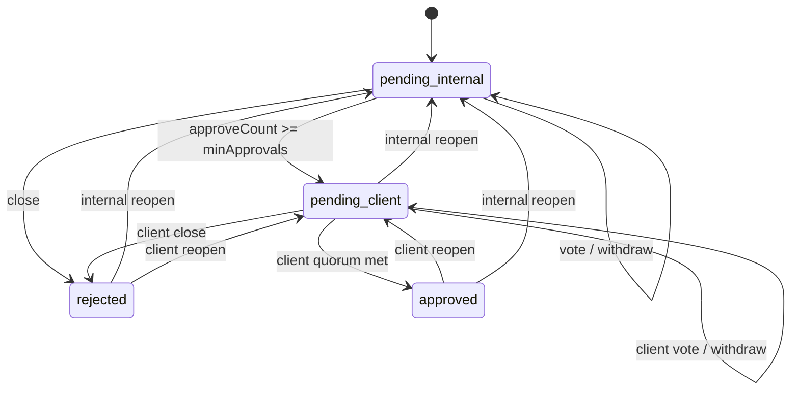

# Review Unapprove + Configurable Minimum Approvals — Design Spec

> **Status:** Approved  
> **Date:** 2026-06-15  
> **Scope:** ai-spector core, CLI/MCP, web handover contract

---

## 1. Problem

1. **No unapprove flow** — once a review track closes (quorum met), votes are locked. Reviewers cannot withdraw their vote or reopen a closed track.
2. **Dynamic 2/3 quorum is unpredictable** — as voters join, the required approval count shifts (e.g. 1 approve → approved; 2nd voter declines → un-approved). Teams want a **fixed minimum approve count** they control.

## 2. Decisions (locked)

| Topic | Decision |
|-------|----------|
| Unapprove scope | All stages — pending, post-quorum, fully approved |
| Who can withdraw | Self only (caller removes own vote) |
| Who can reopen | Any reviewer on that track (`role: user` internal, `role: client` client) |
| Internal reopen cascade | Reset client track entirely (votes cleared, queue job removed) |
| Audit notes | Not required — timestamp + actor in `history.jsonl` |
| Quorum rule | Fixed `minApprovals` per track (replaces `ceil(2/3 × voters)`) |
| Config location | Project-level: `.ai-spector/.docflow/config/review-queue.json` |
| Reopen votes | Retained; **quorum latch** prevents auto-close until new vote after `reopenedAt` |

## 3. Configuration

**File:** `.ai-spector/.docflow/config/review-queue.json`

```json
{
  "version": 1,
  "internal": { "minApprovals": 2 },
  "client": { "minApprovals": 1 }
}
```

| Field | Default if missing | Validation |
|-------|-------------------|------------|
| `internal.minApprovals` | `1` | integer ≥ 1 |
| `client.minApprovals` | `1` | integer ≥ 1 |

**Quorum:**

```
met = approveCount >= minApprovals
```

- `approveCount` = count of votes with `decision === "approve"`
- Declines do not subtract from approve count
- `QuorumSummary.required` = `minApprovals` (not voter-derived)

## 4. Data model changes

### 4.1 Track fields (additive to v3)

```typescript
interface InternalTrack {
  // ...existing fields...
  reopenedAt: string | null;
}

interface ClientTrack {
  // ...existing fields...
  reopenedAt: string | null;
}
```

Normalized default: `reopenedAt: null`.

### 4.2 History events

```typescript
| "vote_withdrawn"
| "track_reopened"
| "client_reset"
```

## 5. Operations

### 5.1 `review_withdraw`

| | |
|---|---|
| Who | Caller only (`by` email) |
| When | Track open (`pending` or `needs_review`) and caller has a vote |
| Effect | Remove caller's vote from `votes[]`; recompute quorum |
| Auto-close | No — track stays open |

### 5.2 `review_reopen`

| | |
|---|---|
| Who | Any user with matching track role |
| When | Track closed (`approved` or `rejected`) |
| Effect | `status → pending`, clear closure fields, set `reopenedAt = now`, votes retained |
| Quorum latch | No auto-close until a vote action with `at > reopenedAt` |
| Queue | Re-add pending job for that track |

**Internal reopen cascade:**

- Reset `client`: `status → pending`, `votes → []`, clear closure fields, `reopenedAt → null`
- Remove client queue job; archive if present
- Re-add internal queue job
- `overallStatus → pending_internal`
- Append `client_reset` history event

**Client reopen (from fully approved):**

- Client track → `pending`, clear closure, set `reopenedAt`
- Re-add client job; `overallStatus → pending_client`
- Internal untouched

## 6. State machine



## 7. CLI / MCP

| Command | MCP tool |
|---------|----------|
| `review withdraw <path>` | `review_withdraw` |
| `review reopen <path>` | `review_reopen` |
| `review config` | `review_config` |

Internal track in v1 CLI/MCP; client withdraw/reopen on web (same contract).

## 8. Web handover additions

- Read `review-queue.json` for `minApprovals`
- Display quorum as `approveCount / minApprovals`
- Implement withdraw + reopen per role (same rules as core)

## 9. Edge cases

| Case | Behavior |
|------|----------|
| Withdraw with no vote | `PRECONDITION_FAILED` — `no_vote_to_withdraw` |
| Withdraw on closed track | `PRECONDITION_FAILED` — `track_closed` |
| Reopen on open track | `PRECONDITION_FAILED` — `track_already_open` |
| Config `minApprovals` raised | Next vote rechecks; does not retroactively unclose |
| Session gate | Withdraw/reopen do not require `review_session_ack_review` |

## 10. Testing

- Config loading and defaults
- `minApprovals` quorum (1 approve pending when min=2)
- Withdraw removes vote and recalculates
- Reopen + latch (stays open until new vote after reopen)
- Internal reopen cascades client reset
- Client reopen from fully approved
- CLI/MCP JSON output and precondition errors
