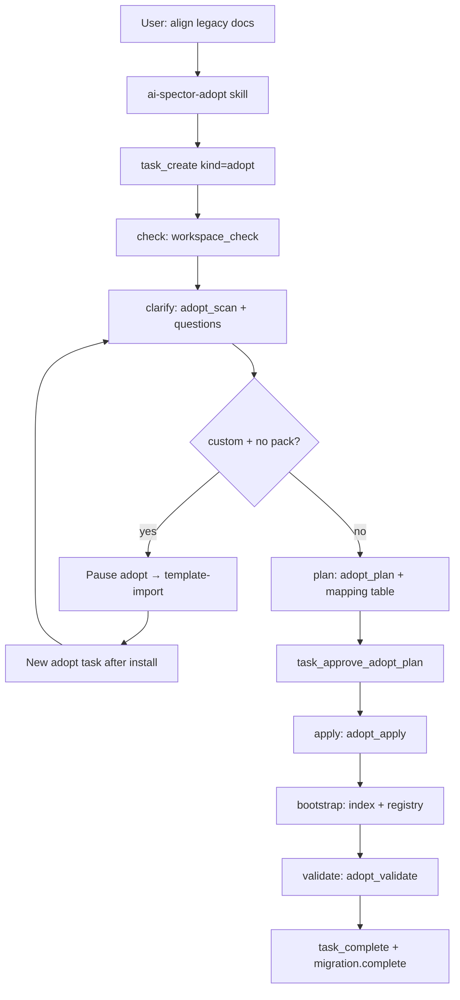

# Adopt v2 — Gated Legacy Alignment Workflow — Design Spec

> **Status:** Approved (brainstorming)  
> **Date:** 2026-06-18  
> **Scope:** ai-spector core, CLI/MCP, agent skill (`ai-spector-adopt`), task engine, routing/docs  
> **Approach:** 1 — Adopt as first-class task (mirrors template-import Superpowers parity)  
> **Supersedes:** Phase/gate model in [2026-06-15-project-adopt-design.md](./2026-06-15-project-adopt-design.md) §4–10 (CLI commands and artifacts remain; gates move to task engine)

---

## 1. Problem

Users with **existing** SRS, basic design, detail design, or prototype docs in non-standard paths need to align with AI Spector before generate, resolve-task, review, and graph workflows work reliably.

The v1 adopt workflow (2026-06-15) shipped CLI scan/plan/apply/bootstrap/validate and an agent runbook, but:

| Gap | Symptom |
|-----|---------|
| **Weak enforcement** | Phases 0–6 are runbook-only — agents skip clarify, apply before approval, or invent scan results |
| **No task engine** | Unlike generate/import/resolve, adopt has no `task_create`, no `PRECONDITION_FAILED`, no `task_resume` |
| **Detail design missing** | `docs/detail-design/` is not scanned, classified, or moved (`SCAN_LAYER_DIRS` omits it) |
| **Disconnected template-import** | Custom format → template-import handoff exists in runbook but is not framed inside a gated adopt journey |
| **Hidden entry** | `WORKFLOW.md` is greenfield-focused; users do not discover "align my legacy docs" |

**Related but different:**

- `ai-spector-setup` — greenfield init when `.ai-spector/` is absent
- `ai-spector-template-import` — install **empty** custom pack for future generation (hard fork when adopt needs a pack)
- `ai-spector-upgrade` — package/scaffold version bump, not doc migration

---

## 2. Goals

| Goal | Detail |
|------|--------|
| **Gated adopt workflow** | `task_create({ kind: "adopt", workflow: "adopt" })` with server-enforced step order |
| **Smart clarify** | `adopt scan` fills inventory/classification; agent asks only blocking gaps (one at a time) |
| **Plan before move** | Mapping table in chat → `task_approve_adopt_plan` → then `adopt apply` |
| **Full doc layers** | SRS + basic design + **detail design** + prototype + data-source inventory |
| **Index as execute step** | `adopt bootstrap` runs full index; `validate` confirms graph + workspace |
| **Template hard fork** | Custom classification + no installed pack → pause adopt task → `ai-spector-template-import` → **new** adopt task after install |
| **Resumable** | `task_list` / "continue adopt" resumes from last incomplete step |

### Success criteria

1. Agent cannot call `adopt_apply` without an active adopt task whose plan is approved via `task_approve_adopt_plan`
2. Legacy detail-design markdown under non-canonical paths appears in scan inventory and approved move plan
3. After adopt `task_complete`, `workspace_check` STRUCT rules pass and `graph validate` has no error-severity findings
4. Custom classification with no pack produces a clear handoff to template-import; adopt task is paused/abandoned with reason recorded
5. User can resume mid-flow via `task_resume` without re-running completed steps

### Out of scope

- Merging template-import into adopt (hard fork stays separate skill + task)
- Auto-generating or rewriting doc **content** (path moves only; content fixes via resolve-task after adopt)
- Word/PDF/Confluence import — markdown only
- Monorepo / multi-root projects
- Undo moves beyond git history
- Tiered Fast/Standard adopt (always full gated pipeline)

---

## 3. Approach

**Hybrid (CLI + agent + human)** — same three-factor model as template-import and v1 adopt:

| Actor | Responsibility |
|-------|----------------|
| **CLI** (`npx ai-spector adopt …`) | Deterministic scan, plan JSON, apply moves, bootstrap index, validate gate |
| **Task engine** | Step tracking, snapshots, `task_approve_adopt_plan`, `PRECONDITION_FAILED` on early tools |
| **Agent** (`ai-spector-adopt` skill) | Explain scan, clarify gaps, present mapping table, confirm bootstrap, route to template-import when needed |
| **Human** | Confirm adopt candidate, answer blocking questions, approve plan, accept validate warnings, complete migration |



---

## 4. Task workflow

### 4.1 New task kind and workflow

Extend `TaskKind`:

```ts
export type TaskKind = "generate" | "resolve" | "import" | "adopt";
```

Add to `BuiltinWorkflowId` and `WORKFLOW_TEMPLATES`:

```ts
const ADOPT_STEPS: TemplateStep[] = [
  { id: "check", phase: "check", description: "Validate workspace; confirm adopt candidate" },
  { id: "clarify", phase: "clarify", description: "Scan + resolve blocking classification questions" },
  { id: "plan", phase: "plan", description: "Present move mapping table; user approves" },
  { id: "apply", phase: "execute", description: "Execute approved file moves" },
  { id: "bootstrap", phase: "execute", description: "Index, optional analyze, prototype, review registry" },
  { id: "validate", phase: "verify", description: "Workspace + graph readiness gate" },
  { id: "complete", phase: "report", description: "Mark migration complete; unlock pipeline" },
];

export const WORKFLOW_TEMPLATES = {
  // …existing…
  adopt: { id: "adopt", kind: "adopt", steps: ADOPT_STEPS },
};
```

`activeSlotFor`: when `kind === "adopt"` return `"adopt"`.

### 4.2 Runbook mapping (replaces v1 Phases 0–6)

| Step | v1 phase | MCP / CLI | Gate |
|------|----------|-----------|------|
| `check` | 0 Preflight | `workspace_check`, `task_create` | User confirms migration candidate |
| `clarify` | 1 Scan | `adopt_scan`, `adopt_context_record` | No blocking `questionsForUser` |
| `plan` | 2 Plan | `adopt_plan` | `task_approve_adopt_plan` after user yes |
| `apply` | 3 Apply | `adopt_apply` (`dryRun` optional) | Plan status `approved` on disk + task |
| `bootstrap` | 4 Bootstrap | `adopt_bootstrap` | User confirms bootstrap options |
| `validate` | 5 Validate | `adopt_validate({ sync: true })` | `ready: true`, no blocking gaps |
| `complete` | 6 Complete | `adopt_setup_mark migration.complete`, `task_complete` | User says migration complete |

### 4.3 Snapshot fields (task)

| Field | Set when | Purpose |
|-------|----------|---------|
| `workspaceCheckAt` | `check` done | Same as generate |
| `adoptScanAt` | First successful `adopt_scan` during clarify | Scan freshness |
| `adoptClarifyCompleteAt` | All blocking questions resolved | Clarify gate |
| `adoptPlanPresentedAt` | Mapping table shown in chat | Plan presentation audit |
| `planApprovedAt` | `task_approve_adopt_plan` | Shared with other workflows |
| `adoptApplyAt` | `adopt_apply` success | Apply gate |
| `adoptBootstrapAt` | `adopt_bootstrap` success | Bootstrap gate |
| `adoptValidateReadyAt` | `adopt_validate` `ready: true` | Validate gate |
| `adoptForkedToImportAt` | Handoff to template-import | Resume hint |

---

## 5. Plan model and approval

### 5.1 AdoptPlan (stored on task + disk)

Keep existing `plan.json` shape under `.ai-spector/.docflow/adopt/`. Extend layers:

```ts
// types.ts extensions
layer: "srs" | "basic-design" | "detail-design" | "prototype";

classification: {
  srs: AdoptLayerClass;
  basicDesign: AdoptLayerClass;
  detailDesign: AdoptLayerClass;  // NEW
  prototype: AdoptPrototypeClass;
  // …unchanged…
};
```

Task `plan` field (new variant on `StoredPlan`):

```ts
| { kind: "adopt"; plan: AdoptPlanSummary }

interface AdoptPlanSummary {
  moveCount: number;
  layers: { srs: number; basicDesign: number; detailDesign: number; prototype: number };
  lowConfidenceCount: number;
  classification: AdoptScanResult["classification"];
  warnings: string[];
}
```

Full `plan.json` remains authoritative for apply; task stores summary for gates and UI.

### 5.2 `task_approve_adopt_plan`

New MCP tool + CLI command (mirror `task_approve_import_plan`):

```bash
npx ai-spector task approve-adopt-plan <taskId>
# MCP: task_approve_adopt_plan({ taskId })
```

**Preconditions:**

- Active task `kind === "adopt"`
- Steps `check`, `clarify` done
- `snapshot.adoptClarifyCompleteAt` set
- `adopt_plan` generated; `plan.json` status `draft`
- `snapshot.adoptPlanPresentedAt` set (agent presented mapping table)
- User explicit yes in chat (agent responsibility)

**Effects:**

- `task.planApprovedAt` = now
- `task.plan` = adopt summary from `plan.json`
- `adopt plan --approve` (or internal `approveAdoptPlan`) — disk `status: "approved"`
- Mark task step `plan` done (only via this tool — not `task_update`)

**Forbidden:** `task_approve_plan`, `task_approve_import_plan`, `adopt_plan --approve` without active adopt task (CLI may accept `--legacy` for scripts).

### 5.3 Mapping table (chat)

Agent presents before approval:

| From | To | Layer | Confidence | Document ID | Notes |
|------|-----|-------|------------|-------------|-------|
| `docs/dd/features/checkout.md` | `docs/detail-design/en/features/checkout.md` | detail-design | high | `doc.dd.detail-feature` | heading match |

Highlight `low` confidence rows; user may edit `plan.json` → `adopt plan --sync`.

---

## 6. Clarify phase

### 6.1 Scan-first (no generic question dump)

1. `adopt_scan` — inventory + classification + `questionsForUser`
2. Agent summarizes: layers detected, file counts, confidence highlights, active pack
3. Blocking questions: **one at a time** → `adopt_context_record` → re-scan until clear
4. Mark clarify done only when scan has zero unresolved blocking questions

### 6.2 Clarify topics (not a fixed script)

| Topic | When asked | Stored as |
|-------|------------|-----------|
| Primary language | Flat `docs/srs/` or mixed layout | `lang-primary` in `context.json` |
| Layer assignment | Ambiguous path (e.g. `docs/design/`) | `layer-<id>` |
| Pack target | `custom` classification | Confirms active pack or triggers fork |
| Prototype type | `disconnected` prototype | `prototype-strategy` |
| Skip layer | User has no DD files | `skip-detail-design` (optional) |

Agent cites **scan evidence** for each question (same spirit as template-import aspect clarify).

### 6.3 Custom pack hard fork

When `classification.srs === "custom"` OR `classification.basicDesign === "custom"` OR `classification.detailDesign === "custom"` **and** no matching pack in `docflow.config.json`:

1. Explain: docs do not match builtin layout; a custom pack is required
2. `task_update` — pause adopt task; set `snapshot.adoptForkedToImportAt`, reason in task notes
3. Route to **`ai-spector-template-import`** (separate skill, separate import task)
4. After `template_import` task completes, user starts **new** adopt task
5. Re-scan with installed pack — classification should improve to `custom` with pack match or `reshaped`

**Do not** nest import steps inside adopt task steps.

---

## 7. Detail design extension

### 7.1 Scan

Add to `SCAN_LAYER_DIRS`:

```ts
{ relativeDir: "docs/detail-design", layer: "detail-design" as const },
```

Also scan common legacy aliases in inventory pass (no move until plan):

| Legacy pattern | Signal |
|----------------|--------|
| `docs/dd/**` | path alias |
| `docs/detail_design/**` | path alias |
| `docs/design/detail/**` | low-confidence layer question |

### 7.2 Classify

Extend `classify.ts`:

- Load `documents-detail-design.json` manifest entries (same pattern as SRS/BD)
- `getManifestEntries("detail-design")` with `doc.dd` node prefix
- `classification.detailDesign`: `builtin-aligned | reshaped | custom | missing`
- Per-domain feature files: match `F-NNN` ids and `features/` path patterns

### 7.3 Plan / apply

- Target paths follow builtin manifest `output` fields, localized with `{lang}` when config uses per-lang folders
- Per-domain: `docs/detail-design/{lang}/features/{slug}.md`
- List chapters: `docs/detail-design/{lang}/feature-list.md`, `common/*.md`

### 7.4 Validate

Add STRUCT check for canonical `docs/detail-design/{lang}/` when DD files exist post-migrate.

Bootstrap adopt tasks: mark `generate:detail-design` slot complete when DD inventory was migrated (same pattern as SRS/BD in `adopt/tasks.ts`).

---

## 8. Server gates

New module `src/core/operations/adopt-gates.ts` (mirror `template-import-gates.ts`).

| Tool / command | Requires |
|----------------|----------|
| `adopt_apply` | Active adopt task; `plan` step approved; `plan.json` status `approved` |
| `adopt_bootstrap` | Active adopt task; `apply` step done; `plan.json` status `applied` |
| `adopt_setup_mark migration.complete` | Active adopt task OR `--legacy`; `validate` step done; `adopt_validate.ready === true` |
| `task_approve_adopt_plan` | Adopt task; check + clarify done; plan presented |
| `task_complete` (adopt) | All steps done including `migration.complete` marked |

`task_approve_plan` when `kind === "adopt"`:

```
PRECONDITION_FAILED — use task_approve_adopt_plan
```

`adopt_plan --approve` without adopt task:

```
PRECONDITION_FAILED — create adopt task and use task_approve_adopt_plan (or --legacy)
```

### 8.1 Legacy escape hatch

`adopt apply --legacy`, `adopt bootstrap --legacy`, `adopt plan --approve --legacy` — for CI/scripts without task (discouraged in agent runbook).

---

## 9. Execute steps

### 9.1 Apply (unchanged mechanics)

- `git mv` in git repos; filesystem move otherwise
- Never delete source tree roots
- Roll back batch on failure; `history.jsonl` audit
- Dry-run via `adopt_apply({ dryRun: true })`

### 9.2 Bootstrap (unchanged order, explicit index)

1. Apply `configPatches` from `plan.json`
2. **`index()`** — full refresh with doc-semantics (primary graph source)
3. Optional analyze on data-source (supplement only)
4. Prototype actions (relocate done in apply; emit manifest)
5. Review registry bootstrap (`needs_review`)
6. Create completed adopt tasks for generate slots (SRS, BD, DD)
7. Update `adopt-setup.json`

Agent confirms bootstrap options with user before run (Gate 3 equivalent).

### 9.3 Validate

Existing `adopt validate` checks plus DD STRUCT coverage.

Loop until `ready: true` or user accepts warnings (warnings cannot block `migration.complete` if policy unchanged from v1).

### 9.4 Complete

```bash
npx ai-spector adopt setup-mark migration.complete
# MCP: adopt_setup_mark({ itemId: "migration.complete" })
task_complete({ taskId })
```

Unlocks: resolve-task, review, generate regen, translations.

---

## 10. Agent skill updates

### 10.1 `ai-spector-adopt` runbook (gated)

Replace phase 0–6 prose with task-step table (§4.2). Add:

- `task_create({ kind: "adopt", workflow: "adopt", trigger: "…" })` on new migration
- `task_list` / `task_resume` for "continue adopt"
- Forbidden table update:

| Forbidden | Use instead |
|-----------|-------------|
| `task_approve_plan` | `task_approve_adopt_plan` |
| `adopt_plan --approve` without task | `task_approve_adopt_plan` |
| `adopt_apply` before plan approval | wait for `task_approve_adopt_plan` |
| `migration.complete` with blocking gaps | fix + re-validate |
| template-import inside adopt task | pause adopt → template-import → new adopt task |

### 10.2 Routing

Update `_skill-router.md`, `ai-spector-routing.mdc`, `WORKFLOW.md`:

| User says | Skill |
|-----------|-------|
| "align legacy docs", "migrate existing docs", "wrong SRS folder", "adopt project", "continue adopt" | `ai-spector-adopt` |

Add WORKFLOW.md row:

| Align legacy SRS/BD/DD | "align my legacy docs", "migrate to ai-spector structure" | `ai-spector-adopt` | gated adopt task → index |

### 10.3 Workspace rule ADOPT-001 (unchanged intent)

Warning when `.ai-spector/` present, docs outside canonical layout, `migration.complete` not set. Hint: start adopt task.

---

## 11. MCP tool reference

| Step | MCP tools |
|------|-----------|
| check | `workspace_check`, `task_create`, `task_update` |
| clarify | `adopt_scan`, `adopt_context_record`, `task_update` |
| plan | `adopt_plan`, `task_approve_adopt_plan` |
| apply | `adopt_apply` |
| bootstrap | `adopt_bootstrap` |
| validate | `adopt_validate`, `adopt_validate({ sync: true })` |
| complete | `adopt_setup_mark`, `task_complete` |

New: `task_approve_adopt_plan`.

---

## 12. End-to-end user story

```text
1. User: "I have legacy SRS and detail design docs — align them with ai-spector"
2. Agent: workspace_check → task_create(adopt) → adopt_scan
3. Agent: "Found 12 SRS files (flat), 8 DD files under docs/dd/. Primary language en?"
4. User answers → adopt_context_record → re-scan
5. Agent: mapping table (20 moves) → user: "approve plan"
6. task_approve_adopt_plan → adopt_apply → adopt_bootstrap (index)
7. adopt_validate → ready → migration.complete → task_complete
8. Agent: "Pipeline unlocked — you can resolve-task, review, or regen chapters"
```

**Custom pack variant:** step 2 scan returns `custom` + no pack → agent pauses adopt, sends user to `/template-import` → after install, new adopt task from step 2.

---

## 13. Error handling

| Failure | Behavior |
|---------|----------|
| Apply mid-batch failure | Roll back completed moves; log `history.jsonl`; exit non-zero; apply step stays incomplete |
| Index/graph errors | Bootstrap completes; validate reports blocking gaps; fix before complete |
| Custom pack required | Pause adopt task; handoff message with template-import triggers |
| User aborts | Artifacts in `.ai-spector/.docflow/adopt/`; resume via `task_resume` |
| Stale scan | If inventory changed since `adoptScanAt`, agent re-runs scan before plan |

---

## 14. Testing strategy

| Layer | Tests |
|-------|-------|
| Task template | `getWorkflowTemplate("adopt")` steps; `activeSlotFor("adopt")` |
| Gates | `adopt_apply` blocked without `task_approve_adopt_plan`; `task_approve_plan` rejects adopt kind |
| DD scan | Fixture: `docs/dd/features/f-01.md` → inventory layer `detail-design` |
| DD plan | Moves to `docs/detail-design/en/features/…` with documentId |
| DD validate | STRUCT pass after apply |
| Fork | Scan `custom` + no pack → gate message suggests template-import |
| Resume | `task_resume` continues from last step |
| Legacy CLI | `--legacy` apply still works without task |

Fixtures under `tests/fixtures/adopt-*` (extend existing adopt fixtures).

---

## 15. Migration from v1 adopt

Projects mid-flight with `plan.json` but no adopt task:

- `adopt scan` unchanged; next agent session creates adopt task
- If `plan.status === "approved"` already, agent may `task_create` + `task_approve_adopt_plan --legacy-sync` (one-time helper that binds existing approved plan to new task) — optional CLI sugar `task adopt-bind-plan`

No breaking change to artifact paths.

---

## 16. Implementation phases (suggested)

| Phase | Deliverable |
|-------|-------------|
| **A** | Task kind + template + `task_approve_adopt_plan` + adopt-gates on apply/bootstrap/setup-mark |
| **B** | Detail design scan/classify/plan/validate |
| **C** | Skill/runbook + routing + WORKFLOW.md |
| **D** | MCP descriptions + route-intent examples + tests |

---

## 17. Decisions log (brainstorming)

| Question | Decision |
|----------|----------|
| New mega-workflow vs upgrade adopt | Upgrade adopt |
| Task pattern | First-class `kind: adopt` with server gates |
| Custom template | Hard fork to template-import; new adopt task after |
| Detail design | Full parity in scan/plan/apply/validate |
| Plan approval tool | Dedicated `task_approve_adopt_plan` (not `task_approve_plan`) |
