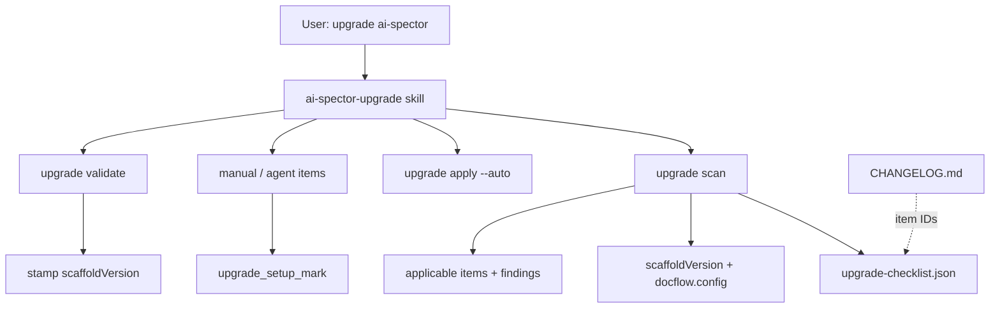

# AI Spector Upgrade Workflow — Design Spec

> **Status:** Approved (brainstorming)  
> **Date:** 2026-06-18  
> **Scope:** ai-spector core, CLI/MCP, agent skill (`ai-spector-upgrade`), package checklist, config scan  
> **Approach:** 2 — Checklist-driven upgrade (chat-first skill + CLI detection)

---

## 1. Problem

When maintainers publish a new `ai-spector` version, users have no official guided workflow to upgrade correctly. Today:

| Gap | Symptom |
|-----|---------|
| **Scaffold drift** | `npm install ai-spector@latest` updates the package but `.cursor/` / `.claude/` skills stay stale |
| **No version stamp** | `setup --check` passes even when scaffold is behind installed package |
| **CHANGELOG-only guidance** | Breaking changes and new config keys are documented inconsistently; config migrations are easy to miss |
| **No chat routing** | Users must read README upgrade bullets or know to say "sync cursor skills" |
| **Manual step scatter** | MCP reload, hook refresh, re-index, config backfill — no single checklist |

README documents `npm install` → `sync-cursor` / `sync-claude` → reload MCP, but there is no phased skill, no scan, and no enforcement that version-specific steps ran.

**Related but different:**

- `ai-spector-setup` — greenfield bootstrap, not version bump
- `ai-spector-adopt` — migrate misplaced **docs**, not package/scaffold upgrade
- `sync-cursor` / `sync-claude` — mechanical copy; no audit, checklist, or version context

---

## 2. Goals

| Goal | Detail |
|------|--------|
| **Chat-first upgrade** | User says "upgrade ai-spector" → `ai-spector-upgrade` skill runs phased runbook |
| **One checklist file** | Package ships `upgrade-checklist.json`; CHANGELOG links item IDs (no duplicate enforcement prose) |
| **Hybrid detection** | Built-in config/code scan + checklist `detect` rules catch drift CHANGELOG may miss |
| **Full migration scope** | Scaffold sync + verification + version-specific steps (re-index, hooks, config backfill) |
| **Safe boundary** | Never overwrite `docs/`, graph content, or user template customizations (same as `sync-cursor`) |
| **Resumable** | Progress in `.ai-spector/.docflow/upgrade/`; "continue upgrade" resumes |

### Success criteria

1. After upgrade workflow completes, `docflow.config.json` → `scaffoldVersion` matches installed package version
2. `upgrade validate` returns `ready: true` and `setup --check` required steps pass
3. All `severity: required` checklist items for the version jump are marked done
4. Agent cannot mark `upgrade.complete` while required items remain open
5. New required config keys are auto-detected even when absent from CHANGELOG (via checklist + config scan)

### Out of scope

- Auto-bumping `package.json` without user confirmation
- Migrating user-edited skill files (only package scaffold overwrite via existing sync behavior)
- Downgrade path (unsupported — warn and stop)
- Monorepo / multi-root projects
- Publishing workflow changes (`deploy.sh`) — separate maintainer concern
- Server gates on unrelated workflows (generate/review) when scaffold is stale — future enhancement

---

## 3. Approach

**Hybrid (CLI + agent + human)** — lighter than adopt, heavier than README bullets:

| Actor | Responsibility |
|-------|----------------|
| **CLI** (`npx ai-spector upgrade`) | Scan, apply auto items, validate, stamp `scaffoldVersion` |
| **Agent** (`ai-spector-upgrade` skill) | Explain findings, confirm version/editor, run phases, mark manual items |
| **Human** | Confirm target version, npm install, MCP reload, approve agent steps |



---

## 4. Version stamping

### `scaffoldVersion` in `docflow.config.json`

Add optional top-level field:

```json
{
  "version": 1,
  "scaffoldVersion": "0.6.0",
  "languages": [{ "code": "en", "label": "English" }],
  ...
}
```

| Event | Action |
|-------|--------|
| `init` | Set `scaffoldVersion` to installed package version |
| `sync-cursor` / `sync-claude` | Update `scaffoldVersion` to installed package version |
| `upgrade validate` (success) | Stamp to target package version |
| Missing field (legacy project) | Treat as `"0.0.0"`; scan reports all checklist items since first use |

`DocflowConfig` type and `loadDocflowConfig()` merge: `scaffoldVersion?: string` (semver).

### Installed package version

Read from `package.json` of the running `ai-spector` binary (`createRequire` — same as `setup.ts`).

### Comparison

Use semver: `semver.lt(project.scaffoldVersion, item.since)` for applicability. `semver.diff` for jump classification (`patch` | `minor` | `major`) used by detectors like `minJump`.

---

## 5. Checklist file

**Path (package):** `src/core/upgrade/upgrade-checklist.json`  
**Path (published):** resolved at runtime via `createRequire` from package root.

### Schema

```typescript
interface UpgradeChecklist {
  version: 1;
  /** Minimum package version that understands this checklist format */
  packageMinVersion: string;
  items: UpgradeChecklistItem[];
}

interface UpgradeChecklistItem {
  id: string;                    // e.g. "UPG-001"
  since: string;                 // semver — applies when scaffoldVersion < since
  until?: string | null;         // optional upper bound
  kind: "auto" | "config" | "agent" | "manual";
  severity: "required" | "recommended";
  title: string;
  detect: UpgradeDetectRule;
  apply?: UpgradeApplyRule;      // auto + config kinds
  agentGuide?: string;           // agent kind
  userGuide?: string;            // manual kind
  changelogRef?: string;         // anchor for CHANGELOG link, e.g. "0.6.0#skills-only-cursor-bundle"
  editors?: ("cursor" | "claude")[];  // omit = both
}
```

### Item kinds

| Kind | Runner | Examples |
|------|--------|----------|
| `auto` | `upgrade apply --auto` | `sync-cursor`, `sync-claude`, `hooks install` |
| `config` | CLI patches `docflow.config.json` | Missing `packs.basicDesign`, deprecated key rename |
| `agent` | Skill executes CLI; user confirms | `index`, `graph validate`, custom pack validate |
| `manual` | User action; skill marks after confirm | MCP reload, enable skills in Cursor settings |

### Detect rules

| `detect.type` | Purpose |
|---------------|---------|
| `scaffold-stale` | `scaffoldVersion < installed`; optional `target`: `cursor` \| `claude`; optional `minJump` |
| `config-missing-key` | Dot-path absent; optional `default` |
| `config-value` | Key present but wrong / deprecated |
| `config-deprecated-key` | Old key present (e.g. `packs.active`) |
| `file-missing` | Expected scaffold path absent |
| `hook-stale` | Pre-commit hook missing marker |
| `mcp-config-stale` | MCP json command/path invalid |
| `always-when-upgrading` | Fires on any version increase |

### Apply rules

| `apply` shape | Action |
|---------------|--------|
| `{ "command": "sync-cursor" }` | Invoke existing operation |
| `{ "command": "sync-claude" }` | Invoke existing operation |
| `{ "command": "hooks install" }` | Invoke existing operation |
| `{ "type": "config-set", "key": "...", "value": ... }` | Deep-set in docflow.config.json |
| `{ "type": "config-rename", "from": "...", "to": "..." }` | Rename key |

### Example items (seed for 0.6.0)

| ID | Since | Kind | Title |
|----|-------|------|-------|
| UPG-001 | 0.6.0 | auto | Refresh Cursor scaffold (`sync-cursor`) |
| UPG-002 | 0.6.0 | auto | Refresh Claude scaffold (`sync-claude`) |
| UPG-010 | 0.6.0 | config | Ensure `packs.basicDesign` exists |
| UPG-011 | 0.6.0 | config | Rename `packs.active` → `packs.srs` if present |
| UPG-020 | 0.5.0 | agent | Re-index after doc-extract changes |
| UPG-021 | 0.5.0 | agent | Validate graph after index |
| UPG-030 | 0.0.0 | manual | Reload MCP in editor |
| UPG-031 | 0.0.0 | manual | Enable Agent Skills in Cursor (if Cursor) |
| UPG-040 | 0.0.0 | auto | Reinstall pre-commit hook |

---

## 6. Config / code scan

`upgrade scan` runs built-in scanners, then evaluates checklist `detect` rules. Union of findings drives `applicableItems`.

### Built-in scanners (always run)

| Scanner ID | Checks | Severity |
|------------|--------|----------|
| `SCAN-scaffold-version` | `scaffoldVersion` vs installed package | error if behind |
| `SCAN-config-schema` | Required `DocflowConfig` keys vs type defaults | error per missing required |
| `SCAN-config-drift` | Known deprecated keys (`packs.active`, etc.) | warning or error |
| `SCAN-scaffold-presence` | Core skill files for detected editors | error if missing |
| `SCAN-hook` | `HOOK_MARKER` in pre-commit hook | warning if git repo |
| `SCAN-mcp-config` | `.cursor/mcp.json` / `.mcp.json` ai-spector entry | warning |

Config schema scanner is the **safety net** when CHANGELOG omits a new key: maintainers add checklist item + config scan rule in the same PR.

### Scan output

Written to `.ai-spector/.docflow/upgrade/scan-result.json` and returned from CLI/MCP.

```typescript
interface UpgradeScanResult {
  scannedAt: string;
  fromVersion: string;       // project scaffoldVersion (or "0.0.0")
  toVersion: string;         // installed package version (or --target if passed)
  editors: ("cursor" | "claude")[];
  applicableItems: string[]; // checklist IDs
  autoFixable: string[];
  findings: UpgradeFinding[];
  ready: boolean;            // true when no required items open
}

interface UpgradeFinding {
  id: string;                // UPG-* or SCAN-*
  status: "ok" | "missing" | "stale" | "warning";
  severity: "required" | "recommended";
  message: string;
  fix?: "auto" | "agent" | "manual";
  detail?: string;
}
```

### Editor detection

Infer from project files:

- Cursor: `.cursor/skills/ai-spector/SKILL.md` exists
- Claude: `.claude/skills/ai-spector/skill.md` or `CLAUDE.md` ai-spector section exists

Filter checklist items by `editors` field. Ask user to confirm if both or ambiguous.

---

## 7. Project state

**Directory:** `.ai-spector/.docflow/upgrade/`

| File | Purpose |
|------|---------|
| `scan-result.json` | Latest `upgrade scan` output |
| `upgrade-setup.json` | Per-item progress (like `adopt-setup.json`) |

```typescript
interface UpgradeSetupState {
  version: 1;
  fromVersion: string | null;
  toVersion: string | null;
  startedAt: string | null;
  completedAt: string | null;
  items: Record<string, { done: boolean; at: string | null; note?: string }>;
}
```

**Gate item IDs:**

| Item ID | Meaning |
|---------|---------|
| `upgrade.confirmed` | User confirmed target version + editors |
| `upgrade.npm-installed` | Package bumped in project |
| `upgrade.auto-applied` | Auto items ran |
| `upgrade.complete` | Validate passed; scaffoldVersion stamped |

Individual checklist items (`UPG-*`) also tracked in `items`.

---

## 8. CLI

Register under `npx ai-spector upgrade` (new command group).

### `upgrade scan`

```bash
npx ai-spector upgrade scan [--target <semver>] [--json] [-C <path>]
```

- Compare `scaffoldVersion` → `toVersion` (default: installed package)
- Run built-in scanners + checklist detection
- Write `scan-result.json`
- Exit code 1 if required findings remain (when `--strict`)

### `upgrade apply`

```bash
npx ai-spector upgrade apply [--auto] [--items UPG-001,UPG-010] [--json] [-C <path>]
```

- `--auto` (default): run all `kind: auto` + `kind: config` applicable items not yet done
- `--items`: subset only
- Does **not** run npm install (user/agent step)
- Mark `upgrade.auto-applied` when auto batch finishes

### `upgrade validate`

```bash
npx ai-spector upgrade validate [--json] [-C <path>]
```

- Re-run scan
- Verify all required `UPG-*` + gate items done
- On success: stamp `scaffoldVersion`, set `upgrade.complete`, `completedAt`
- Also run `setup --check` and include in output

### `upgrade status`

```bash
npx ai-spector upgrade status [--json]
```

- Read `upgrade-setup.json` + quick version compare (no full scan)

### Extend `setup --check`

Add step:

| ID | Label | Status |
|----|-------|--------|
| `scaffold-version` | Scaffold matches installed ai-spector | ok / warning if behind |

Fix hint: `npx ai-spector upgrade scan` or chat "upgrade ai-spector".

---

## 9. MCP tools

Mirror adopt naming. Register in `server.ts` + `tool-descriptions.ts`.

| Tool | When | Notes |
|------|------|-------|
| `upgrade_scan` | Phase 1 | Same as CLI scan |
| `upgrade_apply` | Phase 4 | `{ auto: true }` or `{ items: ["UPG-001"] }` |
| `upgrade_validate` | Phase 6 | Gate for completion |
| `upgrade_setup_mark` | After manual/agent items | `{ itemId: "UPG-030" }` or gate IDs |

`upgrade_setup_mark` for `upgrade.complete` requires `upgrade_validate` → `ready: true`.

No `upgrade_plan` — checklist replaces plan table; user confirms scan summary instead.

---

## 10. Agent skill — `ai-spector-upgrade`

**Scaffold paths:**

- `scaffold/cursor/skills/ai-spector-upgrade/SKILL.md`
- `scaffold/cursor/skills/ai-spector-upgrade/references/runbook.md`
- Sync to Claude via `sync-claude` / `build:claude-scaffold`

### SKILL.md frontmatter

```yaml
name: ai-spector-upgrade
description: >-
  Upgrade ai-spector to a newer package version: scan checklist, sync scaffold,
  apply config migrations, verify hooks and MCP. Use when the user says
  "upgrade ai-spector", "update ai-spector", "sync skills after update",
  "stale scaffold", "new version of ai-spector", or "continue upgrade".
  Do NOT use for greenfield setup (ai-spector-setup) or doc migration (ai-spector-adopt).
paths:
  - "package.json"
  - ".ai-spector/**"
  - ".cursor/**"
  - ".claude/**"
```

### Router updates

Add to `_skill-router.md` (priority **1.5** — after resume task, before incremental change):

| Intent | Skill |
|--------|-------|
| upgrade ai-spector, update ai-spector, sync after update, stale skills, continue upgrade | `ai-spector-upgrade` |

Add to `.cursor/rules/ai-spector-routing.mdc` adopt-style gate row.

### Runbook phases

| Phase | Name | Actions |
|-------|------|---------|
| 0 | Preflight | `workspace_check` or `setup --check`; confirm init done; not adopt candidate |
| 1 | Scan | `upgrade_scan`; show version jump + applicable items table |
| 2 | Confirm | Ask **one** question: target version (default latest) + editors; `upgrade_setup_mark upgrade.confirmed` |
| 3 | Install | User/agent runs `npm install ai-spector@<target>`; mark `upgrade.npm-installed` |
| 4 | Apply auto | `upgrade_apply({ auto: true })`; report what ran |
| 5 | Agent items | For each `kind: agent` item: run guided CLI, show output, mark on user OK |
| 6 | Manual items | One at a time: MCP reload, enable skills; mark each `UPG-*` |
| 7 | Validate | `upgrade_validate`; `setup --check`; print final checklist |
| 8 | Done | Tell user scaffoldVersion stamped; link CHANGELOG upgrade section if major jump |

**Hard stops:**

- Do not skip Phase 2 confirmation
- Do not mark `upgrade.complete` without validate `ready: true`
- Do not run `init --force` as upgrade shortcut
- Downgrade request → warn and stop

### Natural language triggers

"upgrade ai-spector", "update ai-spector", "I installed a new version", "sync skills after update", "stale scaffold", "continue upgrade"

---

## 11. CHANGELOG maintainer workflow

On each release, maintainer updates **two places**:

1. **`upgrade-checklist.json`** — add/modify `UPG-*` items with `detect` + `apply` for new config/scaffold requirements
2. **`CHANGELOG.md`** — under `### Upgrade` (and `### Breaking` when needed), one bullet per user-visible change linking checklist IDs:

```markdown
## [0.6.0] - 2026-06-20

### Upgrade

- **Skills-only Cursor bundle** — checklist `UPG-001`, `UPG-030` (re-sync scaffold; use natural language routing)
- **`packs.basicDesign`** — auto-backfilled (`UPG-010`)

### Breaking

- Slash commands removed — `UPG-001` (re-sync scaffold; use natural language routing)
```

**PR checklist (maintainer):**

- [ ] New config keys have `config-missing-key` item + `loadDocflowConfig` default
- [ ] Scaffold changes have `sync-cursor` / `sync-claude` item if editor bundle changed
- [ ] Breaking section lists `UPG-*` IDs
- [ ] `npm test` includes upgrade scan fixture test

---

## 12. Error handling

| Situation | Behavior |
|-----------|----------|
| Project not initialized | Scan throws; skill routes to `ai-spector-setup` |
| Downgrade (`toVersion < scaffoldVersion`) | Error: downgrades unsupported |
| `npm install` fails | Stop; do not mark `upgrade.npm-installed` |
| Auto apply partial failure | Report failed item; leave others done; validate fails |
| User skips manual MCP reload | `upgrade.complete` blocked until `UPG-030` marked (user confirms) |
| Legacy project (`scaffoldVersion` missing) | Treat as `0.0.0`; may show many items — agent explains one-time catch-up |
| Custom-edited scaffold files | Same as today: `sync-cursor` overwrites package-managed paths; warn in Phase 4 |

---

## 13. Testing

| Area | Tests |
|------|-------|
| `upgrade-checklist.json` | Schema validation; item ID uniqueness |
| Scan | Fixture projects at scaffoldVersion 0.4.x → detect 0.6.0 items |
| Config detect | Missing `packs.basicDesign`; deprecated `packs.active` |
| Apply auto | Mock sync operations; config patch applied |
| Validate | Stamps `scaffoldVersion`; gate when items open |
| `setup --check` | New `scaffold-version` step |
| Semver filtering | `since` / `until` / `minJump` |

Integration fixture: `tests/fixtures/upgrade-stale-scaffold/` with old `.cursor/skills` subset and minimal `docflow.config.json`.

---

## 14. File change summary

| Area | Files |
|------|-------|
| Core | `src/core/upgrade/` — `checklist.json`, `scan.ts`, `apply.ts`, `validate.ts`, `setup.ts`, `types.ts`, `paths.ts` |
| Config | `src/core/config/types.ts`, `load.ts` — `scaffoldVersion` |
| Operations | `src/core/operations/setup.ts` — audit step; `init.ts`, `sync-cursor.ts`, `sync-claude.ts` — stamp version |
| CLI | `src/core/operations/upgrade.ts`, `src/cli.ts`, `src/interfaces/cli/format/upgrade.ts` |
| MCP | `src/interfaces/mcp/tools/upgrade.ts`, `server.ts`, `schemas.ts`, `tool-descriptions.ts` |
| Scaffold | `scaffold/cursor/skills/ai-spector-upgrade/`, `_skill-router.md`, `ai-spector-routing.mdc` |
| Docs | `README.md`, `README.vi.md`, `CHANGELOG.md` |
| Tests | `tests/upgrade/*.test.ts`, fixture project |

---

## 15. Implementation order

1. Types + `scaffoldVersion` field + stamp on init/sync
2. `upgrade-checklist.json` seed items
3. Scan + built-in config scanners
4. Apply + validate + setup state
5. CLI commands + formatters
6. MCP tools
7. `setup --check` extension
8. Agent skill + router
9. README/CHANGELOG maintainer docs
10. Tests + fixture

---

## 16. Open questions (resolved in brainstorming)

| Question | Decision |
|----------|----------|
| Scope | Full migration |
| Checklist model | Hybrid — one package file + CHANGELOG links + config scan |
| Entry point | Chat-first `ai-spector-upgrade` skill |
| Approach | Checklist-driven (not full adopt parity) |
