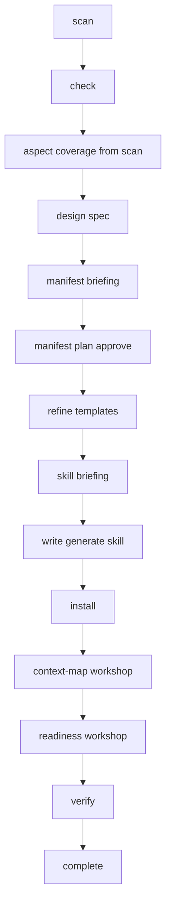
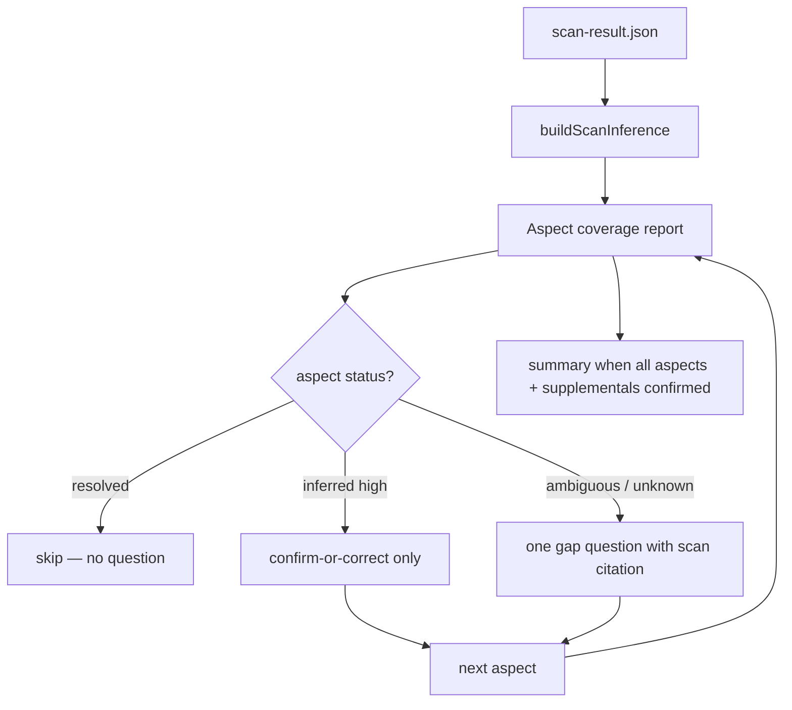

# Template Import Superpowers Parity — Design Spec

> **Status:** Approved (brainstorming)  
> **Date:** 2026-06-18  
> **Scope:** Custom template pack import — Always Full pipeline with first-class import task + server gates  
> **Approach:** 1 — Import as first-class task (like generate/resolve)

---

## 1. Problem

Template import today is a **7-phase runbook** (`ai-spector-template-import`) with weak enforcement:

| Issue | Symptom |
|-------|---------|
| **Agents skip steps (A)** | Install runs before manifest/skill quality checks; generate skill missing gated flow |
| **Users get lost (B)** | Phase 1 dumps 7–9 questions in one batch — no context, no inference, unclear progress |
| **Interrogation UX** | Questions are generic checklists, not guided confirm-or-correct from scan evidence |
| **Poor pack quality** | Worst failures (priority order): generate skill → readiness criteria → context-map TODOs → manifest mapping |

Phase 7 post-install gap-filling is too late — bad packs are already installed and active.

Infrastructure exists (`pack-setup.json`, `template_validate`, `template_setup_mark`, gap matrix) but is not driven step-by-step with server enforcement.

---

## 2. Goals

| Goal | Detail |
|------|--------|
| **Always Full** | Every import: design spec → **smart clarify** → per-artifact briefing → plan → install → post-install workshop → verify |
| **Smart clarify** | **Aspect-driven:** 10 required import aspects; scan fills what it can; questions only for gaps, always citing scan + what aspect unlocks |
| **Server gates** | `template install`, `task_complete`, first generate blocked until phases done; `PRECONDITION_FAILED` with hints |
| **Quality by phase** | Manifest, skill, readiness, context-map each get dedicated gated steps |
| **Resume** | `task_list` / `task_resume` for active import tasks |
| **Generate boundary** | First `generate <pack>` blocked until import task complete + PACK-001 clear |

### Success criteria

1. Agent cannot call `template install` without approved import plan + staged manifest/skill passing gated-flow validation
2. Generate skill always includes gated flow (server regex + skill-briefing step)
3. Every `context-map.json` TODO resolved before import `task_complete`
4. User explicitly reviews readiness criteria before `task_complete`
5. Manifest table approved in chat via `task_approve_import_plan`
6. Clarify never uses a fixed question script — only **aspect gaps** the scan could not resolve
7. Every user-facing question cites **scan evidence** + **which aspect** + **what it unlocks** (manifest, DAG, readiness, etc.)

### Out of scope

- Tiered Simple/Standard/Fast import
- Auto-fixing template content without user briefing
- Changing builtin SRS pack (custom import path only)
- Changing scan file-walk algorithm (inference layer on top of existing `ScanResult` is in scope)
- New graph schema for custom perDomain types

---

## 3. Pipeline (Always Full)

Replaces current Phase 0–7 runbook with gated import task:



| Step | Phase | Superpowers analog | Quality focus |
|------|-------|-------------------|---------------|
| `scan` | pre-task | — | User runs `template scan`; agent verifies `scan-result.json` |
| `check` | gate | `workspace_check` | Workspace + staging folder valid |
| `clarify` | gate | brainstorming (guided) | Scan inference → confirm-or-correct → targeted follow-ups only |
| `design` | gate | design spec | `docs/superpowers/specs/…-pack-design.md` |
| `manifest-briefing` | gate | context briefing | Per-file: documentId, output, perDomain |
| `manifest-plan` | gate | `task_approve_plan` | Manifest table → `task_approve_import_plan` |
| `refine-templates` | execute | implementation | Normalize placeholders → staging |
| `skill-briefing` | gate | briefing | Walk skill outline: waves, gated flow, guardrails |
| `write-skill` | execute | writing-plans artifact | `generate-skill.md` + gated-flow validation |
| `install` | execute | — | `template install` (server-gated) |
| `context-map` | gate | clarify | Resolve every TODO with user |
| `readiness` | gate | readiness review | Review criteria; `template_setup_mark readiness.reviewed` |
| `verify` | gate | verification | `template verify --sync` until `ready: true` |
| `complete` | done | `task_complete` | Pack ready for first generate |

**Pre-task:** `npx ai-spector template scan ./path` → `.ai-spector/packs/.staging/scan-result.json`

---

## 4. Task model

### New types (`task-templates.ts`)

```typescript
export type TaskKind = "generate" | "resolve" | "import";

export type BuiltinWorkflowId =
  | "generate-srs"
  | "generate-basic-design"
  | "generate-detail-design"
  | "resolve"
  | "template-import";

const IMPORT_STEPS: TemplateStep[] = [
  { id: "check", phase: "check", description: "Validate workspace + scan result" },
  { id: "clarify", phase: "clarify", description: "Aspect coverage from scan — confirm gaps only" },
  { id: "design", phase: "design", description: "Pack design spec — user approves" },
  { id: "manifest-briefing", phase: "briefing", description: "Per-document manifest briefing" },
  { id: "manifest-plan", phase: "plan", description: "Manifest table — user approves" },
  { id: "refine-templates", phase: "execute", description: "Normalize templates → staging" },
  { id: "skill-briefing", phase: "briefing", description: "Review generate skill outline with user" },
  { id: "write-skill", phase: "execute", description: "Write generate-skill.md + validate gated flow" },
  { id: "install", phase: "install", description: "template install" },
  { id: "context-map", phase: "clarify", description: "Resolve all context-map TODOs with user" },
  { id: "readiness", phase: "readiness", description: "Review/adjust readiness criteria" },
  { id: "verify", phase: "verify", description: "template verify --sync until ready" },
  { id: "complete", phase: "report", description: "Import complete — pack ready for generate" },
];
```

### TaskSnapshot extensions

```typescript
packDesignSpecPath?: string;
packDesignSpecApprovedAt?: string;
importPlanPath?: string;
scanResultHash?: string;
scanConfirmedAt?: string;
manifestPlanPresentedAt?: string;
manifestPlanApprovedAt?: string;
skillBriefingConfirmedAt?: string;
stagedSkillPath?: string;
contextMapResolvedAt?: string;
readinessReviewedAt?: string;
packValidateReadyAt?: string;
```

### Import plan (`StoredPlan`)

```typescript
| { kind: "import"; plan: ImportPlan }

interface ImportPlan {
  packName: string;
  sourceDir: string;
  documentCount: number;
  rows: ImportManifestRow[];
  waves: { wave: number; documentIds: string[] }[];
  clarifyAnswers: Record<string, string>;
  /** Per-aspect coverage: scan-derived proposals + user confirmation */
  aspectCoverage?: ImportAspectCoverage[];
}

/** Fixed registry — questions exist only to fill these aspects (see import-aspects.md). */
type ImportAspectId =
  | "doc-purpose"
  | "doc-shape"
  | "domain-vocabulary"
  | "list-detail-pairs"
  | "pack-identity"
  | "output-routing"
  | "standards-alignment"
  | "requirements-model"
  | "locale-strategy"
  | "graph-seeds";

type AspectStatus = "resolved" | "inferred" | "ambiguous" | "unknown";

interface ImportAspectCoverage {
  aspectId: ImportAspectId;
  label: string;
  status: AspectStatus;
  /** Why import needs this — ties to manifest / readiness / generate / pack-setup */
  neededFor: string[];
  /** Scan-derived proposal (null if unknown) */
  proposal: unknown | null;
  confidence: "high" | "medium" | "low" | null;
  scanEvidence: string[];   // file paths, placeholders, headings — always cite scan
  scanSignals: string[];    // which signal rules fired
  confirmedAt?: string;
  userValue?: unknown;
}

interface ImportClarifyField<T> {
  value: T;
  confidence: "high" | "medium" | "low";
  evidence: string[];
  confirmedAt?: string;
  userOverride?: boolean;
}

/** @deprecated use aspectCoverage — kept for clarifyAnswers backfill */
interface ImportClarifyProfile {
  purpose?: ImportClarifyField<string>;
  repeatingFiles?: ImportClarifyField<Array<{ path: string; perDomain?: string }>>;
  vocabulary?: ImportClarifyField<string>;
  packName?: ImportClarifyField<string>;
  outputRoot?: ImportClarifyField<string>;
  standards?: ImportClarifyField<string[]>;
  requirementsDepth?: ImportClarifyField<"atomic" | "narrative">;
  languages?: ImportClarifyField<"single" | "multi">;
  graphPrerequisites?: ImportClarifyField<string[]>;
}

interface ImportManifestRow {
  file: string;
  documentId: string;
  output: string;
  type: "single" | string;
}
```

### Task lifecycle

- **Create:** `task_create({ bootstrap: { kind: "import", workflow: "template-import", packName } })`
- **Slot:** `import` in task index `active` map
- **Active worker:** `recordWorkflowFromTask` maps `kind: "import"` → `workflowId: "template-import"`
- **Resume:** `task_list` / `task_resume` — same as generate/resolve

### Legacy staging

Imports started before this change (staging exists, no import task):

- `template install --legacy` allowed when no active import task (escape hatch)
- Agent runbook: detect staging without task → `task_create` from scan-result, backfill snapshot from staging artifacts

---

## 5. Server gates (`task-gates.ts`)

New `assertImportGates` family, mirroring resolve/generate.

| Operation | Required gates |
|-----------|----------------|
| `task_approve_pack_design` | `check`, `clarify` done; design spec file exists |
| `task_approve_import_plan` | `design` done; `packDesignSpecApprovedAt`; `manifest-briefing` done; `manifestPlanPresentedAt` |
| `template install` (CLI + MCP) | Active import task; `manifest-plan` done; `planApprovedAt`; staged `manifest.json`, `templates/`, `generate-skill.md`; skill passes gated-flow regex |
| Mark `install` step done | Install CLI succeeded |
| `template_setup_mark` | Import task past `install`; item valid for phase |
| Mark `context-map` done | `contextMapTodos === 0` |
| Mark `readiness` done | `readiness.reviewed` in pack-setup or `readinessReviewedAt` |
| `task_complete` | `verify` done; `template_validate.ready === true`; `pack-setup.status === "ready"` |
| First `generate` for pack | No blocking import for same `packName`; PACK-001 clear |

### Skill gated-flow validation

Before install, validate `.staging/generate-skill.md`:

```typescript
const IMPORT_SKILL_REQUIRED = [
  /task_list/,
  /readiness-criteria/,
  /workflow-setup/,
  /context-readiness/,
  /generate-workflow/,
  /task_approve_plan/,
];
```

Failure → `PRECONDITION_FAILED: skill_missing_gated_flow` with missing pattern.

### PRECONDITION_FAILED payload

Each failure includes `hint`, `suggestedTools`, `userMessage` (same shape as generate/resolve gates).

---

## 6. MCP / CLI tools

**Agent rule: MCP first.** When the ai-spector MCP server is enabled, agents use MCP tools for every import step. CLI (`npx ai-spector template …`) is for humans, scripts, and MCP-unavailable environments. Gate `hint` / `suggestedTools` list MCP names first.

| Step | MCP (preferred) | CLI fallback |
|------|-----------------|--------------|
| Scan | `template_scan({ sourcePath })` | `template scan <path>` |
| Infer | `template_infer({})` | `template infer` |
| Install | `template_install` | `template install` (+ `--legacy`) |
| Validate | `template_validate({ sync: true })` | `template verify --sync` |
| Task bootstrap | `task_create`, `task_list` | — |

### New

| Tool / command | Purpose |
|----------------|---------|
| `task_approve_import_plan` | User approved manifest table |
| `task_approve_pack_design` | User approved pack design spec |
| `template_scan` | Scan templates → staging (prefer over CLI) |
| `template_infer` | Aspect coverage + supplemental questions |
| `template_install` (MCP) | Gated install wrapper |

### Reused

`task_create`, `task_update`, `task_complete`, `task_list`, `task_resume`, `workspace_check`, `context_record`, `template_validate`, `template_setup_mark`, `template inspect`

### CLI changes

- `template install` calls `assertImportInstallAllowed(root)` unless `--legacy`
- `template scan` next-step message points to `task_create` import bootstrap

---

## 7. Agent UX (skill + runbook)

### Reference files

| File | Content |
|------|---------|
| `references/runbook.md` | Phase router + forbidden-until-approved |
| `references/import-clarify.md` | Aspect-driven clarify — coverage report + gap questions only |
| `references/import-aspects.md` | **Required aspect registry** + scan signal map (source of truth) |
| `references/import-design.md` | Pack design spec template |
| `references/import-manifest.md` | Manifest drafting + per-row briefing |
| `references/import-skill.md` | Generate skill outline + gated-flow checklist |
| `references/import-postinstall.md` | Context-map + readiness workshops |
| `references/pack-gap-matrix.md` | Definition of done (keep) |

### Forbidden until gates pass

| Do NOT | Until |
|--------|-------|
| `template install` | `task_approve_import_plan` |
| Edit installed pack `manifest.json` | install succeeds |
| `task_complete` | `template verify` ready |
| First `generate <pack>` | import task complete + PACK-001 clear |
| Invent context-map values | user answers via `context_record` |

### Smart clarify — aspect-driven, scan-first

**Core rule:** The 10 aspects are a **minimum checklist**, not a maximum. We ask when a required aspect is still `ambiguous` or `unknown`, **and** when `supplementalQuestions[]` from the scan (or agent-added via `task_update`) remain `open`.

**Forbidden:**

- Numbered lists of 5–9 generic questions
- Questions that ignore scan evidence ("What is this template for?" with no reference to files/headings)
- Stopping after 10 aspects when the scan still has open supplemental triggers
- Using CLI when MCP is available (`template_scan`, `template_infer`, …)

**Required flow:**



#### Supplemental questions (beyond 10 aspects)

`buildScanInference` also returns `supplementalQuestions[]` for scan-only triggers, e.g. multi-root folders, uncommon placeholders, repeating files without vocabulary, non-builtin perDomain.

Agents **may add more** supplemental rows via `task_update` on `ImportPlan.supplementalQuestions` when reading templates reveals ambiguity not caught by inference.

`isImportClarifyComplete` requires: all core aspects confirmed **and** no `supplementalQuestions` with `status: "open"`.

#### Required aspect registry (`import-aspects.md`)

Fixed set — clarify exists only to fill these:

| Aspect ID | What import needs | Downstream |
|-----------|-------------------|------------|
| `doc-purpose` | SRS / basic design / ADR / other | `manifest.purpose`, `docType`, readiness profile |
| `doc-shape` | Which files are single vs repeating | `manifest.documents`, DAG seeds |
| `domain-vocabulary` | Singular noun per repeating type | `perDomain`, `outputPattern`, generate wave 1 |
| `list-detail-pairs` | List doc ↔ detail doc mapping | `defaultListedIn`, generate hints |
| `pack-identity` | `packName`, slug | `manifest`, skill name, `nodePrefix` |
| `output-routing` | Output root + per-file paths | `manifest.output*`, task gate paths |
| `standards-alignment` | ISO-29148, arc42, internal | `manifest.standards`, readiness severity |
| `requirements-model` | Atomic FR/NFR vs narrative only | extract-specs, completeness rules |
| `locale-strategy` | Single vs `{lang}` outputs | `docflow.config.json`, output patterns |
| `graph-seeds` | Prerequisite graph node types | `pack-setup` graph.prerequisites |

Questions are **generated from gaps**, not from this table row-by-row.

#### Scan signal map (per aspect)

`buildScanInference` applies rules — each aspect lists what scan can supply:

| Aspect | Scan signals (examples) |
|--------|-------------------------|
| `doc-purpose` | Folder `srs/`, `basic-design/`; headings "Functional Requirements", "Introduction"; arc42 section titles |
| `doc-shape` | `{nn}`, `{slug}` placeholders; h1 `… {name} …`; filenames `*-detail.md`, `per-*` |
| `domain-vocabulary` | Filename/h heading tokens: `use-case`, `feature`, `epic`, `story`, `requirement` |
| `list-detail-pairs` | Paired files: `use-cases.md` + `use-case-detail.md`; list headings vs detail headings |
| `pack-identity` | Source folder name; project name in `{projectName}` placeholder |
| `output-routing` | Existing `docs/` tree; folder mirror under scan `sourceDir`; `{lang}` in template paths |
| `standards-alignment` | ISO-style section numbering; arc42 labels; IEEE requirement tables |
| `requirements-model` | `FR-`, `NFR-`, `{requirementId}` placeholders; vs purely narrative headings |
| `locale-strategy` | `{lang}` in placeholders or suggested output paths |
| `graph-seeds` | Derived from confirmed `perDomain` values — not asked if no repeating files |

When multiple signals conflict → status `ambiguous` → one targeted question.

#### Step A — Scan digest (facts only)

Agent reads `scan-result.json` and posts structured observations **per file**:

```
srs/use-case-detail.md
  headings: Use Case: {name} → Actors → …
  placeholders: {nn}, {slug}, {name}
  signals: repeating-candidate, use-case vocabulary
```

No questions in this message.

#### Step B — Aspect coverage report

CLI/MCP: `template infer` → `clarify-profile.json` with `aspectCoverage[]`.

Agent shows:

| Aspect | Status | Scan says | Needed for |
|--------|--------|-----------|------------|
| doc-shape | inferred (high) | `use-case-detail.md` has {nn},{slug} | manifest perDomain |
| domain-vocabulary | inferred (high) | filename + heading "Use Case" | outputPattern slug |
| pack-identity | unknown | folder `My SRS Templates` — ambiguous slug | packName |
| graph-seeds | resolved | no repeating files | — (skip) |

**Resolved / high-inferred aspects:** no question — go straight to confirm-or-correct in Step C.

**Unknown / ambiguous:** queue exactly one gap question each.

#### Step C — Gap questions (one aspect per message)

Every question **must** include three parts:

1. **Aspect** — which row from the registry is still open  
2. **From scan** — specific files, placeholders, headings  
3. **Unlocks** — what manifest/readiness/generate field this decides  

Example (good):

```
Aspect: pack-identity
From scan: templates live in folder "My SRS Templates/" — no pack slug in files
Unlocks: manifest.packName, skill ai-spector-generate-<pack>, nodePrefix

Which pack slug should we use?
A) my-srs-templates  (from folder name)
B) acme-srs          (match docs/srs/ output)
C) Other: ___
```

Example (bad — do not do):

```
4. What should this template pack be called?
```

Confirm-or-correct for **inferred (high)** aspects uses the same three-part frame, with A) Accept scan proposal.

#### Step D — Conditional depth (scan-triggered only)

Extra turns only when scan detects:

| Scan condition | Aspect | Question type |
|----------------|--------|---------------|
| Two `*-detail.md` with different nouns | `doc-shape` | Which files repeat per which domain? |
| List + detail pair ambiguous | `list-detail-pairs` | Which file lists items vs one-per-item? |
| Output path overlaps existing `docs/` | `output-routing` | Confirm path or pick alternate |
| Both FR tables and narrative-only sections | `requirements-model` | Atomic requirements or narrative pack? |
| `{lang}` present but single locale in config | `locale-strategy` | Enable multi-language in docflow? |

No scan trigger → do not ask.

#### Step E — Coverage complete → summary

Show **all 10 aspects** with final values (scan-resolved + user-confirmed). One approval:

> "All import aspects covered — proceed to pack design spec?"

Mark `clarify` done when every aspect has `confirmedAt` or status `resolved` from scan with user ack on summary.

#### `scan-inference.ts` API

```typescript
const IMPORT_ASPECTS: ImportAspectDefinition[]; // registry + signal rules

function buildScanInference(
  scan: ScanResult,
  projectContext?: { docsDirs: string[]; languages: string[] },
): { aspectCoverage: ImportAspectCoverage[]; scanDigest: ScanFileDigest[] };
```

- `resolved` — scan alone is sufficient (e.g. no repeating files → graph-seeds = useCase count 0)
- `inferred` — proposal with confidence + evidence
- `ambiguous` — conflicting signals → question required
- `unknown` — no signals → question required

Exposed as:

- MCP: `template_infer({})` (preferred), `template_scan({ sourcePath })`
- CLI fallback: `npx ai-spector template infer [--json]`, `template scan <path>`

Gate: `clarify` step cannot complete while `isImportClarifyComplete` is false.

### Artifacts

| Artifact | Path |
|----------|------|
| Pack design spec | `docs/superpowers/specs/YYYY-MM-DD-<pack>-pack-design.md` |
| Import implementation plan | `docs/superpowers/plans/YYYY-MM-DD-import-<pack>.md` |
| Staged manifest | `.ai-spector/packs/.staging/manifest.json` |
| Staged skill | `.ai-spector/packs/.staging/generate-skill.md` |
| Staged templates | `.ai-spector/packs/.staging/templates/` |
| Clarify profile | `.ai-spector/packs/.staging/clarify-profile.json` |

---

## 8. Integration points

| Consumer | Change |
|----------|--------|
| `ai-spector-adopt` | Branch to template-import; resume adopt after import `task_complete` |
| `ai-spector-task` | Show active import tasks; route resume to template-import skill |
| `workspace_check` PACK-001 | Unchanged — still blocks generate when pack-setup incomplete |
| `route-intent` | `template-import` worker already mapped; add task context to handoff |
| Generate skills (`generate-<pack>`) | Written during import; validated by gated-flow regex |

---

## 9. Rollout phases

| Phase | Deliverable |
|-------|-------------|
| **1** | Types + `IMPORT_ASPECTS` registry; `scan-inference.ts` + `template infer`; `import-aspects.md` |
| **2** | `assertImportGates` + tests; gate `template install`; `--legacy` flag |
| **3** | MCP: `task_approve_import_plan`, `task_approve_pack_design`, `template_install` |
| **4** | Skill/runbook split + scaffold mirror (cursor + claude) |
| **5** | `recordWorkflowFromTask` import mapping; `ai-spector-task` resume; adopt runbook update |
| **6** | Tests: gate fixtures, e2e import happy path, skill regex validation |
| **7** | Docs: `WORKFLOW.md`, website import guide, course lesson (optional) |

---

## 10. File checklist

| Area | Files |
|------|-------|
| Core types | `task-templates.ts`, `task.ts`, `task-gates.ts`, `template/scan-inference.ts`, `template/import-aspects.ts` |
| Template ops | `template.ts` (install gate), `pack-validate.ts` (optional import-task link) |
| MCP | `schemas.ts`, `tools/task.ts`, `tools/template.ts`, `server.ts` |
| Workflow | `active-worker.ts`, `guidance.ts`, `route-intent.ts` |
| Tests | `task-gates.test.ts`, `task-import-mcp.test.ts`, `template-install-gate.test.ts` |
| Skills | `ai-spector-template-import/**`, `ai-spector-task/SKILL.md` |
| Scaffold | mirror `scaffold/cursor`, `scaffold/claude` |
| Adopt | `ai-spector-adopt/references/runbook.md` |
| Docs | `WORKFLOW.md`, `website/docs/…` |

---

## 11. Risks & mitigations

| Risk | Mitigation |
|------|------------|
| Slower import for small templates | Accepted — user chose Always Full |
| Legacy staging folders mid-import | `--legacy` + agent backfill runbook |
| Duplicate gate logic (pack-setup vs task steps) | `template verify --sync` reconciles pack-setup; task_complete requires both |
| Agent bypass via raw CLI | Document `--legacy`; prefer MCP `template_install` in skill |
| Inference wrong → bad manifest | Ambiguous/conflicting scan → `ambiguous` status forces question; summary gate before `design` |
| Agents revert to question dumps | `import-aspects.md` registry + skill HARD-GATE; clarify done only when all aspects covered |
