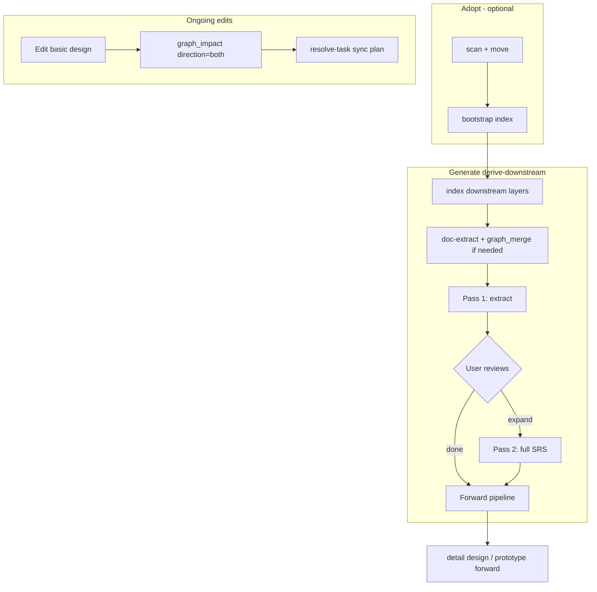

# Derive Downstream — Backfill Upstream Docs from Existing Design Layers — Design Spec

> **Status:** Approved (brainstorming)  
> **Date:** 2026-06-19  
> **Scope:** ai-spector core, CLI/MCP, task engine, readiness, graph impact, generate skills, routing/docs  
> **Approach:** 1 — Extend generate with `sourceMode: derive-downstream`  
> **Related:** [2026-06-15-project-adopt-design.md](./2026-06-15-project-adopt-design.md), [2026-06-18-adopt-v2-gated-workflow-design.md](./2026-06-18-adopt-v2-gated-workflow-design.md)

---

## 1. Problem

AI Spector's document pipeline is **forward-only**:

```text
analyze → SRS → basic design → detail design → prototype
```

Each generate layer reads upstream graph + docs. `workflow.dependencies.json` enforces prerequisites (e.g. detail design requires SRS minimum + basic design). Generate skills instruct agents not to invent content absent from upstream sources.

Real projects often arrive **mid-pipeline**:

| Situation | Example | Today |
|-----------|---------|-------|
| **Backward fill** | Basic + detail design exist; SRS missing or thin | No workflow — forward generate blocks on missing SRS prerequisites |
| **Detail-only gap** | Detail design exists; basic design missing | Same — no derive path |
| **Ripple sync** | Basic design changes; SRS and detail design drift | `graph_impact` finds **downstream** regen only; upstream sync is manual |

**Adopt** (2026-06-15 / v2) solves canonical paths and graph bootstrap from existing markdown but explicitly does **not** generate missing upstream layers. **Resolve-task** handles incremental single-feature edits, not bulk chapter backfill across layers.

---

## 2. Goals

| Goal | Detail |
|------|--------|
| **Backward SRS from BD+DD** | Primary use case: extract requirements implied in basic + detail design into SRS structure |
| **Hybrid output** | Pass 1: extract only (minimal invention, gaps flagged); Pass 2: optional full expand after user review |
| **Extend generate** | Same skills (`ai-spector-generate-srs`, `ai-spector-generate-basic-design`), new `sourceMode` — not a separate workflow family |
| **Human gates preserved** | check → clarify → briefing → plan → `task_approve_plan` → waves → extract specs |
| **Adopt handoff** | After adopt validate detects missing SRS, suggest derive-downstream as next step |
| **Upstream impact hints** | When editing a layer, surface upstream docs that may need sync (suggest-only in v1) |

### Success criteria

1. Project with indexed basic + detail design, no SRS, can run `generate-srs` with `sourceMode: derive-downstream` without `knowledge.json` or prior analyze
2. Extract pass produces SRS files with traceability links to downstream docs and `[DERIVE-GAP]` markers where sources are silent
3. User can resume same task (or linked task) for expand pass after reviewing extract output
4. `workspace_check` and `readiness_assess` use derive profile when `sourceMode` is set — forward probes do not block incorrectly
5. Editing basic design surfaces affected SRS sections in `graph_impact` upstream bucket (suggest-only)

### Out of scope (v1)

- Auto-regenerate upstream docs without human-approved plan
- Derive detail design from code (implementation → design reverse engineering)
- Derive from non-markdown sources (PDF, Confluence)
- Full bidirectional sync engine that merges conflicting edits across layers
- Custom template packs — builtin SRS/basic-design derive only in v1

---

## 3. Approach

**Extend generate with `sourceMode`** on task bootstrap. Default remains `forward`. When `derive-downstream`:

- `workflow.dependencies.json` uses mode-specific prerequisites (downstream docs indexed, graph domain nodes present)
- Readiness uses profile `derive-from-downstream` — downstream docs + graph are primary sources
- Same gated generate flow, DAG waves, and spec review queue
- Two derive phases: `extract` (default) and `expand` (opt-in second pass)

**Rejected alternatives:**

| Approach | Why rejected |
|----------|--------------|
| Separate `derive` CLI + chain into forward generate | Two disconnected user journeys; easy to skip derive step |
| Resolve-task Full tier for multi-layer backfill | Wrong tool for bulk DAG chapter generation |

---

## 4. Task bootstrap schema

```typescript
// task_list bootstrap (generate-srs example)
{
  kind: "generate",
  workflow: "generate-srs",
  docType: "srs",
  trigger: "<user request>",
  sourceMode: "forward" | "derive-downstream",  // default: "forward"
  deriveFrom?: ("basic-design" | "detail-design")[],  // required when derive-downstream
  derivePhase?: "extract" | "expand",  // default: "extract"
  priorDeriveTaskId?: string  // optional link when expand resumes after extract task
}
```

Persisted on `TaskState.snapshot`:

```typescript
{
  sourceMode: "derive-downstream",
  deriveFrom: ["basic-design", "detail-design"],
  derivePhase: "extract",
  priorDeriveTaskId?: string
}
```

Server validates: `derive-downstream` requires non-empty `deriveFrom`; `expand` requires completed extract task or `priorDeriveTaskId`.

---

## 5. Prerequisite overrides

### `workflow.dependencies.json` mode blocks

| Layer to generate | Forward requires | Derive-downstream requires |
|-------------------|------------------|----------------------------|
| SRS | `analyze`, graph merged, `knowledge.json` | `index-downstream`: basic-design **or** detail-design files exist; graph has ≥1 domain node (`useCase`, `feature`, `actor`) from those layers |
| Basic design | SRS minimum + SRS index | detail-design indexed; graph has feature/screen/API nodes from detail |
| Detail design | SRS + basic design | *(unchanged — forward only)* |

Example shape:

```json
"generate-srs": {
  "command": "/generate-srs",
  "requires": ["analyze"],
  "modes": {
    "derive-downstream": {
      "requires": ["index-downstream"],
      "checks": [
        {
          "id": "downstream-docs-exist",
          "type": "hasFilesAny",
          "paths": ["docs/basic-design", "docs/detail-design"],
          "glob": "**/*.md",
          "min": 1,
          "fail": "Need basic-design or detail-design markdown before deriving SRS."
        },
        {
          "id": "graph-domain-nodes",
          "type": "graphNodeCount",
          "types": ["useCase", "feature", "actor"],
          "min": 1,
          "fail": "Graph has no domain nodes from downstream docs — run index and doc-extract merge first."
        }
      ]
    }
  }
}
```

`workspace_check({ workflow, sourceMode })` selects mode checks. MCP `task_create` / `task_list` bootstrap passes `sourceMode` through to dependency resolution.

### Source-of-truth rule

> When downstream layers disagree with each other or with a partial upstream doc, **downstream docs are authoritative for what the system does**. Derivation must not silently contradict them. Conflicts become clarify questions (Q-ids stored in context store).

### Overwrite policy

| Existing upstream state | Behavior |
|-------------------------|----------|
| Missing / empty | Derive freely |
| Partial (some chapters) | Merge into empty sections; conflicts → clarify |
| Complete SRS | **Block** derive-downstream; offer resolve-task for targeted updates |

---

## 6. Two-pass generation

### Pass 1 — Extract (`derivePhase: "extract"`)

**Goal:** Structurally complete SRS (or basic design) with content **only** from downstream sources.

| Step | Behavior |
|------|----------|
| Pre-flight | `index` on `deriveFrom` layers; if graph lacks domain nodes, agent runs doc-extract + `graph_merge` before plan |
| Clarify | `readiness_assess({ profile: "derive-from-downstream" })` — blocking gaps about classification conflicts only |
| Briefing | Per DAG chapter: downstream source sections + graph node ids |
| Plan | Table includes Mode column (`extract`), source paths, expected gap count |
| Generate | DAG waves; agent prompt: extract and restructure only; use `[DERIVE-GAP: <reason>]` when silent |
| Post-wave | `readiness_scan` — gaps expected; do not fail extract pass on `[DERIVE-GAP]` |
| Extract specs | `spec_record` with `provenance: "derive-downstream"` → human `spec_approve` before graph merge |

**Traceability:** New SRS content gets `tracesTo` edges back to basic/detail document nodes. Spec review queue shows derivation provenance.

### Pass 2 — Expand (`derivePhase: "expand"`)

**Triggered by:** *"expand SRS to full"*, *"fill derive gaps"*, or accept offer at extract `task_complete`.

| Difference | Detail |
|------------|--------|
| Readiness profile | Forward-like — `[DERIVE-GAP]` sections become blocking clarify |
| Sources | data-source, context store, agent judgment allowed |
| Overwrite | Fill gaps and enrich thin sections; **do not** replace substantiated extract content without user confirm in plan |

Expand may resume the same task (new phase in snapshot) or bootstrap a linked task with `priorDeriveTaskId`.

### Gate between passes

`task_complete` on extract pass sets `snapshot.extractOffered` and prompts:

> Extract pass complete. Review SRS under `docs/srs/`. Say **"expand SRS to full"** to run Pass 2, or approve docs via review workflow.

---

## 7. Readiness profile: `derive-from-downstream`

New profile in `doc-types/srs/readiness-criteria.json` (and basic-design equivalent):

```json
{
  "profile": "derive-from-downstream",
  "appliesWhen": { "sourceMode": "derive-downstream", "derivePhase": "extract" },
  "criteria": [
    {
      "id": "DER-001",
      "dimension": "inputs",
      "severity": "blocking",
      "question": "Are downstream design documents indexed?",
      "probe": "downstreamDocsIndexed"
    },
    {
      "id": "DER-002",
      "dimension": "graph",
      "severity": "blocking",
      "question": "Does the graph contain domain nodes from downstream docs?",
      "probe": "graphDomainNodesFromDownstream",
      "min": 1
    },
    {
      "id": "DER-003",
      "dimension": "inputs",
      "severity": "should-ask",
      "question": "Is docs/data-source/ available to supplement gaps in expand pass?",
      "probe": "dataSourcePresent"
    }
  ]
}
```

`readiness_assess` selects profile when `opts.sourceMode === "derive-downstream"` (new option). Forward probes skipped in derive mode:

| Forward probe | Derive behavior |
|---------------|-----------------|
| `knowledge.json` populated | Skipped |
| `analysis.lastRunAt` | Warn if null, do not block extract |
| SRS files exist | Block if SRS complete; warn if partial |

Expand phase uses forward profile merged with snapshot of extract gaps.

---

## 8. Routing and agent UX

### Trigger phrases → same generate skills

| User says | Skill | Bootstrap |
|-----------|-------|-----------|
| "generate SRS" | `ai-spector-generate-srs` | `sourceMode: forward` (default) |
| "generate SRS from basic design", "backfill SRS" | same | `sourceMode: derive-downstream`, `deriveFrom: ["basic-design","detail-design"]` |
| "expand SRS", "fill SRS gaps" | same | `derivePhase: expand` |
| "generate basic design from detail design" | `ai-spector-generate-basic-design` | `deriveFrom: ["detail-design"]` |

Update: `ai-spector-generate` router, `_skill-router.md`, `WORKFLOW.md`, generate skill runbooks (mode branch at Step 0).

### Plan table (mandatory column)

```
| # | Chapter | Mode | Sources | Gaps expected |
|---|---------|------|---------|---------------|
| 1 | 4-system-features | extract | basic-design/screen-list, detail-design/feature-list | 2 |
| 2 | use-cases/UC-01 | extract | detail-design/features/f-01 | 0 |
```

---

## 9. Adopt handoff

No new adopt phase. Extend `adopt_validate` gap output:

```json
{
  "gaps": [
    {
      "layer": "srs",
      "severity": "blocking-for-forward-pipeline",
      "suggestion": "generate-srs with sourceMode=derive-downstream",
      "deriveFrom": ["basic-design", "detail-design"]
    }
  ]
}
```

Agent runbook after adopt complete (when SRS missing, BD+DD present):

> Migration complete. SRS is missing but basic + detail design are indexed. Say **"generate SRS from basic design"** to backfill (extract pass first).

---

## 10. Ripple updates — upstream impact (secondary)

When user edits basic design (or any layer), they may need SRS and detail design to stay aligned.

### Extend `graph_impact` rules (`schemas/rules.impact.json`)

Add optional `direction: "both"` (default remains downstream-only):

```json
"pass1_upstream": {
  "satisfies":   { "direction": "out", "depth": 1 },
  "tracesTo":    { "direction": "out", "depth": "unbounded" },
  "listedIn":    { "direction": "in",  "depth": 1 }
},
"buckets": {
  "regenerate": ["section", "document"],
  "review": ["useCase", "feature", "requirement", "nfr", "actor", "dataEntity"],
  "sync-upstream": ["requirement", "useCase", "feature", "section"]
}
```

CLI: `graph impact --git --direction both --json`

Example output after editing `docs/basic-design/en/api-list.md`:

```json
{
  "regenerate": [{ "projectionPath": "docs/detail-design/en/features/f-03.md" }],
  "sync-upstream": [{ "projectionPath": "docs/srs/en/features/F-03.md" }]
}
```

**v1 behavior:** `sync-upstream` is **suggest-only** — agent offers resolve-task Standard plan spanning affected files. No auto upstream regen.

Update: `ai-spector-graph` impact runbook, after-doc-edits rule, resolve-task handoff when impact returns `sync-upstream`.

---

## 11. Error handling

| Situation | Behavior |
|-----------|----------|
| Basic and detail contradict | Clarify Q-id; block `task_approve_plan` until resolved |
| Downstream has placeholder IDs (UC-XX) | Warn in plan; extract keeps placeholders; expand pass assigns real IDs with user confirm |
| Graph missing domain nodes after index | Block — agent runs doc-extract + `graph_merge`, then retries readiness |
| `deriveFrom` layer empty | Block with message naming missing layer |
| User triggers forward generate while derive task active | `activeForSlot` returns existing task — `task_resume` |

---

## 12. Components to change

| Area | Change |
|------|--------|
| `src/core/operations/task.ts` | Persist `sourceMode`, `deriveFrom`, `derivePhase` on snapshot; validation on bootstrap |
| `src/core/operations/check.ts` | Mode-aware `workflow.dependencies.json` resolution |
| `src/core/readiness/assess.ts` | `sourceMode` option; profile `derive-from-downstream` |
| `src/core/readiness/probes.ts` | New probes: `downstreamDocsIndexed`, `graphDomainNodesFromDownstream` |
| `scaffold/.../workflow.dependencies.json` | `modes.derive-downstream` per generate step |
| `scaffold/.../readiness-criteria.json` | Derive profile per doc type |
| `src/core/graph/rules/default-impact.json` | `pass1_upstream`, `sync-upstream` bucket |
| Generate skills + runbooks | Mode branch: briefing sources, plan table, generate prompts |
| `ai-spector-generate` router | Route backfill phrases with derive bootstrap |
| `src/core/adopt/validate.ts` | Emit derive suggestion gaps |
| MCP tool schemas | `workspace_check`, `readiness_assess`, `task_list` bootstrap fields |
| Tests | Unit + fixture E2E for derive prerequisites and impact upstream |

---

## 13. Data flow



---

## 14. Testing

| Test | Asserts |
|------|---------|
| `workspace_check` derive mode | Skips `knowledge.json`; requires downstream files |
| `readiness_assess` profile | `derive-from-downstream` passes with BD+DD only |
| Task bootstrap validation | Rejects `derive-downstream` without `deriveFrom` |
| Task snapshot persistence | `sourceMode` survives `task_resume` |
| Impact upstream | BD edit surfaces SRS in `sync-upstream` bucket |
| E2E fixture `derive-bd-dd-no-srs` | Extract pass produces SRS with `tracesTo` + `[DERIVE-GAP]` |
| Overwrite guard | Complete SRS blocks derive-downstream bootstrap |

---

## 15. Implementation phasing

| Phase | Deliverable |
|-------|-------------|
| **P1** | Task schema + `workspace_check` mode + derive readiness profile + generate-srs extract pass |
| **P2** | Expand pass + adopt validate handoff + routing/docs |
| **P3** | Basic design derive from detail + `graph_impact` upstream bucket |

P1 unblocks the primary user pain (BD+DD, missing SRS). P3 covers ripple sync.

---

## 16. Open decisions (resolved in brainstorming)

| Question | Decision |
|----------|----------|
| Primary pain | Backward creation > ripple sync |
| Typical starting point | Basic + detail exist, SRS missing |
| SRS output style | Hybrid extract then optional expand |
| Entry point | Extend generate with `sourceMode` |
| Upstream auto-regen | Suggest-only in v1 |
