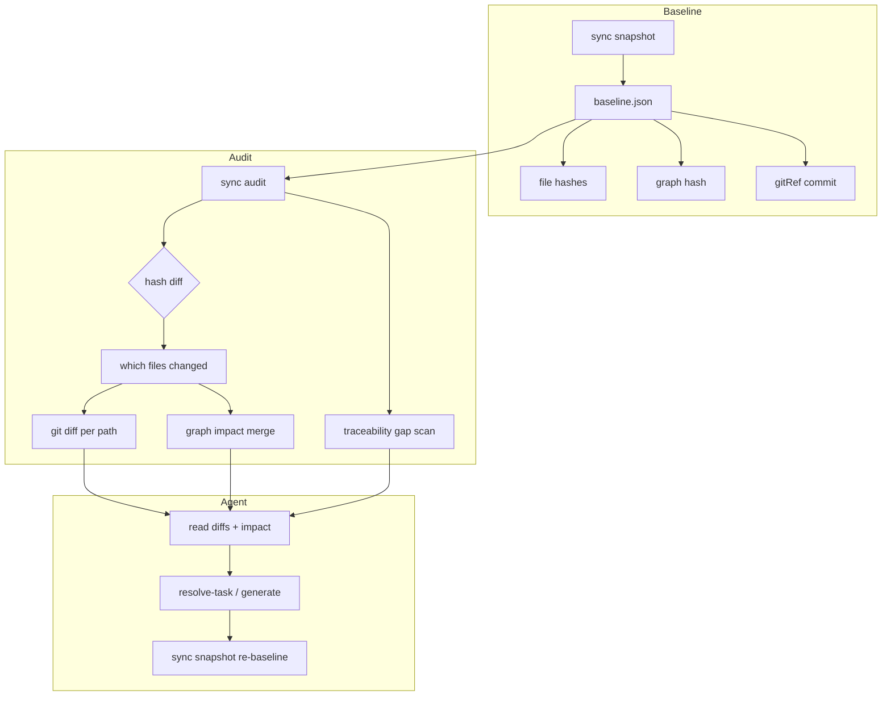

# Layer Sync Audit — Snapshot Baseline + Git Diff + Agent Impact — Design Spec

> **Status:** Approved (brainstorming)  
> **Date:** 2026-06-19  
> **Scope:** ai-spector core, CLI/MCP, graph impact integration, agent skills  
> **Approach:** 1 — Dedicated `sync snapshot` / `sync audit` commands  
> **Related:** [2026-06-19-derive-downstream-design.md](./2026-06-19-derive-downstream-design.md)

---

## 1. Problem

After SRS, basic design, and detail design were once aligned, edits to one layer (especially basic design) can leave upstream or downstream docs stale. Today:

| Mechanism | Trigger | Limitation |
|-----------|---------|------------|
| `graph impact --git` | Uncommitted git diff | Reactive — requires someone to run it after every edit |
| `adopt_validate` | On adopt | Detects missing layers, not drift after sync |
| Review staleness | Hash vs approval record | Per-doc approval, not cross-layer “pipeline synced” |
| `readiness_assess` | On demand | Structural completeness, not “changed since last good state” |

There is no **proactive, on-demand or CI** command that answers: *“What changed across design layers since we last declared everything in sync?”*

Automated **semantic** comparison (LLM or embeddings) across linked SRS ↔ BD ↔ DD prose is unreliable and expensive. The practical model:

1. Record a **baseline** when the user confirms layers are aligned.
2. **Detect** which files changed since baseline (deterministic).
3. Use **git** for content diffs on those files.
4. Attach **graph impact** hints for linked upstream/downstream paths.
5. Let the **agent** analyze diffs and plan updates (`resolve-task`, `generate-*`).

---

## 2. Goals

| Goal | Detail |
|------|--------|
| **Explicit baseline** | User runs `sync snapshot` when SRS + BD + DD are aligned |
| **Proactive audit** | `sync audit` compares live state to baseline without requiring uncommitted edits |
| **Change detection** | Per-file hash diff across three design roots + graph hash |
| **Content diffs via git** | Store `gitRef` at snapshot; audit uses `git diff <gitRef> -- <path>` |
| **Impact hints** | Merge `graph impact` buckets for changed files (`regenerate`, `syncUpstream`, `review`) |
| **Traceability gaps** | Graph walk flags domain entities missing links across layers |
| **Agent handoff** | Skill runbook: present drift → user confirms → resolve-task / generate |
| **CI support** | `--fail-on-drift` exits non-zero when baseline diverges |

### Success criteria

1. After `sync snapshot`, editing a basic-design file and running `sync audit` reports that file under `modified` with a git unified diff and non-empty `impact.regenerate` or `impact.syncUpstream` when graph-linked.
2. `sync audit --fail-on-drift` returns exit 1 when any design-layer file or graph hash differs from baseline.
3. Agent skill presents drift table + impact buckets without inventing paths — CLI/MCP JSON only.
4. No baseline → clear error directing user to `sync snapshot` first.
5. Re-baselining after agent completes updates resets drift to zero.

### Out of scope (v1)

- Automated semantic/LLM drift scoring
- Stored file content snapshots (git is the diff source)
- Translation layer sync (translation queue fingerprints remain separate)
- Auto-regenerate without human-approved plan
- Section-level baseline hashing (file-level; section anchors used only for impact seeding)
- Bidirectional merge of conflicting edits

---

## 3. Approach

**Dedicated `sync` command family** with baseline file under `.ai-spector/.docflow/sync/`.

**Rejected alternatives:**

| Approach | Why rejected |
|----------|--------------|
| Reuse `state.json` index hashes as baseline | Index run updates hashes silently — index ≠ “synced” |
| Git-tag-only (no ai-spector baseline) | Tag does not capture graph hash; awkward pre-commit workflow |
| Automated semantic audit | User decision: agent analyzes diffs; system only detects change |

### Detection vs description vs judgment

```text
sync snapshot  →  baseline (file hashes + graph hash + gitRef)
       ↓
  [edits + commits optional]
       ↓
sync audit     →  1. hash diff: WHICH files changed
               →  2. git diff:  WHAT changed (content)
               →  3. graph impact: linked candidates
       ↓
  agent          →  semantic impact + update plan
```

---

## 4. Baseline schema

**Path:** `.ai-spector/.docflow/sync/baseline.json`

```json
{
  "version": 1,
  "createdAt": "2026-06-19T10:00:00Z",
  "label": "post-sprint-12-alignment",
  "gitRef": "abc1234567890deadbeef",
  "gitRefType": "commit",
  "graphHash": "sha256:…",
  "layers": {
    "srs": {
      "root": "docs/srs",
      "files": {
        "docs/srs/en/4-system-features.md": {
          "hash": "a1b2c3d4e5f67890",
          "sizeBytes": 4200
        }
      }
    },
    "basic-design": {
      "root": "docs/basic-design",
      "files": { }
    },
    "detail-design": {
      "root": "docs/detail-design",
      "files": { }
    }
  },
  "totals": { "files": 142, "bytes": 890000 }
}
```

| Field | Purpose |
|-------|---------|
| `hash` per file | SHA-256 truncated to 16 hex chars (same as review `contentHash`) |
| `graphHash` | Hash of traceability graph JSON at snapshot time |
| `gitRef` | Commit SHA at snapshot (default: `HEAD` resolved at run time) |
| `label` | Optional human label for audit reports |

**File discovery:** Reuse `discoverDocSourceFiles` with roots `docs/srs`, `docs/basic-design`, `docs/detail-design` and glob `**/*.md` — same contract as index (language folders included as nested paths).

**Graph hash:** SHA-256 of normalized graph file bytes from `docflow.config.json` → `paths.graph`.

---

## 5. Commands

### `sync snapshot`

```bash
npx ai-spector sync snapshot [--label <text>] [--git-ref <ref>] [--force] [--json]
```

| Step | Behavior |
|------|----------|
| 1 | Resolve project root; warn if `graph validate` fails (non-blocking) |
| 2 | Discover and hash all design-layer markdown files |
| 3 | Hash traceability graph |
| 4 | Resolve `gitRef` — default `HEAD` commit SHA; `--git-ref` overrides |
| 5 | Write `baseline.json`; fail if exists unless `--force` |
| 6 | Print summary: file count, graph hash prefix, git ref short SHA |

**Preconditions:** Git repo recommended (warn if not — baseline still written with `gitRef: null`; audit will be hash-only for detection, no content diffs).

**MCP:** `sync_snapshot({ label?, gitRef?, force? })`

### `sync audit`

```bash
npx ai-spector sync audit [--json] [--fail-on-drift] [--direction downstream|upstream|both]
```

| Step | Behavior |
|------|----------|
| 1 | Load `baseline.json`; error if missing |
| 2 | Re-discover and hash current files; diff vs baseline → `modified`, `added`, `deleted`, `unchanged` counts per layer |
| 3 | Compare current graph hash vs `baseline.graphHash` → `graphChanged: boolean` |
| 4 | For each changed path, if `baseline.gitRef` set: run `git diff <gitRef> -- <path>` (empty string if binary or error) |
| 5 | For each `modified`/`added`/`deleted` path under design layers: resolve graph seed + run `computeImpact` (merge buckets across seeds) |
| 6 | Run traceability gap scan (§7) |
| 7 | Set `hasDrift` if any file change or `graphChanged` |
| 8 | Exit 1 when `--fail-on-drift` and `hasDrift` |

**Direction default:** `both` when any changed file is under `docs/basic-design/` or `docs/detail-design/`; otherwise `downstream`.

**MCP:** `sync_audit({ failOnDrift?, direction? })`

---

## 6. Audit output schema

```json
{
  "baseline": {
    "createdAt": "2026-06-19T10:00:00Z",
    "label": "post-sprint-12-alignment",
    "gitRef": "abc1234",
    "totals": { "files": 142 }
  },
  "drift": {
    "hasDrift": true,
    "graphChanged": false,
    "byLayer": {
      "basic-design": {
        "modified": [
          {
            "path": "docs/basic-design/en/api-list.md",
            "baselineHash": "a1b2…",
            "currentHash": "c3d4…",
            "diff": "--- a/docs/basic-design/en/api-list.md\n+++ b/…",
            "diffSource": "git",
            "linesAdded": 12,
            "linesRemoved": 3
          }
        ],
        "added": [],
        "deleted": [],
        "unchanged": 38
      },
      "srs": { "modified": [], "added": [], "deleted": [], "unchanged": 24 },
      "detail-design": { "modified": [], "added": [], "deleted": [], "unchanged": 56 }
    }
  },
  "traceabilityGaps": {
    "missingDownstream": [
      {
        "domainId": "feat.auth",
        "layer": "detail-design",
        "message": "F-03 has SRS + basic-design but no detail-design document"
      }
    ],
    "missingUpstream": [],
    "orphanFiles": []
  },
  "impact": {
    "regenerate": [{ "id": "sec.dd.f03", "projectionPath": "docs/detail-design/en/features/f-03.md", "reason": "…" }],
    "syncUpstream": [{ "id": "feat.auth", "projectionPath": "docs/srs/en/features/F-03.md", "reason": "…" }],
    "review": []
  },
  "suggestedNext": "Review drift and impact buckets; run resolve-task or generate for affected paths; then sync snapshot"
}
```

`diffSource` values:

| Value | Meaning |
|-------|---------|
| `git` | Unified diff from `git diff baseline.gitRef -- path` |
| `none` | No git ref at baseline, or not a git repo — path listed only |

---

## 7. Traceability gap scan

Graph-only structural check (no semantic comparison). For each domain node (`useCase`, `feature`, `requirement`, …):

| Check | Flag when |
|-------|-----------|
| `missingDownstream` | Entity has `definedIn`/`listedIn` in SRS and BD but no `tracesTo` / detail-design document node |
| `missingUpstream` | BD or DD section exists with `satisfies` edge but no upstream SRS feature/requirement |
| `orphanFiles` | Markdown file on disk under design roots with no matching `document` node in graph |

Runs on every audit (cheap). Gaps may exist even when `hasDrift` is false — report separately.

---

## 8. Agent workflow

**New skill:** `ai-spector-sync-audit`

```text
1. sync audit --json
2. If !drift.hasDrift && traceabilityGaps empty → "aligned with baseline"
3. Present drift table by layer (modified / added / deleted)
4. For modified files, show git diff summary (or offer to read full diff)
5. Present impact.regenerate / impact.syncUpstream / impact.review with projectionPath
6. Present traceabilityGaps if non-empty
7. User confirms → ai-spector-resolve-task (Standard) for affected paths
   OR generate-* for regenerate bucket entries
8. After updates → npx ai-spector index → user runs sync snapshot to re-baseline
```

**Router entry** (`_skill-router.md`): *sync audit*, *check doc drift*, *what changed since baseline*, *layer sync* → `ai-spector-sync-audit`.

**Optional `workspace_check` hint:** When baseline exists and quick hash probe detects drift, suggest `sync audit` (lightweight — compare counts only, not full audit).

**Guardrails:** Agent must not invent regenerate lists — use CLI/MCP `impact` arrays only. Semantic alignment judgment is agent responsibility after reading git diffs.

---

## 9. CI integration

```yaml
- name: Design layer sync check
  run: npx ai-spector sync audit --fail-on-drift --json
```

| Flag | CI behavior |
|------|-------------|
| `--fail-on-drift` | Exit 1 on any file or graph hash drift |
| `--json` | Machine-readable artifact for PR comments |

CI reports drift; does not run agent updates. Teams commit `baseline.json` (or regenerate in release workflow) when alignment is intentional.

**Optional:** `sync audit --verify-git-ref` ensures current `HEAD` is descendant of `baseline.gitRef` (detects baseline file committed without matching repo state).

---

## 10. Error handling

| Situation | Behavior |
|-----------|----------|
| No baseline | Exit 2; message: run `sync snapshot` |
| Not a git repo | Snapshot allowed with `gitRef: null`; audit hash-only, `diffSource: "none"` |
| `gitRef` no longer in history | Audit warns; skip per-file diffs; hash drift still reported |
| Graph missing | Block audit with message to run `index` |
| Changed file not in graph | Listed in drift; `impact.noTraceabilityImpact` for that seed |
| Binary file under docs | Hash drift only; empty diff |

---

## 11. Components to change

| Area | Change |
|------|--------|
| `src/core/sync/baseline.ts` (new) | Load/save baseline schema; graph hash helper |
| `src/core/sync/snapshot.ts` (new) | Discover files, hash, resolve git ref, write baseline |
| `src/core/sync/audit.ts` (new) | Hash diff, git diff per path, gap scan, impact merge |
| `src/core/sync/gaps.ts` (new) | Traceability gap walk |
| `src/core/sync/git-diff.ts` (new) | Wrap `git diff <ref> -- <path>` with line counts |
| `src/cli.ts` | `sync snapshot`, `sync audit` subcommands |
| `src/interfaces/mcp/` | `sync_snapshot`, `sync_audit` tools |
| `scaffold/.../skills/ai-spector-sync-audit/` | Skill + runbook |
| `scaffold/.../_skill-router.md` | Route sync audit phrases |
| `src/core/operations/check.ts` | Optional lightweight drift hint |
| Tests | `tests/sync/snapshot.test.ts`, `tests/sync/audit.test.ts`, fixture with baseline + edited BD |

---

## 12. Data flow



---

## 13. Testing

| Test | Asserts |
|------|---------|
| Snapshot round-trip | Baseline written; file count matches discovery |
| Audit no drift | Identical state → `hasDrift: false` |
| Audit file modified | Change BD file → appears in `modified` with different hash |
| Audit git diff | With git repo + gitRef → non-empty `diff` on modified file |
| Audit graph changed | Graph merge after snapshot → `graphChanged: true` |
| Impact merge | BD edit surfaces DD in `regenerate` and SRS in `syncUpstream` when linked |
| Gap scan | Feature without DD doc → `missingDownstream` |
| `--fail-on-drift` | Exit 1 when drift; exit 0 when clean |
| No baseline | Exit 2 with clear message |

---

## 14. Implementation phasing

| Phase | Deliverable |
|-------|-------------|
| **P1** | `sync snapshot` + `sync audit` hash diff + git diff + CLI/MCP |
| **P2** | Graph impact merge + traceability gap scan |
| **P3** | Agent skill + router + workspace_check hint + CI docs |

P1 delivers the core user question: *what changed since we were synced?* P2 adds impact and gap hints. P3 wires agent and CI.

---

## 15. Resolved decisions (brainstorming)

| Question | Decision |
|----------|----------|
| Trigger | On-demand / CI proactive audit (not only post-edit hook) |
| Semantic detection | Agent analyzes git diffs; no automated semantic engine |
| Snapshot mechanism | ai-spector `baseline.json` + `gitRef` (Approach 1 + D) |
| Scope | Design layers only: `docs/srs`, `docs/basic-design`, `docs/detail-design` + graph |
| Content diffs | Git `diff` from `baseline.gitRef`; hashes for change detection |
| Stored content snapshots | No — git only in v1 |
