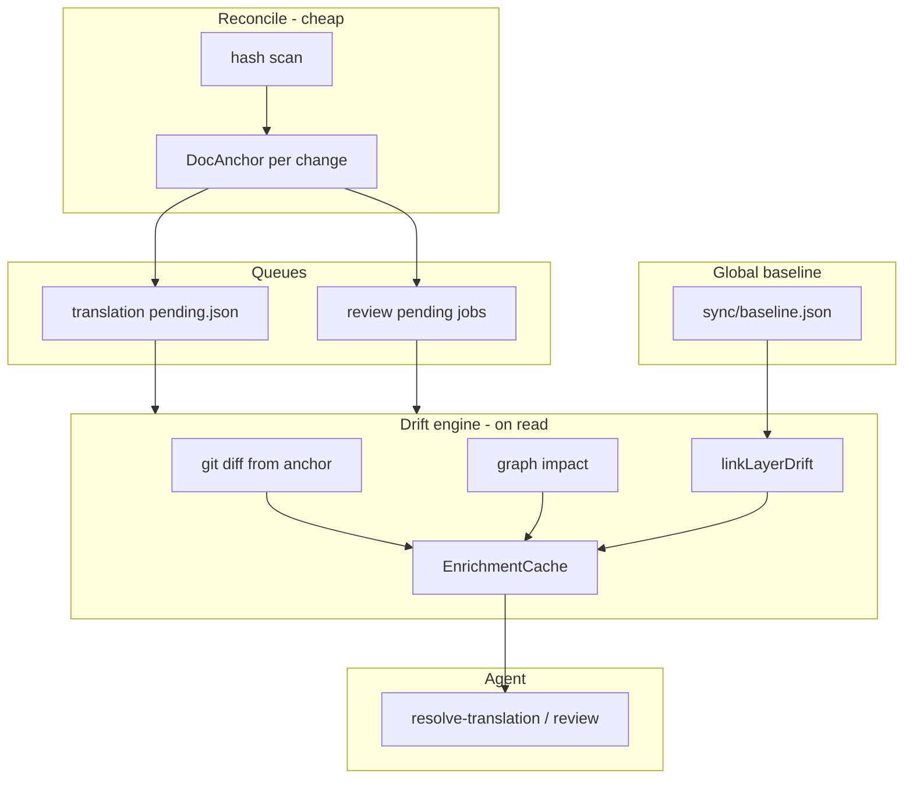

# Queue Drift Engine — Git Anchors + Lazy Enrichment + Graph Impact — Design Spec

> **Status:** Approved (brainstorming)  
> **Date:** 2026-06-19  
> **Scope:** ai-spector core, translation queue, review queue, CLI/MCP, agent skills  
> **Approach:** 1 — Shared drift engine in `src/core/sync/`  
> **Related:** [2026-06-19-layer-sync-audit-design.md](./2026-06-19-layer-sync-audit-design.md), [2026-06-19-derive-downstream-design.md](./2026-06-19-derive-downstream-design.md)

---

## 1. Problem

Translation and review queues today duplicate document content on disk instead of using git history:

| Queue | Current snapshot storage | Limitation |
|-------|-------------------------|------------|
| **Translation** | Full `content` in `fingerprints.json`; inline `diff` in `changes/*.json` at reconcile | Bloats `.ai-spector`; diffs computed eagerly on every reconcile; no cross-layer graph impact |
| **Review** | Full `.md` copies in `review-queue/snapshots/`; `changes/*.json` diffs at reconcile | Same duplication; snapshot diverges from git; no downstream re-review hints |

[Layer sync audit](./2026-06-19-layer-sync-audit-design.md) already solves this for SRS / basic-design / detail-design with:

```text
hashes → git diff (baseline.gitRef) → graph impact → agent judgment
```

Queues still use a separate, file-heavy model. Agents resolving translations or reviews cannot see cross-layer drift or graph-linked candidates without running `sync audit` separately.

The practical unified model:

1. **Detect** change with hashes (cheap, on reconcile).
2. **Anchor** with per-doc/per-job `gitRef` + hash (no full content write).
3. **Enrich** lazily on first queue read: git diff + graph impact + optional link to global sync baseline.
4. **Agent** applies semantic judgment (`resolve-translation`, `resolve-task`, review workflows).

---

## 2. Goals

| Goal | Detail |
|------|--------|
| **Drop content snapshots** | No new writes of full file content to fingerprints or review snapshot files |
| **Git-first diffs** | `git diff <anchor.gitRef> -- <path>` against working tree |
| **Hybrid baselines** | Per-job/per-doc anchors in queues + optional link to global `sync/baseline.json` |
| **Split compute** | Reconcile stores anchors only; diff/impact on first read, cached until resolve |
| **Translation impact (C)** | Intra-doc targets + cross-layer `regenerate` / `syncUpstream` + `layerDrift` when baseline exists |
| **Review impact (E)** | Downstream docs that may need re-review (`review` bucket) |
| **Safe migration** | Lazy fallback to legacy snapshot/content when git diff unavailable; purge on resolve |
| **Agent handoff** | Enriched JSON on `lang queue` / `review queue` reads; skills updated to consume `enrichment` |

### Success criteria

1. After reconcile, `fingerprints.json` entries for changed files contain hash + version only (no new `content` writes).
2. First `lang queue pending --json` or `review queue --json` on a pending item returns `enrichment.diff` with `diffSource: "git"` when repo + `gitRef` are valid.
3. Translation enrichment includes `impact.intraDocTargets` (from job targets) plus non-empty cross-layer buckets when graph-linked.
4. Review enrichment includes downstream paths in `impact.review` when graph-linked.
5. When `sync/baseline.json` exists, enriched output includes `layerDrift` for overlapping changed paths.
6. Resolving a job deletes legacy snapshot file or fingerprint `content` for that doc.
7. Legacy projects with stored content/snapshots continue to work via fallback until jobs resolve.

### Out of scope (v1)

- Replacing `sync audit` as a standalone command (queues link to it, do not subsume it)
- Auto-resolve translations or auto-invalidate reviews from impact alone
- Section-level anchors (file-level only, consistent with layer sync audit)
- Automated semantic/LLM drift scoring in core (agent responsibility)
- Removing `sync audit` global baseline workflow
- Bidirectional merge of conflicting translation edits (unchanged — agent + `fail --reason conflict`)

---

## 3. Approach

**Extend `src/core/sync/` into a shared drift engine** consumed by translation queue, review queue, and (existing) layer sync audit.

**Rejected alternatives:**

| Approach | Why rejected |
|----------|--------------|
| Queue-local enrichment per queue | Duplicated lazy-cache, divergent agent JSON, impact buckets drift from sync audit |
| Explicit `queue enrich` commands | Extra agent step easy to forget; worse DX than transparent lazy cache on read |
| Shared project baseline only (no per-job anchors) | Cannot express "since last approval" or "since origin lang edit" — wrong semantics for queues |

### Detection vs enrichment vs judgment

```text
reconcile       →  hash change + DocAnchor (gitRef + hash) — cheap
       ↓
queue read      →  1. git diff from anchor
               →  2. graph impact (queue-specific merge)
               →  3. optional layerDrift from sync baseline
               →  cache EnrichmentCache on job until resolve
       ↓
agent           →  semantic judgment + resolve-translation / review / resolve-task
```

---

## 4. Shared types

**Path:** types live in `src/core/sync/drift-types.ts` (or extend `src/core/sync/types.ts`).

### `DocAnchor`

```typescript
interface DocAnchor {
  path: string;           // repo-relative file path
  hash: string;           // content hash at anchor time (16-char hex, same as contentHash)
  gitRef: string | null;  // commit SHA when anchored (HEAD at reconcile/approval)
  anchoredAt: string;     // ISO-8601
}
```

### `EnrichmentCache`

```typescript
type DiffSource = "git" | "legacy_snapshot" | "legacy_content" | "none";

interface ImpactBuckets {
  intraDocTargets?: string[];  // translation only — pending target paths
  regenerate: ImpactEntry[];
  syncUpstream: ImpactEntry[];
  review: ImpactEntry[];
}

interface LayerDriftSummary {
  baselineLabel?: string;
  baselineCreatedAt: string;
  modified: string[];   // paths in both queue change and layer baseline drift
}

interface EnrichmentCache {
  diff: string;
  linesAdded: number;
  linesRemoved: number;
  diffSource: DiffSource;
  impact: ImpactBuckets;
  layerDrift?: LayerDriftSummary;
  computedAt: string;
  anchorHash: string;   // invalidation key — current content hash when computed
}
```

`ImpactEntry` reuses the shape from `computeImpact` / `mergeImpactResults` (`id`, `projectionPath`, `reason`, …).

---

## 5. Drift engine (`src/core/sync/enrich.ts`)

| Function | Responsibility |
|----------|----------------|
| `resolveDiffFromAnchor(projectRoot, anchor, legacy?)` | `gitDiffFromRef(cwd, anchor.gitRef, anchor.path)`; fallback to `legacy.content` or `legacy.snapshot` via `computeLineDiff`; return `diffSource` |
| `resolveImpactForPaths(opts)` | Wrap `computeAuditImpact` with direction; merge buckets |
| `linkLayerDrift(projectRoot, changedPaths)` | If `baseline.json` exists, return paths present in `sync audit` hash diff `modified` ∩ `changedPaths` |
| `enrichTranslationJob(projectRoot, job, opts)` | Orchestrate diff per change anchor + impact C + layerDrift |
| `enrichReviewJob(projectRoot, job, approval, opts)` | Orchestrate diff from `baselineAnchor` + impact E + layerDrift |
| `invalidateEnrichmentIfStale(cache, currentHash)` | Return null cache if `cache.anchorHash !== currentHash` |

**Cache persistence:**

- Translation: `job.enrichment?: EnrichmentCache` on `TranslationJob` in `pending.json` (schema bump to v2 fields, backward compatible read).
- Review: `job.enrichment?: EnrichmentCache` on `ReviewJob` in pending jobs file, or computed-only in API response without persist (prefer persist to avoid repeat git/impact work).

**Invalidation:** Reconcile updates `currentHash` / job `updatedAt` → stale cache ignored and recomputed on next read.

---

## 6. Translation queue changes

### 6.1 Reconcile (`src/core/lang/queue.ts`)

| Step | Before | After |
|------|--------|-------|
| Fingerprint update | `hash`, `version`, **`content`** | `hash`, `version`, `scannedAt` only |
| Change detection | `computeLineDiff(previous.content, scan.content)` | Hash compare only; capture `DocAnchor` with `previous.hash` + `resolveGitRef(HEAD)` |
| `FileChangeRecord` | Inline `diff`, `linesAdded`, `linesRemoved` | `anchor: DocAnchor`; optional deprecated `diff` for legacy read |
| Job write | Eager diff in `changes/*.json` | Anchor-only in `changes/*.json` (schema v2) |

`origin` block gains `anchor?: DocAnchor` mirroring latest origin file anchor.

### 6.2 Read path

Commands that enrich on read (when `--json` or default show includes pending detail):

- `npx ai-spector lang queue pending [--json]`
- MCP `lang_queue_pending` (or equivalent)

Flow per pending job:

1. If `job.enrichment` valid for current origin hash → return cached.
2. For each `changes[].anchor` (or single origin anchor): `resolveDiffFromAnchor`.
3. **Impact C:**
   - `intraDocTargets` = paths of targets with `status: "pending"`.
   - Seeds = changed file paths → `computeAuditImpact` with `direction: "both"`.
   - Merge into `regenerate`, `syncUpstream`, `review`.
4. `linkLayerDrift` for changed paths.
5. Write `job.enrichment`; save pending queue if persisted cache.

### 6.3 Resolve

- On `moveJobToResolved`: purge `fingerprints.files[path].content` for job paths.
- Delete legacy snapshot content from `changes/` if migration complete.
- Clear `job.enrichment`.

### 6.4 Schema: `FileChangeRecord` v2

```json
{
  "lang": "en",
  "path": "docs/srs/en/overview.md",
  "hash": "c3d4e5f6…",
  "previousHash": "a1b2c3d4…",
  "previousVersion": 2,
  "version": 3,
  "changedAt": "2026-06-19T12:00:00Z",
  "mtimeMs": 1718798400000,
  "sequence": 1,
  "anchor": {
    "path": "docs/srs/en/overview.md",
    "hash": "a1b2c3d4…",
    "gitRef": "abc1234567890deadbeef",
    "anchoredAt": "2026-06-19T12:00:00Z"
  }
}
```

Legacy records with `diff` field: enrich path uses `diff` directly with `diffSource: "legacy_content"` if anchor missing.

---

## 7. Review queue changes

### 7.1 Anchor points

| Event | Storage |
|-------|---------|
| Internal quorum met | `approval.baselineAnchor: DocAnchor` (primary); stop writing `snapshotRef` for new approvals |
| Content invalidated (reconcile) | Pending `ReviewJob` with `baselineAnchor` from approval, `currentHash` from disk |

`ApprovalRecord` v3 → v4: add `baselineAnchor?: DocAnchor`. `snapshotRef` retained read-only for legacy fallback.

### 7.2 Reconcile (`src/core/reviews/reconcile.ts`)

| Step | Before | After |
|------|--------|-------|
| Staleness check | `contentHash` compare | Unchanged |
| Diff compute | `readSnapshot` + `computeLineDiff` + `saveDiff` | Store pending job with anchors only; no eager diff |
| Snapshot read | Required for diff | Deferred to enrich read path |

### 7.3 Read path

- `npx ai-spector review queue [--json]`
- MCP review queue tool

`enrichReviewJob`:

1. `baselineAnchor` from job or `approval.baselineAnchor`.
2. `resolveDiffFromAnchor` with legacy fallback: `readSnapshot(projectRoot, logicalPath)` when `approval.snapshotRef` set.
3. **Impact E:** seeds = `[approval.docPath]` → `computeAuditImpact` with `direction: "downstream"`; surface `review` bucket (docs depending on changed doc).
4. `linkLayerDrift` for doc path.
5. Cache on job.

### 7.4 Quorum finalize (`finalizeInternalQuorum`)

- Set `approval.baselineAnchor` from current `docPath`, `contentHash`, `resolveGitRef(HEAD)`.
- Do **not** call `writeSnapshot` for new approvals (v1: feature flag `review.writeLegacySnapshots: false` default after migration period).

### 7.5 Resolve / re-approve

- Delete `snapshots/*.md` for logical path if exists.
- Clear enrichment cache.

---

## 8. Enriched output shape

Both queues attach the same enrichment envelope on JSON reads:

```json
{
  "job": { "id": "…", "relativePath": "…", "…": "…" },
  "enrichment": {
    "diff": "--- a/docs/srs/en/foo.md\n+++ b/…",
    "linesAdded": 8,
    "linesRemoved": 2,
    "diffSource": "git",
    "impact": {
      "intraDocTargets": ["docs/srs/jp/foo.md"],
      "regenerate": [
        { "id": "sec.bd.api", "projectionPath": "docs/basic-design/en/api.md", "reason": "…" }
      ],
      "syncUpstream": [],
      "review": [
        { "id": "feat.checkout", "projectionPath": "docs/srs/en/features/checkout.md", "reason": "…" }
      ]
    },
    "layerDrift": {
      "baselineLabel": "post-sprint-12",
      "baselineCreatedAt": "2026-06-19T10:00:00Z",
      "modified": ["docs/basic-design/en/api.md"]
    },
    "computedAt": "2026-06-19T14:30:00Z",
    "anchorHash": "c3d4e5f6a1b2c3d4"
  }
}
```

Translation list endpoints may return `enrichment` per job or omit for table-only views (`--no-enrich` flag for fast listing).

---

## 9. Migration

**Strategy: lazy fallback (brainstorming decision B).**

| Legacy artifact | Fallback | Purge when |
|-----------------|----------|------------|
| `fingerprints.files[path].content` | `computeLineDiff(content, current)` → `diffSource: legacy_content` | Job resolved |
| `review-queue/snapshots/*.md` | `readSnapshot` → `diffSource: legacy_snapshot` | Review re-approved or job resolved |
| `changes/*.json` with inline `diff` | Use inline `diff` if no anchor | Job resolved + schema migrated |
| Missing `gitRef` on old jobs | `diffSource: none`; hash drift still visible | Next reconcile re-anchors with HEAD |

**One-time migration on read (non-blocking):**

- If pending job has no `anchor` but has `previousHash` + legacy content → synthesize `DocAnchor` with `gitRef: null` and attempt `git log -1 -- <path>` to backfill ref when possible.

No mass deletion of snapshot files at upgrade — purge per resolve only.

---

## 10. Agent workflow

### Translation (`ai-spector-resolve-translation`)

```text
1. lang queue pending --json  (enrichment included)
2. For each job: use enrichment.diff for merge context (replace changes/*.json diff reads)
3. Present enrichment.impact.intraDocTargets + cross-layer buckets
4. If layerDrift.modified non-empty → suggest sync audit or cross-layer resolve-task
5. Write targets → lang queue resolves → legacy content purged
```

### Review

```text
1. review queue --json
2. Present enrichment.diff + enrichment.impact.review (downstream re-review candidates)
3. Internal review proceeds as today; agent flags downstream docs for user awareness
4. On quorum: baselineAnchor written (no new snapshot file)
```

**Guardrails:** Agents must not invent impact paths — use `enrichment.impact` arrays only. Semantic alignment is agent responsibility after reading diffs.

**Skills to update:**

| Skill | Change |
|-------|--------|
| `ai-spector-resolve-translation` | Read `enrichment` instead of `changes[].diff` |
| Review runbooks / `ai-spector` review references | Document `enrichment.impact.review` |
| `_skill-router.md` | Optional: route "translation impact" phrases (no new skill required) |

---

## 11. Error handling

| Situation | Behavior |
|-----------|----------|
| Not a git repo | Anchor with `gitRef: null`; enrich uses legacy fallback or `diffSource: none` |
| `gitRef` not in history | Warn in enrichment; try legacy fallback |
| File never committed | `git diff` empty; fallback to legacy content/snapshot |
| Graph missing | Impact buckets empty; warn "run index" |
| No sync baseline | Omit `layerDrift` (not an error) |
| Binary doc path | Hash drift only; empty diff |
| Enrich on 50+ pending jobs | `--no-enrich` for list; enrich single job by id |

---

## 12. Components to change

| Area | Change |
|------|--------|
| `src/core/sync/drift-types.ts` | `DocAnchor`, `EnrichmentCache`, `ImpactBuckets` |
| `src/core/sync/enrich.ts` | Shared enrich orchestration + `linkLayerDrift` (uses `loadBaseline` + `hash-diff`) |
| `src/core/lang/queue-types.ts` | Anchor fields; optional `enrichment` on job |
| `src/core/lang/queue.ts` | Reconcile: anchors only; remove content writes |
| `src/core/lang/queue-store.ts` | Persist enrichment cache; v2 changes schema |
| `src/core/operations/lang-queue.ts` (or CLI handler) | Call enrich on pending read |
| `src/core/reviews/types.ts` | `baselineAnchor` on approval; `enrichment` on job |
| `src/core/reviews/reconcile.ts` | Defer diff to enrich |
| `src/core/reviews/storage.ts` | Deprecate eager `writeSnapshot` / `saveDiff` on reconcile path |
| `src/core/operations/review.ts` | `finalizeInternalQuorum`: write `baselineAnchor` |
| `src/cli.ts` | `--no-enrich` on queue list commands |
| `src/interfaces/mcp/` | Enriched queue tool responses |
| `scaffold/.../ai-spector-resolve-translation/` | Runbook update |
| `scaffold/.../review` references | Enrichment docs |
| Tests | `tests/sync/enrich.test.ts`, `tests/lang/queue-enrich.test.ts`, `tests/reviews/enrich.test.ts` |

**Layer sync audit note:** Update [layer-sync-audit design](./2026-06-19-layer-sync-audit-design.md) out-of-scope line when implementing — translation/review queues share drift engine but retain separate pending job lifecycles.

---

## 13. Data flow



---

## 14. Testing

| Test | Asserts |
|------|---------|
| Reconcile no content write | After change, fingerprint has no `content` field |
| Anchor captured | Job `changes[].anchor.gitRef` set when git repo |
| Enrich git diff | Modified file → non-empty diff, `diffSource: git` |
| Legacy content fallback | Fingerprint with `content`, no git → `legacy_content` |
| Legacy snapshot fallback | Review with `snapshotRef` only → `legacy_snapshot` |
| Translation impact C | SRS origin change surfaces BD in `regenerate` when linked |
| Review impact E | Invalidated doc surfaces dependents in `review` |
| Layer drift link | With baseline + overlapping path → `layerDrift.modified` |
| Cache hit | Second read same hash → no re-exec git (mock) |
| Cache invalidate | Hash change → recompute enrichment |
| Resolve purge | After resolve, legacy content / snapshot removed |
| `--no-enrich` | List returns jobs without enrichment |

---

## 15. Implementation phasing

| Phase | Deliverable |
|-------|-------------|
| **P1** | `drift-types` + `enrich.ts` + translation reconcile anchors + enrich on `lang queue pending --json` |
| **P2** | Review queue anchors + enrich on `review queue --json` + `baselineAnchor` on quorum |
| **P3** | Impact C/E + `layerDrift` link + skill/runbook updates + migration fallbacks hardened |
| **P4** | `--no-enrich`, MCP parity, remove legacy snapshot writes behind flag |

P1 delivers git-first translation diffs. P2 extends to review. P3 adds graph + layer link value. P4 polishes agent/CI ergonomics.

---

## 16. Resolved decisions (brainstorming)

| Question | Decision |
|----------|----------|
| Scope | Both translation and review queues in one spec |
| Baseline model | Hybrid — global `sync snapshot` + per-doc/per-job `DocAnchor` |
| When diff/impact run | Split — reconcile anchors only; enrich on first read, cached until resolve |
| Migration | Lazy fallback to legacy snapshot/content; purge on resolve |
| Translation graph impact | C — intra-doc + cross-layer + optional `layerDrift` |
| Review graph impact | E — downstream docs in `review` bucket |
| Architecture | Approach 1 — shared drift engine in `src/core/sync/` |
