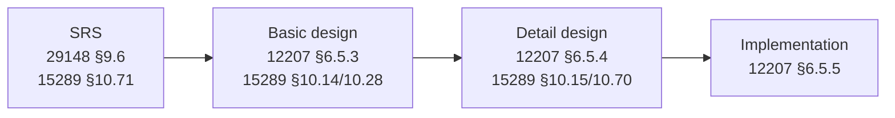

# Standards alignment — AI Spector document types

This document explains which international standards inform each built-in document type in AI Spector, how templates map to those standards, and what “valid” means in this context.

> **Disclaimer:** AI Spector provides an **informative mapping** to widely used systems and software engineering standards. It does **not** certify compliance, replace a formal quality management system, or substitute for purchasing and applying the normative standard texts. Regulated industries (medical, automotive, aerospace, etc.) require additional domain-specific standards (e.g. IEC 62304, ISO 26262, DO-178C).

## Quick reference

| Document type | Folder | Primary standard | Lifecycle process (12207) | 15289 information item |
|---------------|--------|------------------|---------------------------|-------------------------|
| **SRS** | `docs/srs/` | ISO/IEC/IEEE **29148** | §6.4.4 Requirements analysis | §10.71 Software requirements specification |
| **Basic design** | `docs/basic-design/` | ISO/IEC/IEEE **12207** §6.5.3 | Architectural design | §10.14 Database design, §10.28 Interface description |
| **Detail design** | `docs/detail-design/` | ISO/IEC/IEEE **12207** §6.5.4 | Detailed design | §10.15 Design description, §10.70 Software design description |

**Machine-readable template map:** [`template-standards-map.json`](template-standards-map.json) — every template file and section heading mapped to ISO/IEC/IEEE clauses.

**Readiness criteria:** `doc-types/<docType>/readiness-criteria.json` — input gates before generation (`readiness_assess`).

**Output structure:** `doc-types/<docType>/completeness-rules.json` — structural checks after generation (`readiness_scan`).

---

## ISO standards landscape (software)

These are the standards AI Spector maps to, based on ISO/IEC JTC 1/SC 7 and IEEE systems/software engineering:

| Layer | Standard | What it defines |
|-------|----------|-----------------|
| **Requirements** | ISO/IEC/IEEE **29148:2018** | Requirement quality (§5.2), SRS content (§9.6), requirements processes |
| **Life cycle** | ISO/IEC/IEEE **12207:2017** | Software processes — requirements analysis, architectural design, detailed design, implementation |
| **System life cycle** | ISO/IEC/IEEE **15288:2015** | System-level counterpart to 12207 (stakeholder needs, system context) |
| **Documentation** | ISO/IEC/IEEE **15289:2019** | Content of life-cycle information items (SRS, design descriptions, interface descriptions) |
| **Architecture** | ISO/IEC/IEEE **42010:2022** | Architecture descriptions — viewpoints, views, stakeholder concerns, decisions |
| **Quality** | ISO/IEC **25010:2011** | Product quality model — performance, security, usability, maintainability, … |
| **Design views** | IEEE **1016-2009** | Software design descriptions (SDD) — design viewpoints (context, structure, interface, interaction, …) |

Supporting references: IEEE 830-1998 (superseded by 29148), IREB CPRE (elicitation practices).

---

## Traceability chain



Each layer **allocates** upstream requirements (12207) and stays **traceable** (29148 §5.2.8). The traceability graph is the machine-checkable backbone.

---

## SRS — templates aligned to ISO 29148 §9.6

| Template | Output | ISO 29148 | 15289 item |
|----------|--------|-----------|------------|
| `srs/1-introduction.md` | `1-introduction.md` | §9.6.1–9.6.3 | §10.71 |
| `srs/2-overall-description.md` | `2-overall-description.md` | §9.6.4–9.6.9 | §10.71 |
| `srs/3-use-cases.md` | `3-use-cases.md` | §9.6.5, §9.6.10 | §10.71 |
| `srs/3-use-case-detail-template.md` | `use-cases/UC-*.md` | §9.6.10, §9.6.12 | §10.71 |
| `srs/4-system-features-list-template.md` | `4-system-features.md` | §9.6.5, §9.6.10 | §10.71 |
| `srs/4-system-feature-detail-template.md` | `features/F-*.md` | §9.6.10, §9.6.12 | §10.71 |
| `srs/5-data-requirements.md` | `5-data-requirements.md` | §9.6.15 | §10.71 |
| `srs/6-external-interfaces.md` | `6-external-interfaces.md` | §9.6.4.x, §9.6.11 | §10.71 |
| `srs/7-quality-attributes.md` | `7-quality-attributes.md` | §9.6.13–14, §9.6.18 + **25010** | §10.71 |
| `srs/8-internationalization.md` | `8-internationalization.md` | §9.6.7, §9.6.17 | §10.71 |
| `srs/9-other-requirements.md` | `9-other-requirements.md` | §9.6.16–17, §9.6.19–20 | §10.71 |

### Section examples (29148)

| Template section | ISO 29148 clause | Topic |
|------------------|------------------|-------|
| 1.1 Document Purpose | 9.6.2 | SRS audience and use |
| 2.1 Product Perspective | 9.6.4 | System context and interfaces |
| 2.2 User Classes | 9.6.6 | Actor characteristics |
| 5.1 Logical Data Model | 9.6.15 | Logical database requirements |
| 6.2 Software Interfaces | 9.6.4.4 | API / software-to-software |
| 7.2 Performance | 9.6.14 | Performance NFRs |

Full section tables: [`template-standards-map.json`](template-standards-map.json) → `docTypes.srs.templates`.

### What “valid” means for SRS

Per ISO/IEC/IEEE 29148 §5.2:

1. Individual requirements: necessary, appropriate, unambiguous, complete, singular, feasible, verifiable, correct, traceable (`RQ-01` … `RQ-11`).
2. Requirement set: complete, consistent, bounded, structured, no blocking TBD (`RQS-01` … `RQS-05`, `G-021`).
3. Attributes: unique ID, priority, source, verification method (`RQA-01` … `RQA-05`).

---

## Basic design — templates aligned to 12207 §6.5.3 + 15289 + 42010

Architectural design transforms SRS requirements into top-level structure (12207 §6.5.3.1) and defines interfaces between components (§6.5.3.2).

| Template | Output | Primary standards | IEEE 1016 viewpoint |
|----------|--------|-------------------|---------------------|
| `basic_design/db-design-template.md` | `db-design.md` | 15289 §10.14, 29148 §9.6.15 | Information (§5.6) |
| `basic_design/list-api-template.md` | `api-list.md` | 15289 §10.28, 12207 §6.5.3.2 | Interface (§5.8) |
| `basic_design/detail-api-template.md` | `api/*.md` | 15289 §10.28, 29148 §9.6.11 | Interface (§5.8) |
| `basic_design/list-screen-template.md` | `list-screens.md` | 42010 viewpoint, 29148 §9.6.4.2 | Context / UI view |
| `basic_design/detail-screen-template.md` | `screens/*.md` | 15289 §10.28, 25010 Usability | Interface (§5.8) |

### Section examples (basic design)

| Template section | Standard clause | Topic |
|------------------|-----------------|-------|
| DB §2 ERD | 29148:9.6.15 | Logical model from SRS data requirements |
| API §3 Endpoint Summary | 12207:6.5.3.1 | Requirement allocation to interfaces |
| API detail §2 Data Models | 1016:5.6 | Request/response schemas |
| Screen §4 Screen Index | 12207:6.5.3.1 | UI component inventory |
| Screen detail §1.x Wireframe | 42010:view | UI architecture view |

Full section tables: `template-standards-map.json` → `docTypes.basic-design.templates`.

---

## Detail design — templates aligned to 12207 §6.5.4 + 15289 + 1016

Detailed design refines architectural components into units that can be coded and tested (12207 §6.5.4.1) with complete interface specifications (§6.5.4.2).

| Template | Output | Primary standards | IEEE 1016 viewpoint |
|----------|--------|-------------------|---------------------|
| `common/architecture-overview-template.md` | `common/architecture-overview.md` | 42010, 12207 §6.5.4 | Context (§5.2), Structure (§5.9) |
| `common/security-patterns-template.md` | `common/security-patterns.md` | 25010 Security | Overlay |
| `common/error-handling-patterns-template.md` | `common/error-handling-patterns.md` | 29148 §9.6.18 | Overlay |
| `common/performance-standards-template.md` | `common/performance-standards.md` | 25010 Performance | Overlay |
| `common/integration-patterns-template.md` | `common/integration-patterns.md` | 29148 §9.6.4.3 | Interface (§5.8) |
| `common/deployment-infrastructure-template.md` | `common/deployment-infrastructure.md` | 42010 view | Resource (§5.13) |
| `feature-list-template.md` | `feature-list.md` | 29148 §9.6.10 | — |
| `feature-detail-design-template.md` | `features/*.md` | 15289 §10.15 | Structure, Interaction (§5.9–5.10) |

### Section examples (detail design)

| Template section | Standard clause | Topic |
|------------------|-----------------|-------|
| Architecture §2 System Context | 1016:5.2 | C4 Level 1 — context viewpoint |
| Architecture §4 Component Architecture | 12207:6.5.4.1 | Software units |
| Feature §2 Component Design | 1016:5.9 | Class/module structure |
| Feature §3 Sequence Diagrams | 1016:5.10 | Interaction viewpoint |
| Feature §11 Testing Strategy | 29148:9.6.19 | Verification per feature |

Full section tables: `template-standards-map.json` → `docTypes.detail-design.templates`.

---

## How templates relate to 42010 viewpoints

ISO/IEC/IEEE 42010 requires architecture descriptions to address **stakeholder concerns** through **viewpoints** and **views**. AI Spector templates approximate this:

| 42010 / 1016 concern | Where captured |
|----------------------|----------------|
| Context (system boundary) | SRS §2.1, DD `architecture-overview` §2 |
| Structure (components) | DD `architecture-overview` §3–4, feature §2 |
| Interface (APIs) | BD `api-list` / `api/*`, SRS §6 |
| Information (data) | SRS §5, BD `db-design` |
| Interaction (behavior) | SRS UC flows, DD feature §3 sequences |
| Security / performance (concerns) | SRS §7, DD `common/*` pattern chapters |

---

## Configuring project standards intent

```json
{
  "readiness": {
    "standards": ["ISO-29148", "ISO-12207", "ISO-42010", "ISO-15289"]
  }
}
```

`workspace_check` compares config tags to each doc type’s `standards[]` in `readiness-criteria.json`.

---

## Normative sources

| Standard | URL |
|----------|-----|
| ISO/IEC/IEEE 29148:2018 | https://www.iso.org/standard/72089.html |
| ISO/IEC/IEEE 12207:2017 | https://www.iso.org/standard/63712.html |
| ISO/IEC/IEEE 42010:2022 | https://www.iso.org/standard/74283.html |
| ISO/IEC/IEEE 15289:2019 | https://www.iso.org/standard/71993.html |
| ISO/IEC 25010:2011 | https://www.iso.org/standard/35733.html |
| IEEE 1016-2009 | https://standards.ieee.org/standard/1016-2009.html |

---

## Related files

| File | Purpose |
|------|---------|
| [`template-standards-map.json`](template-standards-map.json) | Per-template, per-section ISO clause mapping |
| `doc-types/srs/readiness-criteria.json` | SRS readiness gates |
| `doc-types/basic-design/readiness-criteria.json` | BD readiness gates |
| `doc-types/detail-design/readiness-criteria.json` | DD readiness gates |
| `doc-types/*/completeness-rules.json` | Output structure validation |
| `.ai-spector/templates/` | Template files (copied on `npx ai-spector init`) |
