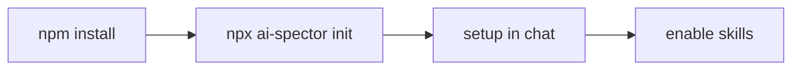

# Section: Get started

Install AI Spector and make the agent ready to work.

| Lesson | Time | Goal |
|--------|------|------|
| [Prerequisites & init](01-prerequisites-and-init.md) | 10 min | Install package + `npx ai-spector init` |
| [Setup & skills](02-setup-and-skills.md) | 10 min | Chat setup + enable skill routing |

**Next section:** [Chat basics](../02-chat-basics/README.md)
