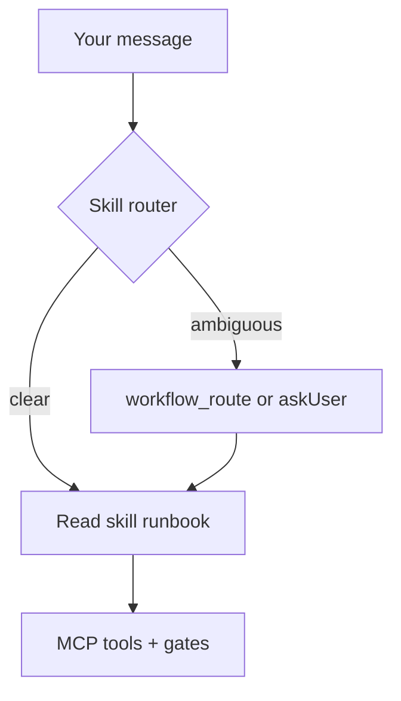

# How chat works

**Section:** [Chat basics](README.md) · **Course:** [Home](../README.md)  
**Time:** ~10 min

**Goal:** Understand routing and what “approve” means.

---

## Skills & routing

| Piece | Role |
|-------|------|
| **Routing** | `_skill-router.md` + `ai-spector-routing.mdc` pick the skill from your message |
| **Skill** | One workflow per job (analyze, generate, review…) with a runbook under `references/` |

Describe what you need in chat — the agent reads the matching skill and follows its runbook. Same phrases work in **Cursor** and **Claude Code**.

When intent is still unclear, the agent calls **`workflow_route`** or asks one clarifying question (see below).

**Reference:** `.cursor/WORKFLOW.md` — full “what to say” table.

---

## Skill map (quick reference)

| You want to… | Skill | Example phrase |
|--------------|-------|----------------|
| Setup / check workspace | `ai-spector-setup` / `ai-spector-check` | `setup ai-spector project` |
| Analyze / validate graph | `ai-spector-graph` | `analyze my data source` |
| Generate SRS / basic design | `ai-spector-generate-srs` / `…-basic-design` | `generate the SRS` |
| One feature / section change | `ai-spector-resolve-task` | `I want to add login with Google` |
| Document sign-off | `ai-spector-review` | `review documents`, `approve srs/01-overview` |
| Comment threads | `ai-spector-resolve-comments` | `resolve comments` |
| Resume paused work | `ai-spector-task` | `resume my SRS`, `active tasks` |
| Prototype | `ai-spector-generate-prototype` | `generate prototype` |
| Search by meaning | `ai-spector-search` | `find mentions of rate limiting` |

---

## Common phrases

| You want to… | Say (examples) |
|--------------|----------------|
| Generate SRS | *“generate the SRS”*, *“write use cases”* |
| Sign off a document | *“review documents”*, *“approve srs/01-overview”* |
| Resolve feedback | *“resolve comments”*, *“show open comments”* |
| Analyze sources | *“analyze my data source”* |
| Check workspace | *“check my workspace”* |

Unsure? Say *“help me approve”* — the agent asks one clarifying question.

---

## Four kinds of “approve”

| You mean | Say | Not this |
|----------|-----|----------|
| Sign off a document | *“review srs/01-overview”*, *“approve the SRS”* | spec / plan / comment |
| Approve extracted spec | *“approve SPEC-001”* | document sign-off |
| Execute a plan | *“yes, go ahead”* after plan table | document sign-off |
| Close comment thread | *“resolve C-012”* | document sign-off |

---

## What you should see

- Agent names or follows the right skill (not a random mix of runbooks).
- On ambiguous *“approve”* or *“looks good”*: a **four-option menu** before any approve tool runs.
- Skills enabled under `.cursor/skills/` — if routing fails, re-enable all folders.

---

## Troubleshooting

| Symptom | Fix |
|---------|-----|
| Wrong workflow (e.g. generate instead of resolve-task) | Use phrases from the skill map; say *"one feature only"* |
| Agent calls approve too early | You must complete runbook gates first |
| No MCP tools | Reload MCP; check `.cursor/mcp.json` |

---

## Next

[Workspace & tasks](02-workspace-and-tasks.md)
