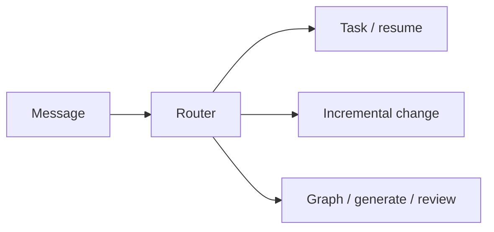

# Section: Chat basics

How the agent routes your requests via skills and `_skill-router.md`.

| Lesson | Time | Goal |
|--------|------|------|
| [How chat works](01-how-chat-works.md) | 10 min | Skill map, routing, four approve types |
| [Workspace & tasks](02-workspace-and-tasks.md) | 10 min | Health check, resume/pause |
| [Incremental changes](03-incremental-changes.md) | 10 min | Add one feature without full regen |

**Next section:** [Graph & sources](../03-graph/README.md)
