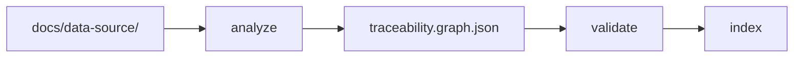

# Section: Graph & sources

Turn requirements into a traceability graph.

| Lesson | Time | Goal |
|--------|------|------|
| [Add sources & analyze](01-sources-and-analyze.md) | 10 min | Ingest requirements |
| [Validate, index & explore](02-validate-index-explore.md) | 10 min | Fix graph, refresh index, visualize |

**Next section:** [Generate documents](../04-generate/README.md)
