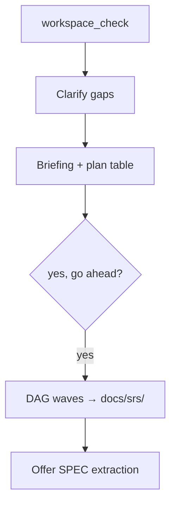

# Generate SRS

**Section:** [Generate documents](README.md) · **Course:** [Home](../README.md)  
**Time:** ~15 min · **Before:** [Validate graph](../03-graph/02-validate-index-explore.md)

**Goal:** Run the full gated SRS workflow — clarify, plan, write, approve specs.

---

## Start

```
generate the SRS
```

The agent creates a **task** — no files written yet.

---

## Gated flow



---

## Clarify & approve plan

1. Workspace check
2. Clarifying questions (answers stored for later sessions)
3. Briefing: sources and graph nodes that shape the SRS
4. Plan table — reply **`yes, go ahead`** (plan approval — not document sign-off)

Pause anytime: `pause task` → later `resume my SRS`.

---

## What you should see (before writes)

- Clarification questions with stored answers on re-run.
- Plan table: chapters/waves, sources, key graph nodes.
- Agent **waits** at plan gate — no `docs/srs/` files until you approve.

---

## Generation waves

SRS writes in **waves** (template dependency order) under `docs/srs/`. Progress is saved — safe to resume if interrupted.

After writing: `refresh the index`.

Wrong content? Fix `docs/data-source/` → re-analyze → regenerate. Direct edits to `docs/srs/` may be overwritten on regen.

---

## What you should see (after waves)

- New or updated files under `docs/srs/` (actors, use cases, features…).
- Task progress shows completed waves.

---

## Approve extracted specs

After generation, review **SPEC-NNN** items — only approved specs merge into the graph:

```
pending specs
approve SPEC-001
reject SPEC-002 — duplicate of UC-003
```

This is **spec approval** — not formal document sign-off (see [Document review](../06-review/01-document-review.md)).

---

## Troubleshooting

| Symptom | Fix |
|---------|-----|
| Files written before plan yes | Stop; plan gate was skipped |
| Empty SRS sections | Re-analyze sources; check graph validate |
| SPEC approve confused with doc review | SPEC = after generate; doc review = "review documents" |

---

## Check

`docs/srs/` has actors and use cases. Approved specs appear in the graph.

---

## Next

[Basic design](02-basic-design.md)
