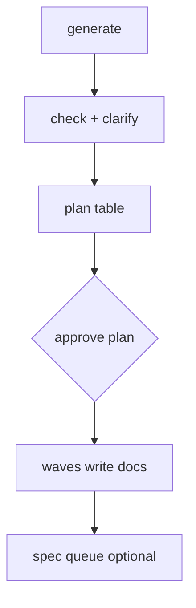

# Section: Generate documents

SRS and basic design with human-in-the-loop gates.

| Lesson | Time | Goal |
|--------|------|------|
| [Generate SRS](01-generate-srs.md) | 15 min | Clarify → plan → waves → specs |
| [Basic design](02-basic-design.md) | 10 min | Architecture from SRS |

**Before this section:** Graph validated with zero errors.

**Next section:** [Design & prototype](../05-prototype/README.md)
