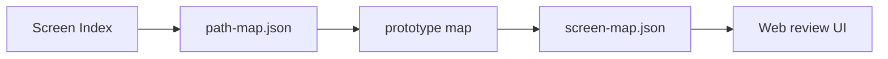

# External prototype map *(optional)*

**Section:** [Design & prototype](README.md) · **Course:** [Home](../README.md)  
**Time:** ~10 min · **Skip if** you generate prototypes in-repo

**Goal:** Map hosted prototype URLs to screen ids so reviewers can open screens from the web app — no HTML generation in this repo.

---

## When to use

| Situation | Workflow |
|-----------|----------|
| Prototype built elsewhere, hosted at a POC or legacy server | **This lesson** |
| Prototype generated under `prototype/src` or `prototype/dist` | [Build prototype](02-build-prototype.md) |

---

## Start

```
map external prototype URLs
```

or *"prototype is already on poc.dev — wire screen-map"*, *"generate path-map for hosted prototype"*.

---

## What the agent asks

1. **URL layout** — `reviewHost` (required), optional `projectId` / `deployVersion`, or `directReviewUrl: true` when each screen is a full URL on another host.
2. **Path per screen** — e.g. `dist/login`, `login` (flat deploy), or `https://legacy.example.com/app/login`.

Example constructed URL (versioned POC):

```text
https://poc.dev.kaopiz.com/acme-crm/1.4/dist/login
```

Example flat POC:

```text
https://poc.dev.kaopiz.com/login
```

---

## Flow



1. Read Screen Index from `list-screens.md`.
2. Draft `prototype/path-map.json` with `"hosted": true`.
3. Show confirmation table: screenId → prototypePath → **reviewUrl**.
4. Wait for your **yes**, then write and run:

```bash
npx ai-spector prototype map --strict
```

5. Edit `path-map.json` and re-run `prototype map` when deploy paths change.

---

## path-map.json sketch

**Versioned POC:**

```json
{
  "schemaVersion": 1,
  "buildMode": "spa",
  "hosted": true,
  "reviewHost": "https://poc.dev.kaopiz.com",
  "projectId": "acme-crm",
  "deployVersion": "1.4",
  "defaultScreenId": "login",
  "prototypeBypassAuth": true,
  "screens": {
    "login": { "prototypePath": "dist/login" },
    "order-detail": { "prototypePath": "dist/orders/demo-001" }
  }
}
```

**Full URL per screen** (`directReviewUrl: true`):

```json
{
  "hosted": true,
  "directReviewUrl": true,
  "screens": {
    "login": { "prototypePath": "https://legacy.example.com/app/login" }
  }
}
```

---

## What you should see

- `prototype/path-map.json` — editable source (ops/deploy paths).
- `prototype/screen-map.json` — output with `reviewUrl` per screen for the web team.
- CLI table logging review base URL or `directReviewUrl: true`.
- `prototype map --strict` passes with no missing Screen Index rows.

---

## Troubleshooting

| Symptom | Fix |
|---------|-----|
| reviewUrl 404 on POC | Paths must match nginx deploy layout; check `deployVersion` segment |
| Agent runs `prototype manifest` | Hosted workflow uses `prototype map`, not manifest/sync |
| Missing screen in map | Add row to `path-map.json` screens + re-run `prototype map` |

---

## Next section

[Review & changes](../06-review/README.md)
