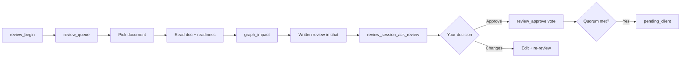

# Document review & sign-off

**Section:** [Review & changes](README.md) · **Course:** [Home](../README.md)  
**Time:** ~15 min

**Goal:** Formally sign off a document after readiness scoring — not comments or specs.

Skill: **`ai-spector-review`**

Two tracks: **internal (you in chat)** → **client (web app)**. This lesson covers internal review.

---

## Start

```
review documents
```

or *"review srs/01-overview"*, *"what needs review"*, *"pending client approval"*.

Named path skips the queue pick — agent goes straight to that document.

---

## Flow



1. **Begin** — `review_begin` discovers docs and opens the internal queue.
2. **Queue** — table of docs pending sign-off; you pick one (unless you named a path).
3. **Readiness** — structural scan + output checklist + custom checklists.
4. **Graph impact** — what downstream docs may need updates.
5. **Review summary** — agent writes findings in chat (not a silent approve).
6. **Ack** — `review_session_ack_review` unlocks approve.
7. **Your decision** — Approve / Request changes / Dismiss / Skip.
8. On **Approve** → `review_approve` casts a **vote** (optional note).

---

## Quorum voting

Internal sign-off needs **≥ ⌈2/3 × voters⌉** approve votes — not a single click.

- First vote adds you as a reviewer.
- Agent shows quorum progress: `approveCount/required`.
- When quorum is met, the doc moves to **`pending_client`** (client track on web app).
- **Decline** (`review_decline`) records disagreement but does not auto-reject.
- **Close** (`review_close`) when quorum cannot be reached.

---

## What you should see

- Table from `review_queue` with logical paths (`srs/01-overview`, …).
- Readiness scores and checklist rows in the review summary.
- Agent **does not** call `review_approve` until you explicitly approve **after** the written summary and session ack.
- After quorum: document status `pending_client` in `.ai-spector/.docflow/review-queue/`.

**Custom checklists:** drop JSON in `.ai-spector/.docflow/config/review-checklists/`.

**Commit review state** (team-shared approvals):

```bash
git add .ai-spector/.docflow/review-queue/
git commit -m "chore(review): approve srs/01-overview"
```

---

## Not document review

| You mean | Use instead |
|----------|-------------|
| Approve SPEC-001 after generate | *"approve SPEC-001"* (spec queue) |
| Yes to a plan table | *"yes, go ahead"* (task plan) |
| Close comment C-012 | [Comment threads](02-comment-threads.md) |

---

## Troubleshooting

| Symptom | Fix |
|---------|-----|
| Agent approves without a written review | Remind: full runbook before `review_approve` |
| `review_approve` blocked | Run `review_session_ack_review` after the summary |
| *"continue"* resumes wrong workflow | Active **review session** wins over task resume — say which doc |
| Confused with comment resolve | Document sign-off = logical path + readiness; comments = C-NNN |
| graph_impact empty | Index may be stale — `npx ai-spector index` then retry |

---

## Next

[Comment threads](02-comment-threads.md)
