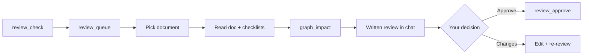

# Document review & sign-off

**Section:** [Review & changes](README.md) · **Course:** [Home](../README.md)  
**Time:** ~15 min

**Goal:** Formally sign off a document after readiness scoring — not comments or specs.

Skill: **`ai-spector-review`**

---

## Start

```
review documents
```

or *"review srs/01-overview"*, *"what needs review"*, *"pending client approval"*.

---

## Flow



1. **Queue** — table of docs pending sign-off; you pick one.
2. **Readiness** — structural scan + output checklist + custom checklists.
3. **Graph impact** — what downstream docs may need updates.
4. **Review summary** — agent writes findings in chat (not a silent approve).
5. **Your decision** — Approve / Request changes / Dismiss.
6. On **Approve** only → `review_approve`.

---

## What you should see

- Table from `review_queue` with logical paths (`srs/01-overview`, …).
- Readiness scores and checklist rows in the review summary.
- Agent **does not** call `review_approve` until you explicitly approve after reading the summary.
- After approve: document status updated in `.ai-spector/.docflow/review-queue/`.

**Custom checklists:** drop JSON in `.ai-spector/.docflow/config/review-checklists/`.

---

## Not document review

| You mean | Use instead |
|----------|-------------|
| Approve SPEC-001 after generate | *"approve SPEC-001"* (spec queue) |
| Yes to a plan table | *"yes, go ahead"* (task plan) |
| Close comment C-012 | [Comment threads](02-comment-threads.md) |

---

## Troubleshooting

| Symptom | Fix |
|---------|-----|
| Agent approves without a written review | Remind: full runbook before `review_approve` |
| *"continue"* resumes wrong workflow | Active **review session** wins over task resume — say which doc |
| Confused with comment resolve | Document sign-off = logical path + readiness; comments = C-NNN |

---

## Next

[Comment threads](02-comment-threads.md)
